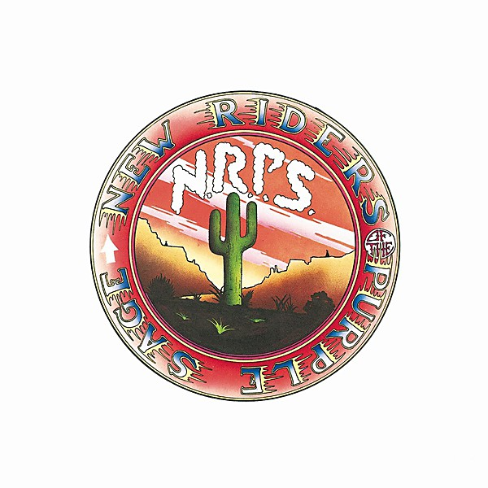

# New Riders of the Purple Sage

By **New Riders of the Purple Sage**

## Album Data

- **Catalog:** Beets
- **Format:** Digital, Album
- **Album:** New Riders of the Purple Sage
- **Artist:** New Riders Of The Purple Sage
- **Albumartist:** New Riders of the Purple Sage
- **Genre:** Country Rock
- **MusicBrainz Album Artist ID:** [64c8fe79-1f93-483f-aace-b6a6e379e7d2](https://musicbrainz.org/artist/64c8fe79-1f93-483f-aace-b6a6e379e7d2)
- **MusicBrainz Album ID:** [7cfd4022-6ea4-4e1b-a2a8-e76767b4959a](https://musicbrainz.org/release/7cfd4022-6ea4-4e1b-a2a8-e76767b4959a)
- **MusicBrainz Release Group ID:** [51e0c8ec-07cb-339b-a534-248dc1659b5d](https://musicbrainz.org/release-group/51e0c8ec-07cb-339b-a534-248dc1659b5d)
- **Year:** 1989
- **Catalog #:** CK 30888
- **Label:** Columbia
- **Total Tracks:** 10

## Album Tracks

### Track 01 - I Don't Know You

- **Artist:** New Riders of the Purple Sage
- **Format:** MP3
- **Genre:** Folk Rock
- **Length:** 2:28
- **MusicBrainz Track ID:** [8c87e774-0ed5-431c-9c2a-63b067f2fa13](https://musicbrainz.org/recording/8c87e774-0ed5-431c-9c2a-63b067f2fa13)
- **Title:** I Don't Know You
- **Track:** 01
- **Year:** 1989

### Track 02 - Whatcha Gonna Do

- **Artist:** New Riders of the Purple Sage
- **Format:** MP3
- **Genre:** Southern Rock
- **Length:** 3:19
- **MusicBrainz Track ID:** [3d6eb0da-94d7-4402-b536-b388337ee523](https://musicbrainz.org/recording/3d6eb0da-94d7-4402-b536-b388337ee523)
- **Title:** Whatcha Gonna Do
- **Track:** 02
- **Year:** 1989

### Track 03 - Portland Woman

- **Artist:** New Riders of the Purple Sage
- **Format:** MP3
- **Genre:** Acid Rock
- **Length:** 3:41
- **MusicBrainz Track ID:** [36f729ba-0e2f-43d0-9b23-76648c5b946d](https://musicbrainz.org/recording/36f729ba-0e2f-43d0-9b23-76648c5b946d)
- **Title:** Portland Woman
- **Track:** 03
- **Year:** 1989

### Track 04 - Henry

- **Artist:** New Riders of the Purple Sage
- **Format:** MP3
- **Genre:** Folk Rock
- **Length:** 2:38
- **MusicBrainz Track ID:** [218211f7-b39d-497a-bc9b-7e7c0cfc90ae](https://musicbrainz.org/recording/218211f7-b39d-497a-bc9b-7e7c0cfc90ae)
- **Title:** Henry
- **Track:** 04
- **Year:** 1989

### Track 05 - Dirty Business

- **Artist:** New Riders of the Purple Sage
- **Format:** MP3
- **Genre:** Acid Rock
- **Length:** 8:23
- **MusicBrainz Track ID:** [bcc8b985-0a7d-4de2-9afd-fb3ac6eb7771](https://musicbrainz.org/recording/bcc8b985-0a7d-4de2-9afd-fb3ac6eb7771)
- **Title:** Dirty Business
- **Track:** 05
- **Year:** 1989

### Track 06 - Glendale Train

- **Artist:** New Riders of the Purple Sage
- **Format:** MP3
- **Genre:** Southern Rock
- **Length:** 3:05
- **MusicBrainz Track ID:** [12e778f0-391c-4de6-b996-6732f0c56ee6](https://musicbrainz.org/recording/12e778f0-391c-4de6-b996-6732f0c56ee6)
- **Title:** Glendale Train
- **Track:** 06
- **Year:** 1989

### Track 07 - Garden of Eden

- **Artist:** New Riders of the Purple Sage
- **Format:** MP3
- **Genre:** Acid Rock
- **Length:** 4:35
- **MusicBrainz Track ID:** [8fdf086e-c68f-4252-9a73-975125d396bc](https://musicbrainz.org/recording/8fdf086e-c68f-4252-9a73-975125d396bc)
- **Title:** Garden of Eden
- **Track:** 07
- **Year:** 1989

### Track 08 - All I Ever Wanted

- **Artist:** New Riders of the Purple Sage
- **Format:** MP3
- **Genre:** Folk Rock
- **Length:** 4:39
- **MusicBrainz Track ID:** [3f9d8706-acdf-4575-b1af-286fae215ad6](https://musicbrainz.org/recording/3f9d8706-acdf-4575-b1af-286fae215ad6)
- **Title:** All I Ever Wanted
- **Track:** 08
- **Year:** 1989

### Track 09 - Last Lonely Eagle

- **Artist:** New Riders of the Purple Sage
- **Format:** MP3
- **Genre:** Southern Rock
- **Length:** 5:21
- **MusicBrainz Track ID:** [0dd9cdca-8de1-4375-814f-2aaf56547144](https://musicbrainz.org/recording/0dd9cdca-8de1-4375-814f-2aaf56547144)
- **Title:** Last Lonely Eagle
- **Track:** 09
- **Year:** 1989

### Track 10 - Louislana Lady

- **Artist:** New Riders of the Purple Sage
- **Format:** MP3
- **Genre:** Folk Rock
- **Length:** 3:05
- **MusicBrainz Track ID:** [51a456b2-e120-4ec5-a216-30fe80403d5d](https://musicbrainz.org/recording/51a456b2-e120-4ec5-a216-30fe80403d5d)
- **Title:** Louislana Lady
- **Track:** 10
- **Year:** 1989

## See also

- [Vinyl: Louisiana Lady](../../Vinyl/New_Riders_Of_The_Purple_Sage/Louisiana_Lady.md)
- [Vinyl: ](../../Vinyl/New_Riders_Of_The_Purple_Sage/New_Riders_Of_The_Purple_Sage.md)
