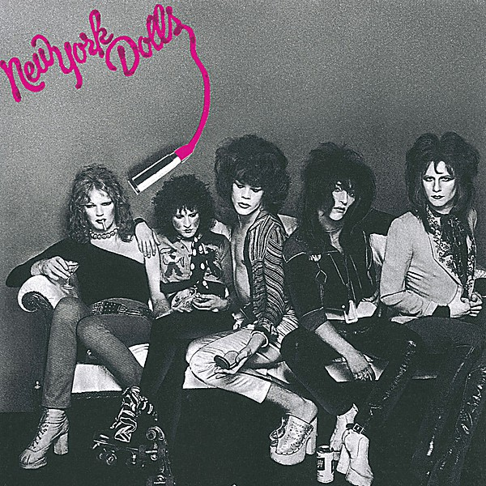

# New York Dolls

By **New York Dolls**

## Album Data

- **Catalog:** Beets
- **Format:** Digital, Album
- **Album:** New York Dolls
- **Artist:** New York Dolls
- **Albumartist:** New York Dolls
- **Genre:** Punk Rock
- **MusicBrainz Album Artist ID:** [1b96b9c9-0832-40cb-9f8d-7274de3733fc](https://musicbrainz.org/artist/1b96b9c9-0832-40cb-9f8d-7274de3733fc)
- **MusicBrainz Album ID:** [1f6cc992-e572-4f3c-b62a-cb6111383e67](https://musicbrainz.org/release/1f6cc992-e572-4f3c-b62a-cb6111383e67)
- **MusicBrainz Release Group ID:** [4cdd4c59-e38f-382b-b01c-e69829faa69c](https://musicbrainz.org/release-group/4cdd4c59-e38f-382b-b01c-e69829faa69c)
- **Year:** 1989
- **Catalog #:** 832 752-2
- **Label:** Mercury Records
- **Total Tracks:** 11

## Album Tracks

### Track 01 - Personality Crisis

- **Artist:** New York Dolls
- **Format:** AAC
- **Genre:** Punk Rock
- **Length:** 3:40
- **MusicBrainz Track ID:** [d774aae2-e7c7-449f-b5db-897925d07ffc](https://musicbrainz.org/recording/d774aae2-e7c7-449f-b5db-897925d07ffc)
- **Title:** Personality Crisis
- **Track:** 01
- **Year:** 1989

### Track 02 - Looking for a Kiss

- **Artist:** New York Dolls
- **Format:** AAC
- **Genre:** Punk Rock
- **Length:** 3:19
- **MusicBrainz Track ID:** [abf0bc14-d9b0-431a-98b6-d8ef49f0aa9a](https://musicbrainz.org/recording/abf0bc14-d9b0-431a-98b6-d8ef49f0aa9a)
- **Title:** Looking for a Kiss
- **Track:** 02
- **Year:** 1989

### Track 03 - Vietnamese Baby

- **Artist:** New York Dolls
- **Format:** AAC
- **Genre:** Punk Rock
- **Length:** 3:36
- **MusicBrainz Track ID:** [ad8588ee-846e-4deb-b1b5-38aa4a04234c](https://musicbrainz.org/recording/ad8588ee-846e-4deb-b1b5-38aa4a04234c)
- **Title:** Vietnamese Baby
- **Track:** 03
- **Year:** 1989

### Track 04 - Lonely Planet Boy

- **Artist:** New York Dolls
- **Format:** AAC
- **Genre:** Punk Rock
- **Length:** 4:09
- **MusicBrainz Track ID:** [a7ef44a5-aec6-4c3b-82fc-a5568eacdc36](https://musicbrainz.org/recording/a7ef44a5-aec6-4c3b-82fc-a5568eacdc36)
- **Title:** Lonely Planet Boy
- **Track:** 04
- **Year:** 1989

### Track 05 - Frankenstein (Original)

- **Artist:** New York Dolls
- **Format:** AAC
- **Genre:** Punk Rock
- **Length:** 5:57
- **MusicBrainz Track ID:** [a21e3ff5-a411-462f-b5be-adf637da77b8](https://musicbrainz.org/recording/a21e3ff5-a411-462f-b5be-adf637da77b8)
- **Title:** Frankenstein (Original)
- **Track:** 05
- **Year:** 1989

### Track 06 - Trash

- **Artist:** New York Dolls
- **Format:** AAC
- **Genre:** Punk Rock
- **Length:** 3:14
- **MusicBrainz Track ID:** [df6c9105-3cf3-44c0-b17a-be599e2dbcd2](https://musicbrainz.org/recording/df6c9105-3cf3-44c0-b17a-be599e2dbcd2)
- **Title:** Trash
- **Track:** 06
- **Year:** 1989

### Track 07 - Bad Girl

- **Artist:** New York Dolls
- **Format:** AAC
- **Genre:** Punk Rock
- **Length:** 3:04
- **MusicBrainz Track ID:** [5c48058c-cb93-410a-b7eb-4fd58770cb9b](https://musicbrainz.org/recording/5c48058c-cb93-410a-b7eb-4fd58770cb9b)
- **Title:** Bad Girl
- **Track:** 07
- **Year:** 1989

### Track 08 - Subway Train

- **Artist:** New York Dolls
- **Format:** AAC
- **Genre:** Punk Rock
- **Length:** 4:21
- **MusicBrainz Track ID:** [a51b76b7-c6c0-481c-88c0-9697ccb9cb17](https://musicbrainz.org/recording/a51b76b7-c6c0-481c-88c0-9697ccb9cb17)
- **Title:** Subway Train
- **Track:** 08
- **Year:** 1989

### Track 09 - Pills

- **Artist:** New York Dolls
- **Format:** AAC
- **Genre:** Rock And Roll
- **Length:** 2:51
- **MusicBrainz Track ID:** [5689bce2-b690-4b22-a8a2-f2752d317221](https://musicbrainz.org/recording/5689bce2-b690-4b22-a8a2-f2752d317221)
- **Title:** Pills
- **Track:** 09
- **Year:** 1989

### Track 10 - Private World

- **Artist:** New York Dolls
- **Format:** AAC
- **Genre:** Rock And Roll
- **Length:** 3:39
- **MusicBrainz Track ID:** [811580d8-1300-46f1-8843-120c631fd30e](https://musicbrainz.org/recording/811580d8-1300-46f1-8843-120c631fd30e)
- **Title:** Private World
- **Track:** 10
- **Year:** 1989

### Track 11 - Jet Boy

- **Artist:** New York Dolls
- **Format:** AAC
- **Genre:** Punk Rock
- **Length:** 4:38
- **MusicBrainz Track ID:** [f3581430-6e77-44ea-90ea-a027b9a55e97](https://musicbrainz.org/recording/f3581430-6e77-44ea-90ea-a027b9a55e97)
- **Title:** Jet Boy
- **Track:** 11
- **Year:** 1989

## See also

- [Vinyl: ](../../Vinyl/New_York_Dolls/New_York_Dolls_index.md)
- [Vinyl: New York Dolls](../../Vinyl/New_York_Dolls/New_York_Dolls.md)
