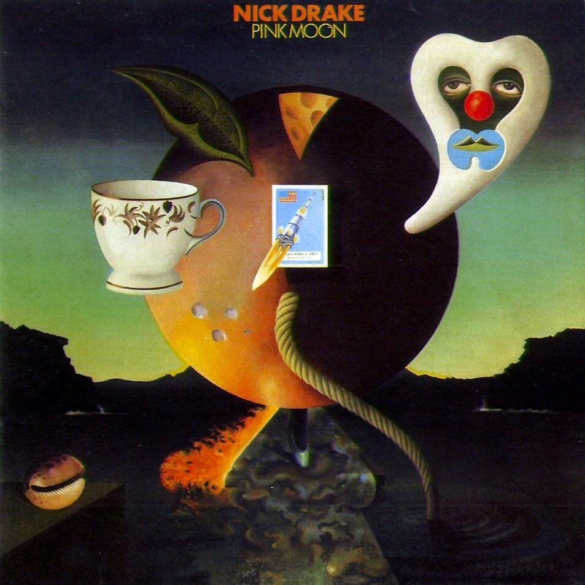

# Pink Moon

By **Nick Drake**

## Album Data

- **Catalog:** Beets
- **Format:** Digital, Album
- **Album:** Pink Moon
- **Artist:** Nick Drake
- **Albumartist:** Nick Drake
- **Genre:** Folk Rock
- **MusicBrainz Album Artist ID:** [99ea432a-e3d8-42cb-9d5e-db316a6a8458](https://musicbrainz.org/artist/99ea432a-e3d8-42cb-9d5e-db316a6a8458)
- **MusicBrainz Album ID:** [a674d091-6e29-40f1-b02a-8263a39d7f11](https://musicbrainz.org/release/a674d091-6e29-40f1-b02a-8263a39d7f11)
- **MusicBrainz Release Group ID:** [740ec10a-e887-38a6-a04d-fe2069c9e2a7](https://musicbrainz.org/release-group/740ec10a-e887-38a6-a04d-fe2069c9e2a7)
- **Year:** 2000
- **Catalog #:** HNCD 4436
- **Label:** Hannibal
- **Total Tracks:** 11

## Album Tracks

### Track 01 - Pink Moon

- **Artist:** Nick Drake
- **Format:** MP3
- **Genre:** Folk Rock
- **Length:** 2:03
- **MusicBrainz Track ID:** [d840d505-c0e0-44fe-9c03-3a272cfff88e](https://musicbrainz.org/recording/d840d505-c0e0-44fe-9c03-3a272cfff88e)
- **Title:** Pink Moon
- **Track:** 01
- **Year:** 2000

### Track 02 - Place to Be

- **Artist:** Nick Drake
- **Format:** MP3
- **Genre:** Folk Rock
- **Length:** 2:41
- **MusicBrainz Track ID:** [1ad3672f-7584-4719-9fdf-a7aab6dfdc3e](https://musicbrainz.org/recording/1ad3672f-7584-4719-9fdf-a7aab6dfdc3e)
- **Title:** Place to Be
- **Track:** 02
- **Year:** 2000

### Track 03 - Road

- **Artist:** Nick Drake
- **Format:** MP3
- **Genre:** Folk Rock
- **Length:** 1:59
- **MusicBrainz Track ID:** [1b509236-71ef-446e-b89d-3926c092178e](https://musicbrainz.org/recording/1b509236-71ef-446e-b89d-3926c092178e)
- **Title:** Road
- **Track:** 03
- **Year:** 2000

### Track 04 - Which Will

- **Artist:** Nick Drake
- **Format:** MP3
- **Genre:** Folk Rock
- **Length:** 2:56
- **MusicBrainz Track ID:** [98ced1f7-9fc2-4ce1-af93-3f1bb04899e4](https://musicbrainz.org/recording/98ced1f7-9fc2-4ce1-af93-3f1bb04899e4)
- **Title:** Which Will
- **Track:** 04
- **Year:** 2000

### Track 05 - Horn

- **Artist:** Nick Drake
- **Format:** MP3
- **Genre:** Ambient
- **Length:** 1:20
- **MusicBrainz Track ID:** [e2471abf-b272-431f-a030-48a958aa3694](https://musicbrainz.org/recording/e2471abf-b272-431f-a030-48a958aa3694)
- **Title:** Horn
- **Track:** 05
- **Year:** 2000

### Track 06 - Things Behind the Sun

- **Artist:** Nick Drake
- **Format:** MP3
- **Genre:** Folk Rock
- **Length:** 3:54
- **MusicBrainz Track ID:** [9760a459-fd07-4931-ae89-b74b4df56e66](https://musicbrainz.org/recording/9760a459-fd07-4931-ae89-b74b4df56e66)
- **Title:** Things Behind the Sun
- **Track:** 06
- **Year:** 2000

### Track 07 - Know

- **Artist:** Nick Drake
- **Format:** MP3
- **Genre:** Folk Rock
- **Length:** 2:23
- **MusicBrainz Track ID:** [87b03e0d-2d43-451e-80ab-ecb299405863](https://musicbrainz.org/recording/87b03e0d-2d43-451e-80ab-ecb299405863)
- **Title:** Know
- **Track:** 07
- **Year:** 2000

### Track 08 - Parasite

- **Artist:** Nick Drake
- **Format:** MP3
- **Genre:** Folk Rock
- **Length:** 3:34
- **MusicBrainz Track ID:** [b47e5611-009b-4c2d-9f71-03b19e5208c4](https://musicbrainz.org/recording/b47e5611-009b-4c2d-9f71-03b19e5208c4)
- **Title:** Parasite
- **Track:** 08
- **Year:** 2000

### Track 09 - Free Ride

- **Artist:** Nick Drake
- **Format:** MP3
- **Genre:** Folk Rock
- **Length:** 3:03
- **MusicBrainz Track ID:** [c3a7b1d5-5965-4df2-ab94-e8534629dddb](https://musicbrainz.org/recording/c3a7b1d5-5965-4df2-ab94-e8534629dddb)
- **Title:** Free Ride
- **Track:** 09
- **Year:** 2000

### Track 10 - Harvest Breed

- **Artist:** Nick Drake
- **Format:** MP3
- **Genre:** Rock
- **Length:** 1:34
- **MusicBrainz Track ID:** [6da72adb-8df0-4d0c-a13d-16905981e67a](https://musicbrainz.org/recording/6da72adb-8df0-4d0c-a13d-16905981e67a)
- **Title:** Harvest Breed
- **Track:** 10
- **Year:** 2000

### Track 11 - From the Morning

- **Artist:** Nick Drake
- **Format:** MP3
- **Genre:** Folk Rock
- **Length:** 2:29
- **MusicBrainz Track ID:** [a40490cf-7e8d-444e-93f7-5b6507708031](https://musicbrainz.org/recording/a40490cf-7e8d-444e-93f7-5b6507708031)
- **Title:** From the Morning
- **Track:** 11
- **Year:** 2000

## See also

- [Bryter Layter](Bryter_Layter.md)
- [Roon: A Treasury](../../Roon/Nick_Drake/A_Treasury.md)
- [Roon: Bryter Layter](../../Roon/Nick_Drake/Bryter_Layter.md)
- [Roon: Five Leaves Left](../../Roon/Nick_Drake/Five_Leaves_Left.md)
- [Vinyl: ](../../Vinyl/Nick_Drake/Nick_Drake.md)
- [Vinyl: Pink Moon](../../Vinyl/Nick_Drake/Pink_Moon.md)
