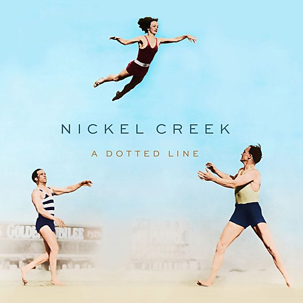

# A Dotted Line

By **Nickel Creek**

## Album Data

- **Catalog:** Beets
- **Format:** Digital, Album
- **Album:** A Dotted Line
- **Artist:** Nickel Creek
- **Albumartist:** Nickel Creek
- **Genre:** Bluegrass
- **MusicBrainz Album Artist ID:** [365144f7-85af-4c83-b24b-b1d0b26160bb](https://musicbrainz.org/artist/365144f7-85af-4c83-b24b-b1d0b26160bb)
- **MusicBrainz Album ID:** [84ef0490-383e-4de6-92ad-da122c834115](https://musicbrainz.org/release/84ef0490-383e-4de6-92ad-da122c834115)
- **MusicBrainz Release Group ID:** [a4cd605b-34a8-427c-99de-02d31dc43889](https://musicbrainz.org/release-group/a4cd605b-34a8-427c-99de-02d31dc43889)
- **Year:** 2014
- **Catalog #:** 541944
- **Label:** Nonesuch
- **Total Tracks:** 10

## Album Tracks

### Track 01 - Rest of My Life

- **Artist:** Nickel Creek
- **Format:** ALAC
- **Genre:** Bluegrass
- **Length:** 3:39
- **MusicBrainz Track ID:** [16b0f515-f528-4576-9609-a4c04a664a0d](https://musicbrainz.org/recording/16b0f515-f528-4576-9609-a4c04a664a0d)
- **Title:** Rest of My Life
- **Track:** 01
- **Year:** 2014

### Track 02 - Destination

- **Artist:** Nickel Creek
- **Format:** ALAC
- **Genre:** Bluegrass
- **Length:** 3:51
- **MusicBrainz Track ID:** [65638b0c-9208-4330-96f1-3019f4f7015d](https://musicbrainz.org/recording/65638b0c-9208-4330-96f1-3019f4f7015d)
- **Title:** Destination
- **Track:** 02
- **Year:** 2014

### Track 03 - Elsie

- **Artist:** Nickel Creek
- **Format:** ALAC
- **Genre:** Bluegrass
- **Length:** 2:32
- **MusicBrainz Track ID:** [39c427b9-6260-4abb-8cd6-070e3183a9c3](https://musicbrainz.org/recording/39c427b9-6260-4abb-8cd6-070e3183a9c3)
- **Title:** Elsie
- **Track:** 03
- **Year:** 2014

### Track 04 - Christmas Eve

- **Artist:** Nickel Creek
- **Format:** ALAC
- **Genre:** Bluegrass
- **Length:** 4:22
- **MusicBrainz Track ID:** [42a1c27f-7f74-47e2-afd0-8e76f3eaab95](https://musicbrainz.org/recording/42a1c27f-7f74-47e2-afd0-8e76f3eaab95)
- **Title:** Christmas Eve
- **Track:** 04
- **Year:** 2014

### Track 05 - Hayloft

- **Artist:** Nickel Creek
- **Format:** ALAC
- **Genre:** Bluegrass
- **Length:** 3:17
- **MusicBrainz Track ID:** [29af131e-8185-4d00-9571-b036d8da48b9](https://musicbrainz.org/recording/29af131e-8185-4d00-9571-b036d8da48b9)
- **Title:** Hayloft
- **Track:** 05
- **Year:** 2014

### Track 06 - 21st of May

- **Artist:** Nickel Creek
- **Format:** ALAC
- **Genre:** Bluegrass
- **Length:** 2:47
- **MusicBrainz Track ID:** [a3a71b19-730d-4e54-9470-5d11f0458b5a](https://musicbrainz.org/recording/a3a71b19-730d-4e54-9470-5d11f0458b5a)
- **Title:** 21st of May
- **Track:** 06
- **Year:** 2014

### Track 07 - Love of Mine

- **Artist:** Nickel Creek
- **Format:** ALAC
- **Genre:** Americana
- **Length:** 4:42
- **MusicBrainz Track ID:** [df6cb737-0a0f-499b-a9bf-cf47e1070ae9](https://musicbrainz.org/recording/df6cb737-0a0f-499b-a9bf-cf47e1070ae9)
- **Title:** Love of Mine
- **Track:** 07
- **Year:** 2014

### Track 08 - Elephant in the Corn

- **Artist:** Nickel Creek
- **Format:** ALAC
- **Genre:** Bluegrass
- **Length:** 5:10
- **MusicBrainz Track ID:** [98ed7ac4-85b2-49ec-85a0-ce004114fbfa](https://musicbrainz.org/recording/98ed7ac4-85b2-49ec-85a0-ce004114fbfa)
- **Title:** Elephant in the Corn
- **Track:** 08
- **Year:** 2014

### Track 09 - You Don't Know What's Going On

- **Artist:** Nickel Creek
- **Format:** ALAC
- **Genre:** Bluegrass
- **Length:** 2:50
- **MusicBrainz Track ID:** [6f698e3f-8fb6-440e-8a57-8d8dcb3a6aea](https://musicbrainz.org/recording/6f698e3f-8fb6-440e-8a57-8d8dcb3a6aea)
- **Title:** You Don't Know What's Going On
- **Track:** 09
- **Year:** 2014

### Track 10 - Where Is Love Now

- **Artist:** Nickel Creek
- **Format:** ALAC
- **Genre:** Bluegrass
- **Length:** 4:44
- **MusicBrainz Track ID:** [331691df-cd86-4957-a461-6ce13b2542b1](https://musicbrainz.org/recording/331691df-cd86-4957-a461-6ce13b2542b1)
- **Title:** Where Is Love Now
- **Track:** 10
- **Year:** 2014

