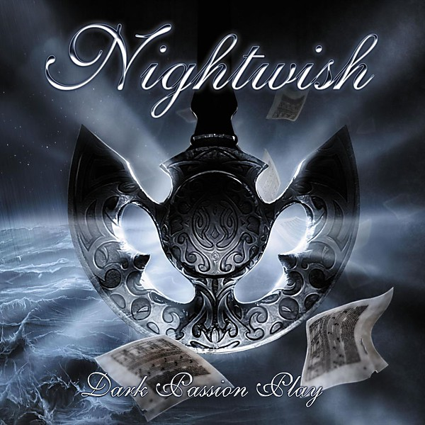

# Dark Passion Play

By **Nightwish**

## Album Data

- **Catalog:** Beets
- **Format:** Digital, Album
- **Album:** Dark Passion Play
- **Artist:** Nightwish
- **Albumartist:** Nightwish
- **Genre:** Symphonic Metal
- **MusicBrainz Album Artist ID:** [00a9f935-ba93-4fc8-a33a-993abe9c936b](https://musicbrainz.org/artist/00a9f935-ba93-4fc8-a33a-993abe9c936b)
- **MusicBrainz Album ID:** [671178ca-b663-468b-ae9a-4580822e3bdb](https://musicbrainz.org/release/671178ca-b663-468b-ae9a-4580822e3bdb)
- **MusicBrainz Release Group ID:** [c12897a3-af7a-3466-8892-58af84765813](https://musicbrainz.org/release-group/c12897a3-af7a-3466-8892-58af84765813)
- **Year:** 2007
- **Catalog #:** 1686-179842
- **Label:** Roadrunner Records
- **Total Tracks:** 13

## Album Tracks

### Track 01 - The Poet and the Pendulum

- **Artist:** Nightwish
- **Format:** ALAC
- **Genre:** Symphonic Metal
- **Length:** 13:54
- **MusicBrainz Track ID:** [ff3ce2c1-8998-4399-bffa-4a31ced4f805](https://musicbrainz.org/recording/ff3ce2c1-8998-4399-bffa-4a31ced4f805)
- **Title:** The Poet and the Pendulum
- **Track:** 01
- **Year:** 2007

### Track 02 - Bye Bye Beautiful

- **Artist:** Nightwish
- **Format:** ALAC
- **Genre:** Symphonic Metal
- **Length:** 4:14
- **MusicBrainz Track ID:** [39fd5c95-172d-4aeb-8660-001f3f6daefd](https://musicbrainz.org/recording/39fd5c95-172d-4aeb-8660-001f3f6daefd)
- **Title:** Bye Bye Beautiful
- **Track:** 02
- **Year:** 2007

### Track 03 - Amaranth

- **Artist:** Nightwish
- **Format:** ALAC
- **Genre:** Symphonic Metal
- **Length:** 3:51
- **MusicBrainz Track ID:** [a3d59d03-f692-4410-a4f8-2e60a0766c5b](https://musicbrainz.org/recording/a3d59d03-f692-4410-a4f8-2e60a0766c5b)
- **Title:** Amaranth
- **Track:** 03
- **Year:** 2007

### Track 04 - Cadence of Her Last Breath

- **Artist:** Nightwish
- **Format:** ALAC
- **Genre:** Symphonic Metal
- **Length:** 4:14
- **MusicBrainz Track ID:** [a3597940-42a2-45ec-8fca-f32e74ecec96](https://musicbrainz.org/recording/a3597940-42a2-45ec-8fca-f32e74ecec96)
- **Title:** Cadence of Her Last Breath
- **Track:** 04
- **Year:** 2007

### Track 05 - Master Passion Greed

- **Artist:** Nightwish
- **Format:** ALAC
- **Genre:** Symphonic Metal
- **Length:** 6:02
- **MusicBrainz Track ID:** [def2a4db-d861-42b2-8bb0-535b7af5c354](https://musicbrainz.org/recording/def2a4db-d861-42b2-8bb0-535b7af5c354)
- **Title:** Master Passion Greed
- **Track:** 05
- **Year:** 2007

### Track 06 - Eva

- **Artist:** Nightwish
- **Format:** ALAC
- **Genre:** Symphonic Metal
- **Length:** 4:25
- **MusicBrainz Track ID:** [9793fd25-469c-41b5-aabd-c04fa3ab0984](https://musicbrainz.org/recording/9793fd25-469c-41b5-aabd-c04fa3ab0984)
- **Title:** Eva
- **Track:** 06
- **Year:** 2007

### Track 07 - Sahara

- **Artist:** Nightwish
- **Format:** ALAC
- **Genre:** Symphonic Metal
- **Length:** 5:47
- **MusicBrainz Track ID:** [1ac6e1b4-9141-4b4e-8c34-2917b83ee9a9](https://musicbrainz.org/recording/1ac6e1b4-9141-4b4e-8c34-2917b83ee9a9)
- **Title:** Sahara
- **Track:** 07
- **Year:** 2007

### Track 08 - Whoever Brings the Night

- **Artist:** Nightwish
- **Format:** ALAC
- **Genre:** Symphonic Metal
- **Length:** 4:17
- **MusicBrainz Track ID:** [cf640c77-b12f-425b-a71a-9da1e5cd7fb4](https://musicbrainz.org/recording/cf640c77-b12f-425b-a71a-9da1e5cd7fb4)
- **Title:** Whoever Brings the Night
- **Track:** 08
- **Year:** 2007

### Track 09 - For the Heart I Once Had

- **Artist:** Nightwish
- **Format:** ALAC
- **Genre:** Symphonic Metal
- **Length:** 3:55
- **MusicBrainz Track ID:** [fc82ced0-e65f-4b73-8200-b408085ce46c](https://musicbrainz.org/recording/fc82ced0-e65f-4b73-8200-b408085ce46c)
- **Title:** For the Heart I Once Had
- **Track:** 09
- **Year:** 2007

### Track 10 - The Islander

- **Artist:** Nightwish
- **Format:** ALAC
- **Genre:** Symphonic Metal
- **Length:** 5:05
- **MusicBrainz Track ID:** [a63193b5-20c9-4580-98b6-114208ccfa99](https://musicbrainz.org/recording/a63193b5-20c9-4580-98b6-114208ccfa99)
- **Title:** The Islander
- **Track:** 10
- **Year:** 2007

### Track 11 - Last of the Wilds

- **Artist:** Nightwish
- **Format:** ALAC
- **Genre:** Symphonic Metal
- **Length:** 5:40
- **MusicBrainz Track ID:** [4c7981bd-f8be-4c43-90c8-952a1b42a81f](https://musicbrainz.org/recording/4c7981bd-f8be-4c43-90c8-952a1b42a81f)
- **Title:** Last of the Wilds
- **Track:** 11
- **Year:** 2007

### Track 12 - 7 Days to the Wolves

- **Artist:** Nightwish
- **Format:** ALAC
- **Genre:** Symphonic Metal
- **Length:** 7:03
- **MusicBrainz Track ID:** [bb93d25b-d598-41d2-9874-e7284127ff59](https://musicbrainz.org/recording/bb93d25b-d598-41d2-9874-e7284127ff59)
- **Title:** 7 Days to the Wolves
- **Track:** 12
- **Year:** 2007

### Track 13 - Meadows of Heaven

- **Artist:** Nightwish
- **Format:** ALAC
- **Genre:** Symphonic Metal
- **Length:** 7:10
- **MusicBrainz Track ID:** [f8ba0cd5-46ce-49f4-8cc4-9f984037eed9](https://musicbrainz.org/recording/f8ba0cd5-46ce-49f4-8cc4-9f984037eed9)
- **Title:** Meadows of Heaven
- **Track:** 13
- **Year:** 2007

## See also

- [Roon: Dark Passion Play](../../Roon/Nightwish/Dark_Passion_Play.md)
