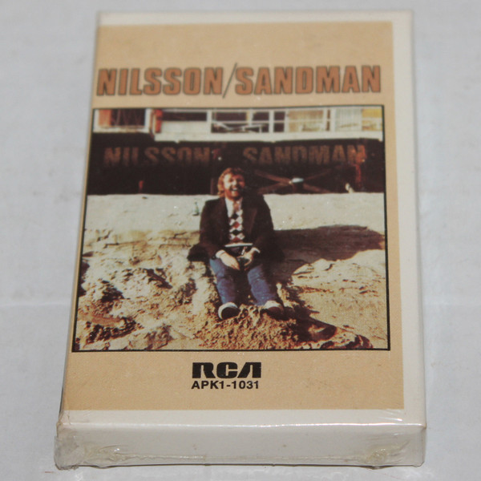

# Sandman

By **Nilsson**

## Album Data

- **Catalog:** Beets
- **Format:** Digital, Album
- **Album:** Sandman
- **Artist:** Nilsson
- **Albumartist:** Nilsson
- **Genre:** Soft Rock
- **MusicBrainz Album Artist ID:** 
- **MusicBrainz Album ID:** 
- **MusicBrainz Release Group ID:** 
- **Year:** 1976
- **Catalog #:** 
- **Label:** 
- **Total Tracks:** 10

## Album Tracks

### Track 01 - I'll Take A Tango

- **Artist:** Nilsson
- **Format:** ALAC
- **Genre:** Rock
- **Length:** 3:00
- **MusicBrainz Track ID:** 
- **Title:** I'll Take A Tango
- **Track:** 01
- **Year:** 1976

### Track 02 - Something True

- **Artist:** Nilsson
- **Format:** ALAC
- **Genre:** Soft Rock
- **Length:** 2:58
- **MusicBrainz Track ID:** 
- **Title:** Something True
- **Track:** 02
- **Year:** 1976

### Track 03 - Pretty Soon There'll Be Nothng Left For Everybody

- **Artist:** Nilsson
- **Format:** ALAC
- **Genre:** Soft Rock
- **Length:** 2:53
- **MusicBrainz Track ID:** 
- **Title:** Pretty Soon There'll Be Nothng Left For Everybody
- **Track:** 03
- **Year:** 1976

### Track 04 - The Ivy Covered Walls

- **Artist:** Nilsson
- **Format:** ALAC
- **Genre:** Soft Rock
- **Length:** 3:15
- **MusicBrainz Track ID:** 
- **Title:** The Ivy Covered Walls
- **Track:** 04
- **Year:** 1976

### Track 05 - Here's Why I Did Not Go To Work Today

- **Artist:** Nilsson
- **Format:** ALAC
- **Genre:** Vocal Jazz
- **Length:** 4:08
- **MusicBrainz Track ID:** 
- **Title:** Here's Why I Did Not Go To Work Today
- **Track:** 05
- **Year:** 1976

### Track 06 - The Flying Saucer Song

- **Artist:** Nilsson
- **Format:** ALAC
- **Genre:** Soft Rock
- **Length:** 6:43
- **MusicBrainz Track ID:** 
- **Title:** The Flying Saucer Song
- **Track:** 06
- **Year:** 1976

### Track 07 - How To Write A Song

- **Artist:** Nilsson
- **Format:** ALAC
- **Genre:** Soft Rock
- **Length:** 3:14
- **MusicBrainz Track ID:** 
- **Title:** How To Write A Song
- **Track:** 07
- **Year:** 1976

### Track 08 - Jesus Christ You're Tall

- **Artist:** Nilsson
- **Format:** ALAC
- **Genre:** Humor
- **Length:** 4:10
- **MusicBrainz Track ID:** 
- **Title:** Jesus Christ You're Tall
- **Track:** 08
- **Year:** 1976

### Track 09 - Will She Miss Me?

- **Artist:** Nilsson
- **Format:** ALAC
- **Genre:** Sunshine Pop
- **Length:** 4:51
- **MusicBrainz Track ID:** 
- **Title:** Will She Miss Me?
- **Track:** 09
- **Year:** 1976

### Track 10 - A Tree Out In The Yard (Central Park) albums_by_artist.sh albums-info.sh album_tracks.sh bak Beets_Albums_by_Artist.md data dupart mbids.txt mkalbums scripts tracks-info.sh

- **Artist:** Nilsson
- **Format:** ALAC
- **Genre:** Soft Rock
- **Length:** 4:32
- **MusicBrainz Track ID:** 
- **Title:** A Tree Out In The Yard (Central Park) albums_by_artist.sh albums-info.sh album_tracks.sh bak Beets_Albums_by_Artist.md data dupart mbids.txt mkalbums scripts tracks-info.sh
- **Track:** 10
- **Year:** 1975

## See also

- [Aerial Pandemonium Ballet](Aerial_Pandemonium_Ballet.md)
