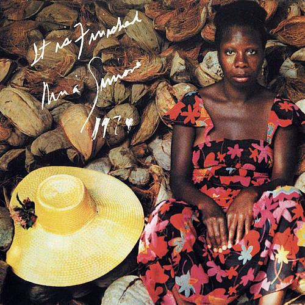

# It Is Finished

By **Nina Simone**

## Album Data

- **Catalog:** Beets
- **Format:** Digital, Album
- **Album:** It Is Finished
- **Artist:** Nina Simone
- **Albumartist:** Nina Simone
- **Genre:** Vocal Jazz
- **MusicBrainz Album Artist ID:** [2944824d-4c26-476f-a981-be849081942f](https://musicbrainz.org/artist/2944824d-4c26-476f-a981-be849081942f)
- **MusicBrainz Album ID:** [651232f1-cd45-30de-a427-c1684e671207](https://musicbrainz.org/release/651232f1-cd45-30de-a427-c1684e671207)
- **MusicBrainz Release Group ID:** [76640bb3-2bbf-3e87-932b-caaa9cec077d](https://musicbrainz.org/release-group/76640bb3-2bbf-3e87-932b-caaa9cec077d)
- **Year:** 2004
- **Catalog #:** 822 846-2
- **Label:** PolyGram Records, Inc.
- **Total Tracks:** 12

## Album Tracks

### Track 01 - I Loves You Porgy

- **Artist:** Nina Simone
- **Format:** ALAC
- **Genre:** Vocal Jazz
- **Length:** 2:33
- **MusicBrainz Track ID:** [e489ce53-9fe1-4c1c-a60c-1adb72a1194f](https://musicbrainz.org/recording/e489ce53-9fe1-4c1c-a60c-1adb72a1194f)
- **Title:** I Loves You Porgy
- **Track:** 01
- **Year:** 1999

### Track 02 - Mississippi Goddam

- **Artist:** Nina Simone
- **Format:** ALAC
- **Genre:** Vocal Jazz
- **Length:** 4:54
- **MusicBrainz Track ID:** [021ae0bf-534c-4d66-a426-4069c8633d7b](https://musicbrainz.org/recording/021ae0bf-534c-4d66-a426-4069c8633d7b)
- **Title:** Mississippi Goddam
- **Track:** 02
- **Year:** 1999

### Track 03 - The Other Woman

- **Artist:** Nina Simone
- **Format:** ALAC
- **Genre:** Vocal Jazz
- **Length:** 3:06
- **MusicBrainz Track ID:** [cc530dfb-f8e3-4bbd-90a5-de0fd7fe9d5a](https://musicbrainz.org/recording/cc530dfb-f8e3-4bbd-90a5-de0fd7fe9d5a)
- **Title:** The Other Woman
- **Track:** 03
- **Year:** 1999

### Track 04 - Sinnerman

- **Artist:** Nina Simone
- **Format:** ALAC
- **Genre:** Vocal Jazz
- **Length:** 10:22
- **MusicBrainz Track ID:** [bc0e9d24-8b23-41ca-a389-3196e071c56e](https://musicbrainz.org/recording/bc0e9d24-8b23-41ca-a389-3196e071c56e)
- **Title:** Sinnerman
- **Track:** 04
- **Year:** 1999

### Track 05 - Ne me quitte pas

- **Artist:** Nina Simone
- **Format:** ALAC
- **Genre:** Vocal Jazz
- **Length:** 3:37
- **MusicBrainz Track ID:** [f129c4f6-58c8-48b6-b735-b0c71e41b826](https://musicbrainz.org/recording/f129c4f6-58c8-48b6-b735-b0c71e41b826)
- **Title:** Ne me quitte pas
- **Track:** 05
- **Year:** 1999

### Track 06 - See Line Woman

- **Artist:** Nina Simone
- **Format:** ALAC
- **Genre:** Vocal Jazz
- **Length:** 2:38
- **MusicBrainz Track ID:** [e95a8db9-7b26-4280-aa02-6a16def9580d](https://musicbrainz.org/recording/e95a8db9-7b26-4280-aa02-6a16def9580d)
- **Title:** See Line Woman
- **Track:** 06
- **Year:** 1999

### Track 07 - I Put a Spell on You

- **Artist:** Nina Simone
- **Format:** ALAC
- **Genre:** Vocal Jazz
- **Length:** 2:38
- **MusicBrainz Track ID:** [de488d7f-c86c-4cab-99e2-4c1c5c345508](https://musicbrainz.org/recording/de488d7f-c86c-4cab-99e2-4c1c5c345508)
- **Title:** I Put a Spell on You
- **Track:** 07
- **Year:** 1999

### Track 08 - Break Down and Let It All Out

- **Artist:** Nina Simone
- **Format:** ALAC
- **Genre:** Vocal Jazz
- **Length:** 2:39
- **MusicBrainz Track ID:** [ea5f8974-50a3-4256-8d78-40af8aa4f4b1](https://musicbrainz.org/recording/ea5f8974-50a3-4256-8d78-40af8aa4f4b1)
- **Title:** Break Down and Let It All Out
- **Track:** 08
- **Year:** 1999

### Track 09 - Four Women

- **Artist:** Nina Simone
- **Format:** ALAC
- **Genre:** Vocal Jazz
- **Length:** 4:27
- **MusicBrainz Track ID:** [3a3f7456-40a2-4979-8fb6-76944ed24281](https://musicbrainz.org/recording/3a3f7456-40a2-4979-8fb6-76944ed24281)
- **Title:** Four Women
- **Track:** 09
- **Year:** 1999

### Track 10 - Wild Is the Wind

- **Artist:** Nina Simone
- **Format:** ALAC
- **Genre:** Vocal Jazz
- **Length:** 7:01
- **MusicBrainz Track ID:** [6ae4943d-158a-4c72-bdce-e8221ed61f7f](https://musicbrainz.org/recording/6ae4943d-158a-4c72-bdce-e8221ed61f7f)
- **Title:** Wild Is the Wind
- **Track:** 10
- **Year:** 1999

### Track 11 - Pirate Jenny

- **Artist:** Nina Simone
- **Format:** ALAC
- **Genre:** Soul
- **Length:** 6:42
- **MusicBrainz Track ID:** [b469e898-4444-47f1-b1ac-23deacd1759a](https://musicbrainz.org/recording/b469e898-4444-47f1-b1ac-23deacd1759a)
- **Title:** Pirate Jenny
- **Track:** 11
- **Year:** 1999

### Track 12 - Don't Let Me Be Misunderstood

- **Artist:** Nina Simone
- **Format:** ALAC
- **Genre:** Soul
- **Length:** 2:44
- **MusicBrainz Track ID:** [61bf8dcc-5362-4947-ae4d-3a6ac3345486](https://musicbrainz.org/recording/61bf8dcc-5362-4947-ae4d-3a6ac3345486)
- **Title:** Don't Let Me Be Misunderstood
- **Track:** 12
- **Year:** 1999

## See also

- [The Best of Nina Simone](The_Best_of_Nina_Simone.md)
- [Vinyl: My Baby Just Cares For Me](../../Vinyl/Nina_Simone/My_Baby_Just_Cares_For_Me.md)
- [Vinyl: Nina Simone At Town Hall](../../Vinyl/Nina_Simone/Nina_Simone_At_Town_Hall.md)
- [Vinyl: ](../../Vinyl/Nina_Simone/Nina_Simone.md)
