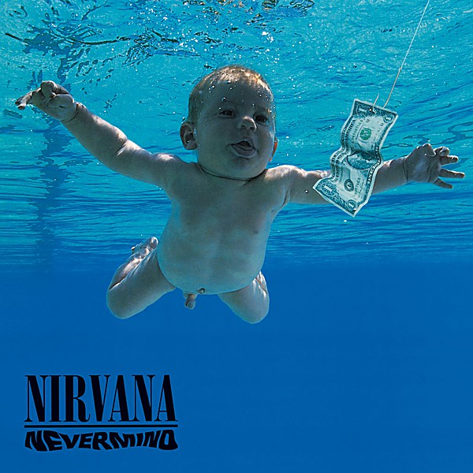

# Nevermind

By **Nirvana**

## Album Data

- **Catalog:** Beets
- **Format:** Digital, Album
- **Album:** Nevermind
- **Artist:** Nirvana
- **Albumartist:** Nirvana
- **Genre:** Grunge
- **MusicBrainz Album Artist ID:** 
- **MusicBrainz Album ID:** 
- **MusicBrainz Release Group ID:** 
- **Year:** 0000
- **Catalog #:** 
- **Label:** 
- **Total Tracks:** 00

## Album Tracks

### Track 00 - 01-Smells_Like_Teen_Spirit!!s

- **Artist:** Nirvana
- **Format:** MP3
- **Genre:** Grunge
- **Length:** 5:00
- **MusicBrainz Track ID:** 
- **Title:** 01-Smells_Like_Teen_Spirit!!s
- **Track:** 00
- **Year:** 0000

### Track 00 - Lounge Act

- **Artist:** Nirvana
- **Format:** AAC
- **Genre:** Grunge
- **Length:** 2:36
- **MusicBrainz Track ID:** 
- **Title:** Lounge Act
- **Track:** 00
- **Year:** 1991

### Track 01 - Territorial Pissings

- **Artist:** Nirvana
- **Format:** AAC
- **Genre:** Grunge
- **Length:** 2:22
- **MusicBrainz Track ID:** 
- **Title:** Territorial Pissings
- **Track:** 01
- **Year:** 0000

### Track 04 - Nevermind - 04 - Bre

- **Artist:** Nirvana
- **Format:** AAC
- **Genre:** Grunge
- **Length:** 3:03
- **MusicBrainz Track ID:** 
- **Title:** Nevermind - 04 - Bre
- **Track:** 04
- **Year:** 1991

### Track 06 - Polly

- **Artist:** Nirvana
- **Format:** AAC
- **Genre:** Grunge
- **Length:** 2:56
- **MusicBrainz Track ID:** 
- **Title:** Polly
- **Track:** 06
- **Year:** 2001

### Track 12 - Something In The Way

- **Artist:** Nirvana
- **Format:** MP3
- **Genre:** Grunge
- **Length:** 2:30
- **MusicBrainz Track ID:** 
- **Title:** Something In The Way
- **Track:** 12
- **Year:** 1991

