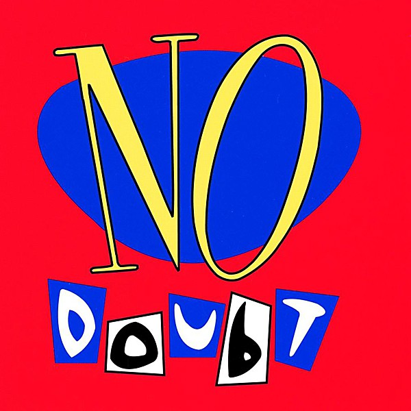

# No Doubt

By **No Doubt**

## Album Data

- **Catalog:** Beets
- **Format:** Digital, Album
- **Album:** No Doubt
- **Artist:** No Doubt
- **Albumartist:** No Doubt
- **Genre:** Ska Punk
- **MusicBrainz Album Artist ID:** [fbd2a255-1d57-4d31-ac11-65b671c19958](https://musicbrainz.org/artist/fbd2a255-1d57-4d31-ac11-65b671c19958)
- **MusicBrainz Album ID:** [b0b690ee-6729-40cd-96e7-f36610166d7c](https://musicbrainz.org/release/b0b690ee-6729-40cd-96e7-f36610166d7c)
- **MusicBrainz Release Group ID:** [44920790-1478-3368-bc98-8cb53f7b3e0f](https://musicbrainz.org/release-group/44920790-1478-3368-bc98-8cb53f7b3e0f)
- **Year:** 1992
- **Catalog #:** B0017311-02
- **Label:** Interscope Records
- **Total Tracks:** 11

## Album Tracks

### Track 01 - Settle Down

- **Artist:** No Doubt
- **Format:** MP3
- **Genre:** Ska
- **Length:** 6:00
- **MusicBrainz Track ID:** [9a700703-3b34-47bf-b924-4bf509af2272](https://musicbrainz.org/recording/9a700703-3b34-47bf-b924-4bf509af2272)
- **Title:** Settle Down
- **Track:** 01
- **Year:** 2012

### Track 02 - Looking Hot

- **Artist:** No Doubt
- **Format:** MP3
- **Genre:** Electropop
- **Length:** 4:42
- **MusicBrainz Track ID:** [6e9456fa-89c1-4344-bddb-167f564a370b](https://musicbrainz.org/recording/6e9456fa-89c1-4344-bddb-167f564a370b)
- **Title:** Looking Hot
- **Track:** 02
- **Year:** 2012

### Track 03 - One More Summer

- **Artist:** No Doubt
- **Format:** MP3
- **Genre:** Pop Rock
- **Length:** 4:38
- **MusicBrainz Track ID:** [75612f5c-735b-4a36-9f65-07dd85a23d8d](https://musicbrainz.org/recording/75612f5c-735b-4a36-9f65-07dd85a23d8d)
- **Title:** One More Summer
- **Track:** 03
- **Year:** 2012

### Track 04 - Push and Shove

- **Artist:** No Doubt
- **Format:** MP3
- **Genre:** Dubstep
- **Length:** 5:06
- **MusicBrainz Track ID:** [d13f462c-f394-432b-be8e-1cc45ae4c992](https://musicbrainz.org/recording/d13f462c-f394-432b-be8e-1cc45ae4c992)
- **Title:** Push and Shove
- **Track:** 04
- **Year:** 2012

### Track 05 - Easy

- **Artist:** No Doubt
- **Format:** MP3
- **Genre:** Soft Rock
- **Length:** 5:10
- **MusicBrainz Track ID:** [5ea5c500-8903-4cad-9054-ba765398d4ed](https://musicbrainz.org/recording/5ea5c500-8903-4cad-9054-ba765398d4ed)
- **Title:** Easy
- **Track:** 05
- **Year:** 2012

### Track 06 - Gravity

- **Artist:** No Doubt
- **Format:** MP3
- **Genre:** Pop Rock
- **Length:** 4:25
- **MusicBrainz Track ID:** [7df4e2bd-f6bd-41a0-9267-9f5c6290b1aa](https://musicbrainz.org/recording/7df4e2bd-f6bd-41a0-9267-9f5c6290b1aa)
- **Title:** Gravity
- **Track:** 06
- **Year:** 2012

### Track 07 - Undercover

- **Artist:** No Doubt
- **Format:** MP3
- **Genre:** Pop Rock
- **Length:** 3:31
- **MusicBrainz Track ID:** [241ec75d-c680-4381-b135-f5f02d5e8943](https://musicbrainz.org/recording/241ec75d-c680-4381-b135-f5f02d5e8943)
- **Title:** Undercover
- **Track:** 07
- **Year:** 2012

### Track 08 - Undone

- **Artist:** No Doubt
- **Format:** MP3
- **Genre:** Soft Rock
- **Length:** 4:37
- **MusicBrainz Track ID:** [4f6a2e10-2c7b-4f64-ba3b-9e868964993d](https://musicbrainz.org/recording/4f6a2e10-2c7b-4f64-ba3b-9e868964993d)
- **Title:** Undone
- **Track:** 08
- **Year:** 2012

### Track 09 - Sparkle

- **Artist:** No Doubt
- **Format:** MP3
- **Genre:** Ska
- **Length:** 4:08
- **MusicBrainz Track ID:** [ebb73bed-6c9c-4129-acba-4a239b754182](https://musicbrainz.org/recording/ebb73bed-6c9c-4129-acba-4a239b754182)
- **Title:** Sparkle
- **Track:** 09
- **Year:** 2012

### Track 10 - Heaven

- **Artist:** No Doubt
- **Format:** MP3
- **Genre:** Synthpop
- **Length:** 4:06
- **MusicBrainz Track ID:** [24001c07-0d29-4909-8218-0044f707b56a](https://musicbrainz.org/recording/24001c07-0d29-4909-8218-0044f707b56a)
- **Title:** Heaven
- **Track:** 10
- **Year:** 2012

### Track 11 - Dreaming the Same Dream

- **Artist:** No Doubt
- **Format:** MP3
- **Genre:** Synthpop
- **Length:** 5:27
- **MusicBrainz Track ID:** [261bf95b-fdc8-490e-83e7-9c0cdf8a05d3](https://musicbrainz.org/recording/261bf95b-fdc8-490e-83e7-9c0cdf8a05d3)
- **Title:** Dreaming the Same Dream
- **Track:** 11
- **Year:** 2012

## See also

- [Push and Shove](Push_and_Shove.md)
- [Return of Saturn](Return_of_Saturn.md)
- [Rock Steady](Rock_Steady.md)
- [The Beacon Street Collection](The_Beacon_Street_Collection.md)
- [The Singles 1992–2003](The_Singles_1992–2003.md)
- [Tragic Kingdom](Tragic_Kingdom.md)
- [CD: ](../../CD/No_Doubt/No_Doubt.md)
- [CD: Tragic Kingdom](../../CD/No_Doubt/Tragic_Kingdom.md)
- [Roon: Push And Shove (Deluxe)](../../Roon/No_Doubt/Push_And_Shove_Deluxe.md)
- [Roon: Return Of Saturn](../../Roon/No_Doubt/Return_Of_Saturn.md)
- [Roon: Rock Steady (Expanded Edition)](../../Roon/No_Doubt/Rock_Steady_Expanded_Edition.md)
- [Roon: Tragic Kingdom](../../Roon/No_Doubt/Tragic_Kingdom.md)
- [Vinyl: ](../../Vinyl/No_Doubt/No_Doubt.md)
- [Vinyl: Tragic Kingdom](../../Vinyl/No_Doubt/Tragic_Kingdom.md)
