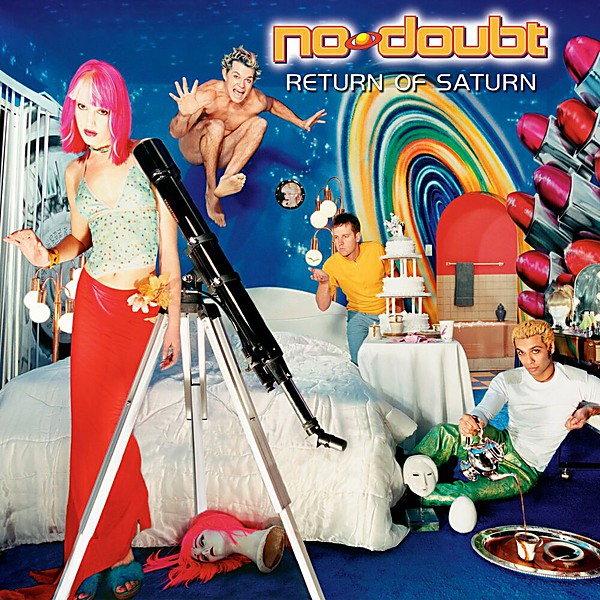

# Return of Saturn

By **No Doubt**

## Album Data

- **Catalog:** Beets
- **Format:** Digital, Album
- **Album:** Return of Saturn
- **Artist:** No Doubt
- **Albumartist:** No Doubt
- **Genre:** Ska
- **MusicBrainz Album Artist ID:** [fbd2a255-1d57-4d31-ac11-65b671c19958](https://musicbrainz.org/artist/fbd2a255-1d57-4d31-ac11-65b671c19958)
- **MusicBrainz Album ID:** [babc0460-f5b0-47e9-abae-0b9df6b87deb](https://musicbrainz.org/release/babc0460-f5b0-47e9-abae-0b9df6b87deb)
- **MusicBrainz Release Group ID:** [c78cdf1e-4674-37fd-a02e-04c4033adffc](https://musicbrainz.org/release-group/c78cdf1e-4674-37fd-a02e-04c4033adffc)
- **Year:** 2000
- **Catalog #:** 
- **Label:** 
- **Total Tracks:** 13

## Album Tracks

### Track 01 - Intro

- **Artist:** No Doubt
- **Format:** ALAC
- **Genre:** Rock
- **Length:** 0:29
- **MusicBrainz Track ID:** [91fc6b9c-c597-4a29-aef6-4c8ffe2042c3](https://musicbrainz.org/recording/91fc6b9c-c597-4a29-aef6-4c8ffe2042c3)
- **Title:** Intro
- **Track:** 01
- **Year:** 2001

### Track 02 - Hella Good

- **Artist:** No Doubt
- **Format:** ALAC
- **Genre:** Ska
- **Length:** 4:04
- **MusicBrainz Track ID:** [2a49142b-4a4b-42a6-943b-7dfa11a241b0](https://musicbrainz.org/recording/2a49142b-4a4b-42a6-943b-7dfa11a241b0)
- **Title:** Hella Good
- **Track:** 02
- **Year:** 2001

### Track 04 - Making Out

- **Artist:** No Doubt
- **Format:** ALAC
- **Genre:** Indie Rock
- **Length:** 4:16
- **MusicBrainz Track ID:** [e911701c-3af1-40ee-ba46-ff51f2eb8cc5](https://musicbrainz.org/recording/e911701c-3af1-40ee-ba46-ff51f2eb8cc5)
- **Title:** Making Out
- **Track:** 04
- **Year:** 2001

### Track 06 - Detective

- **Artist:** No Doubt
- **Format:** ALAC
- **Genre:** Ska
- **Length:** 2:55
- **MusicBrainz Track ID:** [7b859003-8409-419e-9d2b-cef54e7d9b7a](https://musicbrainz.org/recording/7b859003-8409-419e-9d2b-cef54e7d9b7a)
- **Title:** Detective
- **Track:** 06
- **Year:** 2001

### Track 07 - Don't Let Me Down

- **Artist:** No Doubt
- **Format:** ALAC
- **Genre:** Indie Rock
- **Length:** 4:10
- **MusicBrainz Track ID:** [df6fbd39-2b1d-4cfb-9a84-5d79c03f7cfe](https://musicbrainz.org/recording/df6fbd39-2b1d-4cfb-9a84-5d79c03f7cfe)
- **Title:** Don't Let Me Down
- **Track:** 07
- **Year:** 2001

### Track 08 - Start the Fire

- **Artist:** No Doubt
- **Format:** ALAC
- **Genre:** Ska
- **Length:** 4:13
- **MusicBrainz Track ID:** [0b64f04e-afb6-4595-bfa7-922e2e8c662e](https://musicbrainz.org/recording/0b64f04e-afb6-4595-bfa7-922e2e8c662e)
- **Title:** Start the Fire
- **Track:** 08
- **Year:** 2001

### Track 09 - Running

- **Artist:** No Doubt
- **Format:** ALAC
- **Genre:** Ska
- **Length:** 4:03
- **MusicBrainz Track ID:** [a26f532b-a363-406f-bf53-7260d308dfee](https://musicbrainz.org/recording/a26f532b-a363-406f-bf53-7260d308dfee)
- **Title:** Running
- **Track:** 09
- **Year:** 2001

### Track 10 - In My Head

- **Artist:** No Doubt
- **Format:** ALAC
- **Genre:** Ska Punk
- **Length:** 3:27
- **MusicBrainz Track ID:** [3ade3fc4-e866-4a2e-890b-26748cc9aa4c](https://musicbrainz.org/recording/3ade3fc4-e866-4a2e-890b-26748cc9aa4c)
- **Title:** In My Head
- **Track:** 10
- **Year:** 2001

### Track 11 - Platinum Blonde Life

- **Artist:** No Doubt
- **Format:** ALAC
- **Genre:** Ska
- **Length:** 3:29
- **MusicBrainz Track ID:** [87b62985-d4c3-498d-a8e7-09b748baa341](https://musicbrainz.org/recording/87b62985-d4c3-498d-a8e7-09b748baa341)
- **Title:** Platinum Blonde Life
- **Track:** 11
- **Year:** 2001

### Track 12 - Waiting Room

- **Artist:** No Doubt
- **Format:** ALAC
- **Genre:** Ska Punk
- **Length:** 4:29
- **MusicBrainz Track ID:** [9178139e-8227-4e10-89ba-ccc3f8612da8](https://musicbrainz.org/recording/9178139e-8227-4e10-89ba-ccc3f8612da8)
- **Title:** Waiting Room
- **Track:** 12
- **Year:** 2001

### Track 13 - Rock Steady

- **Artist:** No Doubt
- **Format:** ALAC
- **Genre:** Rocksteady
- **Length:** 5:22
- **MusicBrainz Track ID:** [43ad2d1d-f272-4484-b538-9d467977097b](https://musicbrainz.org/recording/43ad2d1d-f272-4484-b538-9d467977097b)
- **Title:** Rock Steady
- **Track:** 13
- **Year:** 2001

### Track 03 - Hey Baby

- **Artist:** No Doubt feat. Bounty Killer
- **Format:** ALAC
- **Genre:** Ska
- **Length:** 3:29
- **MusicBrainz Track ID:** [546f3866-fd6f-449c-8e7e-75adf7bb51cf](https://musicbrainz.org/recording/546f3866-fd6f-449c-8e7e-75adf7bb51cf)
- **Title:** Hey Baby
- **Track:** 03
- **Year:** 2001

### Track 05 - Underneath It All

- **Artist:** No Doubt feat. Lady Saw
- **Format:** ALAC
- **Genre:** Ska Punk
- **Length:** 5:04
- **MusicBrainz Track ID:** [3df24577-f3c1-44e0-a888-a47196e8b811](https://musicbrainz.org/recording/3df24577-f3c1-44e0-a888-a47196e8b811)
- **Title:** Underneath It All
- **Track:** 05
- **Year:** 2001

## See also

- [No Doubt](No_Doubt.md)
- [Push and Shove](Push_and_Shove.md)
- [Rock Steady](Rock_Steady.md)
- [The Beacon Street Collection](The_Beacon_Street_Collection.md)
- [The Singles 1992–2003](The_Singles_1992–2003.md)
- [Tragic Kingdom](Tragic_Kingdom.md)
- [CD: ](../../CD/No_Doubt/No_Doubt.md)
- [CD: Tragic Kingdom](../../CD/No_Doubt/Tragic_Kingdom.md)
- [Roon: Push And Shove (Deluxe)](../../Roon/No_Doubt/Push_And_Shove_Deluxe.md)
- [Roon: Return Of Saturn](../../Roon/No_Doubt/Return_Of_Saturn.md)
- [Roon: Rock Steady (Expanded Edition)](../../Roon/No_Doubt/Rock_Steady_Expanded_Edition.md)
- [Roon: Tragic Kingdom](../../Roon/No_Doubt/Tragic_Kingdom.md)
- [Vinyl: ](../../Vinyl/No_Doubt/No_Doubt.md)
- [Vinyl: Tragic Kingdom](../../Vinyl/No_Doubt/Tragic_Kingdom.md)
