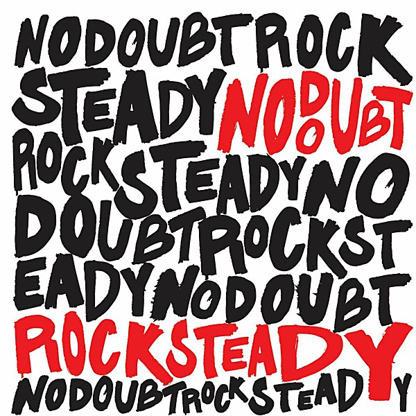

# Rock Steady

By **No Doubt**

## Album Data

- **Catalog:** Beets
- **Format:** Digital, Album
- **Album:** Rock Steady
- **Artist:** No Doubt
- **Albumartist:** No Doubt
- **Genre:** Ska
- **MusicBrainz Album Artist ID:** [fbd2a255-1d57-4d31-ac11-65b671c19958](https://musicbrainz.org/artist/fbd2a255-1d57-4d31-ac11-65b671c19958)
- **MusicBrainz Album ID:** [0de8efff-e99a-410e-9062-71fd6a63c3f1](https://musicbrainz.org/release/0de8efff-e99a-410e-9062-71fd6a63c3f1)
- **MusicBrainz Release Group ID:** [578bcf09-58af-3eb0-baf6-0f7e836efbd7](https://musicbrainz.org/release-group/578bcf09-58af-3eb0-baf6-0f7e836efbd7)
- **Year:** 2001
- **Catalog #:** BS#03
- **Label:** Beacon Street Records
- **Total Tracks:** 10

## Album Tracks

### Track 01 - Open the Gate

- **Artist:** No Doubt
- **Format:** ALAC
- **Genre:** Ska Punk
- **Length:** 3:40
- **MusicBrainz Track ID:** [c440c1e3-3684-412c-a08f-60bc0b667079](https://musicbrainz.org/recording/c440c1e3-3684-412c-a08f-60bc0b667079)
- **Title:** Open the Gate
- **Track:** 01
- **Year:** 1995

### Track 02 - Blue in the Face

- **Artist:** No Doubt
- **Format:** ALAC
- **Genre:** Ska Punk
- **Length:** 4:35
- **MusicBrainz Track ID:** [735b9730-2863-4c0b-8dd3-b279243cb358](https://musicbrainz.org/recording/735b9730-2863-4c0b-8dd3-b279243cb358)
- **Title:** Blue in the Face
- **Track:** 02
- **Year:** 1995

### Track 03 - Total Hate ’95

- **Artist:** No Doubt
- **Format:** ALAC
- **Genre:** Ska Punk
- **Length:** 3:18
- **MusicBrainz Track ID:** [48ac063c-a0c4-402b-8b4c-67198b1c35bc](https://musicbrainz.org/recording/48ac063c-a0c4-402b-8b4c-67198b1c35bc)
- **Title:** Total Hate ’95
- **Track:** 03
- **Year:** 1995

### Track 04 - Stricken

- **Artist:** No Doubt
- **Format:** ALAC
- **Genre:** Ska Punk
- **Length:** 4:06
- **MusicBrainz Track ID:** [1167934d-90c2-4a9f-a956-9dc388819f26](https://musicbrainz.org/recording/1167934d-90c2-4a9f-a956-9dc388819f26)
- **Title:** Stricken
- **Track:** 04
- **Year:** 1995

### Track 05 - Greener Pastures

- **Artist:** No Doubt
- **Format:** ALAC
- **Genre:** Ska Punk
- **Length:** 5:05
- **MusicBrainz Track ID:** [741659a1-da90-4849-8fa2-0346626f85b0](https://musicbrainz.org/recording/741659a1-da90-4849-8fa2-0346626f85b0)
- **Title:** Greener Pastures
- **Track:** 05
- **Year:** 1995

### Track 06 - By the Way

- **Artist:** No Doubt
- **Format:** ALAC
- **Genre:** Ska
- **Length:** 4:29
- **MusicBrainz Track ID:** [c89e021f-8ea4-4c57-8893-7c3dbe2a5417](https://musicbrainz.org/recording/c89e021f-8ea4-4c57-8893-7c3dbe2a5417)
- **Title:** By the Way
- **Track:** 06
- **Year:** 1995

### Track 07 - Snakes

- **Artist:** No Doubt
- **Format:** ALAC
- **Genre:** Ska
- **Length:** 4:37
- **MusicBrainz Track ID:** [0080f12b-67b5-4996-bb5b-093d7bee17d1](https://musicbrainz.org/recording/0080f12b-67b5-4996-bb5b-093d7bee17d1)
- **Title:** Snakes
- **Track:** 07
- **Year:** 1995

### Track 08 - That’s Just Me

- **Artist:** No Doubt
- **Format:** ALAC
- **Genre:** Ska Punk
- **Length:** 4:08
- **MusicBrainz Track ID:** [9c6eb807-1eaf-45f3-85c8-9d4f755d2dbf](https://musicbrainz.org/recording/9c6eb807-1eaf-45f3-85c8-9d4f755d2dbf)
- **Title:** That’s Just Me
- **Track:** 08
- **Year:** 1995

### Track 09 - Squeal

- **Artist:** No Doubt
- **Format:** ALAC
- **Genre:** Ska Punk
- **Length:** 2:38
- **MusicBrainz Track ID:** [b9a4597a-86e9-4a42-b513-dcf41c95d69f](https://musicbrainz.org/recording/b9a4597a-86e9-4a42-b513-dcf41c95d69f)
- **Title:** Squeal
- **Track:** 09
- **Year:** 1995

### Track 10 - Doghouse

- **Artist:** No Doubt
- **Format:** ALAC
- **Genre:** Ska Punk
- **Length:** 4:26
- **MusicBrainz Track ID:** [726525f4-ec7a-482f-ad08-a7743f869a63](https://musicbrainz.org/recording/726525f4-ec7a-482f-ad08-a7743f869a63)
- **Title:** Doghouse
- **Track:** 10
- **Year:** 1995

## See also

- [No Doubt](No_Doubt.md)
- [Push and Shove](Push_and_Shove.md)
- [Return of Saturn](Return_of_Saturn.md)
- [The Beacon Street Collection](The_Beacon_Street_Collection.md)
- [The Singles 1992–2003](The_Singles_1992–2003.md)
- [Tragic Kingdom](Tragic_Kingdom.md)
- [CD: ](../../CD/No_Doubt/No_Doubt.md)
- [CD: Tragic Kingdom](../../CD/No_Doubt/Tragic_Kingdom.md)
- [Roon: Push And Shove (Deluxe)](../../Roon/No_Doubt/Push_And_Shove_Deluxe.md)
- [Roon: Return Of Saturn](../../Roon/No_Doubt/Return_Of_Saturn.md)
- [Roon: Rock Steady (Expanded Edition)](../../Roon/No_Doubt/Rock_Steady_Expanded_Edition.md)
- [Roon: Tragic Kingdom](../../Roon/No_Doubt/Tragic_Kingdom.md)
- [Vinyl: ](../../Vinyl/No_Doubt/No_Doubt.md)
- [Vinyl: Tragic Kingdom](../../Vinyl/No_Doubt/Tragic_Kingdom.md)
