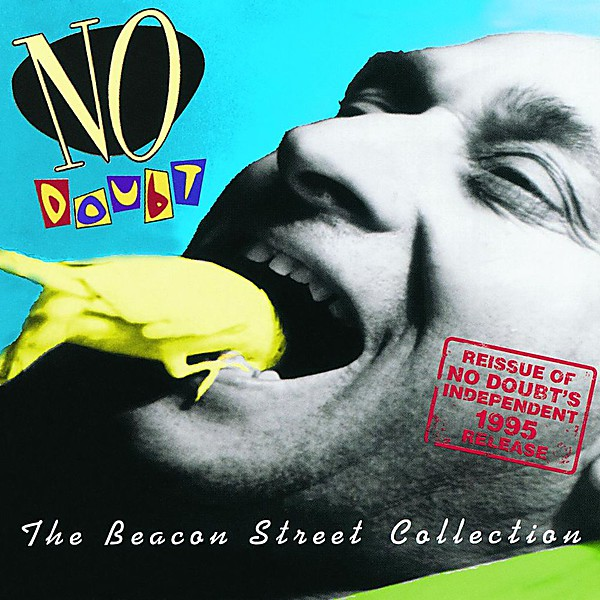

# The Beacon Street Collection

By **No Doubt**

## Album Data

- **Catalog:** Beets
- **Format:** Digital, Album
- **Album:** The Beacon Street Collection
- **Artist:** No Doubt
- **Albumartist:** No Doubt
- **Genre:** Ska Punk
- **MusicBrainz Album Artist ID:** [fbd2a255-1d57-4d31-ac11-65b671c19958](https://musicbrainz.org/artist/fbd2a255-1d57-4d31-ac11-65b671c19958)
- **MusicBrainz Album ID:** [b64eb5cf-ec72-3cf7-b3a7-d663583f40b7](https://musicbrainz.org/release/b64eb5cf-ec72-3cf7-b3a7-d663583f40b7)
- **MusicBrainz Release Group ID:** [99b56fb0-2f53-3a88-94f9-e2a950dab3b5](https://musicbrainz.org/release-group/99b56fb0-2f53-3a88-94f9-e2a950dab3b5)
- **Year:** 1995
- **Catalog #:** B0001495-02
- **Label:** Interscope Records
- **Total Tracks:** 15

## Album Tracks

### Track 01 - Just a Girl

- **Artist:** No Doubt
- **Format:** MP3
- **Genre:** Ska Punk
- **Length:** 3:25
- **MusicBrainz Track ID:** [693e1e1e-04b8-441f-bcaa-5c0c33acdff2](https://musicbrainz.org/recording/693e1e1e-04b8-441f-bcaa-5c0c33acdff2)
- **Title:** Just a Girl
- **Track:** 01
- **Year:** 2003

### Track 02 - It’s My Life

- **Artist:** No Doubt
- **Format:** MP3
- **Genre:** Ska
- **Length:** 3:45
- **MusicBrainz Track ID:** [8c482f02-4204-40d2-8eac-5f5041aa03f9](https://musicbrainz.org/recording/8c482f02-4204-40d2-8eac-5f5041aa03f9)
- **Title:** It’s My Life
- **Track:** 02
- **Year:** 2003

### Track 04 - Bathwater

- **Artist:** No Doubt
- **Format:** MP3
- **Genre:** Ska Punk
- **Length:** 4:00
- **MusicBrainz Track ID:** [60de9f58-423d-4a9d-94e1-9b1d309a9b18](https://musicbrainz.org/recording/60de9f58-423d-4a9d-94e1-9b1d309a9b18)
- **Title:** Bathwater
- **Track:** 04
- **Year:** 2003

### Track 05 - Sunday Morning

- **Artist:** No Doubt
- **Format:** MP3
- **Genre:** Ska Punk
- **Length:** 4:31
- **MusicBrainz Track ID:** [814d0058-998a-4657-9842-a2c7ad2ad3a8](https://musicbrainz.org/recording/814d0058-998a-4657-9842-a2c7ad2ad3a8)
- **Title:** Sunday Morning
- **Track:** 05
- **Year:** 2003

### Track 06 - Hella Good

- **Artist:** No Doubt
- **Format:** MP3
- **Genre:** Ska
- **Length:** 4:02
- **MusicBrainz Track ID:** [2a49142b-4a4b-42a6-943b-7dfa11a241b0](https://musicbrainz.org/recording/2a49142b-4a4b-42a6-943b-7dfa11a241b0)
- **Title:** Hella Good
- **Track:** 06
- **Year:** 2003

### Track 07 - New

- **Artist:** No Doubt
- **Format:** MP3
- **Genre:** Ska Punk
- **Length:** 4:24
- **MusicBrainz Track ID:** [ede14e19-a715-42c9-b7e4-a7343a5303f9](https://musicbrainz.org/recording/ede14e19-a715-42c9-b7e4-a7343a5303f9)
- **Title:** New
- **Track:** 07
- **Year:** 2003

### Track 09 - Excuse Me Mr.

- **Artist:** No Doubt
- **Format:** MP3
- **Genre:** Ska Punk
- **Length:** 3:04
- **MusicBrainz Track ID:** [56973e77-b19e-4a63-a53f-6d4dc4178a4a](https://musicbrainz.org/recording/56973e77-b19e-4a63-a53f-6d4dc4178a4a)
- **Title:** Excuse Me Mr.
- **Track:** 09
- **Year:** 2003

### Track 10 - Running

- **Artist:** No Doubt
- **Format:** MP3
- **Genre:** Ska
- **Length:** 4:00
- **MusicBrainz Track ID:** [a26f532b-a363-406f-bf53-7260d308dfee](https://musicbrainz.org/recording/a26f532b-a363-406f-bf53-7260d308dfee)
- **Title:** Running
- **Track:** 10
- **Year:** 2003

### Track 11 - Spiderwebs

- **Artist:** No Doubt
- **Format:** MP3
- **Genre:** Ska Punk
- **Length:** 4:26
- **MusicBrainz Track ID:** [1712fd13-69b1-47bb-8eba-97211153c061](https://musicbrainz.org/recording/1712fd13-69b1-47bb-8eba-97211153c061)
- **Title:** Spiderwebs
- **Track:** 11
- **Year:** 2003

### Track 12 - Simple Kind of Life

- **Artist:** No Doubt
- **Format:** MP3
- **Genre:** Ska
- **Length:** 4:15
- **MusicBrainz Track ID:** [c5961d32-50ac-4c80-883a-49da9481ef31](https://musicbrainz.org/recording/c5961d32-50ac-4c80-883a-49da9481ef31)
- **Title:** Simple Kind of Life
- **Track:** 12
- **Year:** 2003

### Track 13 - Don’t Speak

- **Artist:** No Doubt
- **Format:** MP3
- **Genre:** Ska
- **Length:** 4:22
- **MusicBrainz Track ID:** [75f82744-5d4d-417c-b276-37dc4c17a98d](https://musicbrainz.org/recording/75f82744-5d4d-417c-b276-37dc4c17a98d)
- **Title:** Don’t Speak
- **Track:** 13
- **Year:** 2003

### Track 14 - Ex‐Girlfriend

- **Artist:** No Doubt
- **Format:** MP3
- **Genre:** Ska Punk
- **Length:** 3:31
- **MusicBrainz Track ID:** [2aafa22b-0b2c-4c60-b7eb-fbd4ac45d4a7](https://musicbrainz.org/recording/2aafa22b-0b2c-4c60-b7eb-fbd4ac45d4a7)
- **Title:** Ex‐Girlfriend
- **Track:** 14
- **Year:** 2003

### Track 15 - Trapped in a Box

- **Artist:** No Doubt
- **Format:** MP3
- **Genre:** Ska Punk
- **Length:** 3:23
- **MusicBrainz Track ID:** [c2a0b467-c37f-4144-9546-30caae5bed51](https://musicbrainz.org/recording/c2a0b467-c37f-4144-9546-30caae5bed51)
- **Title:** Trapped in a Box
- **Track:** 15
- **Year:** 2003

### Track 03 - Hey Baby

- **Artist:** No Doubt feat. Bounty Killer
- **Format:** MP3
- **Genre:** Ska
- **Length:** 3:26
- **MusicBrainz Track ID:** [546f3866-fd6f-449c-8e7e-75adf7bb51cf](https://musicbrainz.org/recording/546f3866-fd6f-449c-8e7e-75adf7bb51cf)
- **Title:** Hey Baby
- **Track:** 03
- **Year:** 2003

### Track 08 - Underneath It All

- **Artist:** No Doubt feat. Lady Saw
- **Format:** MP3
- **Genre:** Ska Punk
- **Length:** 5:01
- **MusicBrainz Track ID:** [3df24577-f3c1-44e0-a888-a47196e8b811](https://musicbrainz.org/recording/3df24577-f3c1-44e0-a888-a47196e8b811)
- **Title:** Underneath It All
- **Track:** 08
- **Year:** 2003

## See also

- [No Doubt](No_Doubt.md)
- [Push and Shove](Push_and_Shove.md)
- [Return of Saturn](Return_of_Saturn.md)
- [Rock Steady](Rock_Steady.md)
- [The Singles 1992–2003](The_Singles_1992–2003.md)
- [Tragic Kingdom](Tragic_Kingdom.md)
- [CD: ](../../CD/No_Doubt/No_Doubt.md)
- [CD: Tragic Kingdom](../../CD/No_Doubt/Tragic_Kingdom.md)
- [Roon: Push And Shove (Deluxe)](../../Roon/No_Doubt/Push_And_Shove_Deluxe.md)
- [Roon: Return Of Saturn](../../Roon/No_Doubt/Return_Of_Saturn.md)
- [Roon: Rock Steady (Expanded Edition)](../../Roon/No_Doubt/Rock_Steady_Expanded_Edition.md)
- [Roon: Tragic Kingdom](../../Roon/No_Doubt/Tragic_Kingdom.md)
- [Vinyl: ](../../Vinyl/No_Doubt/No_Doubt.md)
- [Vinyl: Tragic Kingdom](../../Vinyl/No_Doubt/Tragic_Kingdom.md)
