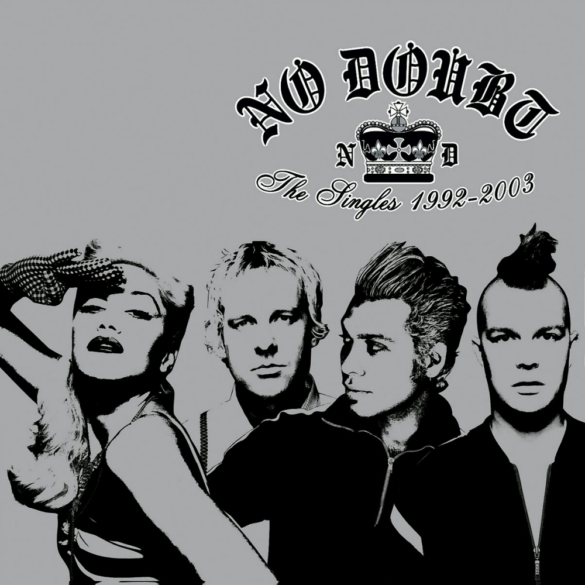

# The Singles 1992–2003

By **No Doubt**

## Album Data

- **Catalog:** Beets
- **Format:** Digital, Album
- **Album:** The Singles 1992–2003
- **Artist:** No Doubt
- **Albumartist:** No Doubt
- **Genre:** Ska
- **MusicBrainz Album Artist ID:** [fbd2a255-1d57-4d31-ac11-65b671c19958](https://musicbrainz.org/artist/fbd2a255-1d57-4d31-ac11-65b671c19958)
- **MusicBrainz Album ID:** [6971fe20-50ac-48bc-aa73-ef12fcde3741](https://musicbrainz.org/release/6971fe20-50ac-48bc-aa73-ef12fcde3741)
- **MusicBrainz Release Group ID:** [f540bfe0-009c-3b11-a23c-d80d6d9aae99](https://musicbrainz.org/release-group/f540bfe0-009c-3b11-a23c-d80d6d9aae99)
- **Year:** 2003
- **Catalog #:** INTD-92580
- **Label:** Trauma Records
- **Total Tracks:** 14

## Album Tracks

### Track 01 - Spiderwebs

- **Artist:** No Doubt
- **Format:** ALAC
- **Genre:** Ska Punk
- **Length:** 4:28
- **MusicBrainz Track ID:** [1712fd13-69b1-47bb-8eba-97211153c061](https://musicbrainz.org/recording/1712fd13-69b1-47bb-8eba-97211153c061)
- **Title:** Spiderwebs
- **Track:** 01
- **Year:** 1995

### Track 02 - Excuse Me Mr.

- **Artist:** No Doubt
- **Format:** ALAC
- **Genre:** Ska Punk
- **Length:** 3:05
- **MusicBrainz Track ID:** [56973e77-b19e-4a63-a53f-6d4dc4178a4a](https://musicbrainz.org/recording/56973e77-b19e-4a63-a53f-6d4dc4178a4a)
- **Title:** Excuse Me Mr.
- **Track:** 02
- **Year:** 1995

### Track 03 - Just a Girl

- **Artist:** No Doubt
- **Format:** ALAC
- **Genre:** Ska Punk
- **Length:** 3:29
- **MusicBrainz Track ID:** [693e1e1e-04b8-441f-bcaa-5c0c33acdff2](https://musicbrainz.org/recording/693e1e1e-04b8-441f-bcaa-5c0c33acdff2)
- **Title:** Just a Girl
- **Track:** 03
- **Year:** 1995

### Track 04 - Happy Now?

- **Artist:** No Doubt
- **Format:** ALAC
- **Genre:** Ska Punk
- **Length:** 3:43
- **MusicBrainz Track ID:** [210990b8-8966-4f0a-ab8f-ad9fd938783a](https://musicbrainz.org/recording/210990b8-8966-4f0a-ab8f-ad9fd938783a)
- **Title:** Happy Now?
- **Track:** 04
- **Year:** 1995

### Track 05 - Different People

- **Artist:** No Doubt
- **Format:** ALAC
- **Genre:** Ska Punk
- **Length:** 4:35
- **MusicBrainz Track ID:** [254a9e3e-11f3-4500-94da-59abbcc49e33](https://musicbrainz.org/recording/254a9e3e-11f3-4500-94da-59abbcc49e33)
- **Title:** Different People
- **Track:** 05
- **Year:** 1995

### Track 06 - Hey You

- **Artist:** No Doubt
- **Format:** ALAC
- **Genre:** Ska Punk
- **Length:** 3:34
- **MusicBrainz Track ID:** [ff4623c5-15f3-4730-8f4b-105ee5241fec](https://musicbrainz.org/recording/ff4623c5-15f3-4730-8f4b-105ee5241fec)
- **Title:** Hey You
- **Track:** 06
- **Year:** 1995

### Track 07 - The Climb

- **Artist:** No Doubt
- **Format:** ALAC
- **Genre:** Ska Punk
- **Length:** 6:38
- **MusicBrainz Track ID:** [a5ba0a92-902f-4b78-9590-3f5a899ecc33](https://musicbrainz.org/recording/a5ba0a92-902f-4b78-9590-3f5a899ecc33)
- **Title:** The Climb
- **Track:** 07
- **Year:** 1995

### Track 08 - Sixteen

- **Artist:** No Doubt
- **Format:** ALAC
- **Genre:** Ska Punk
- **Length:** 3:22
- **MusicBrainz Track ID:** [9b733049-855c-48a6-93e8-131cd002a6a4](https://musicbrainz.org/recording/9b733049-855c-48a6-93e8-131cd002a6a4)
- **Title:** Sixteen
- **Track:** 08
- **Year:** 1995

### Track 09 - Sunday Morning

- **Artist:** No Doubt
- **Format:** ALAC
- **Genre:** Ska Punk
- **Length:** 4:33
- **MusicBrainz Track ID:** [814d0058-998a-4657-9842-a2c7ad2ad3a8](https://musicbrainz.org/recording/814d0058-998a-4657-9842-a2c7ad2ad3a8)
- **Title:** Sunday Morning
- **Track:** 09
- **Year:** 1995

### Track 10 - Don’t Speak

- **Artist:** No Doubt
- **Format:** ALAC
- **Genre:** Ska Punk
- **Length:** 4:23
- **MusicBrainz Track ID:** [75f82744-5d4d-417c-b276-37dc4c17a98d](https://musicbrainz.org/recording/75f82744-5d4d-417c-b276-37dc4c17a98d)
- **Title:** Don’t Speak
- **Track:** 10
- **Year:** 1995

### Track 11 - You Can Do It

- **Artist:** No Doubt
- **Format:** ALAC
- **Genre:** Ska Punk
- **Length:** 4:14
- **MusicBrainz Track ID:** [154c88a6-8595-4b31-833e-cbdcdc71cf1d](https://musicbrainz.org/recording/154c88a6-8595-4b31-833e-cbdcdc71cf1d)
- **Title:** You Can Do It
- **Track:** 11
- **Year:** 1995

### Track 12 - World Go ’Round

- **Artist:** No Doubt
- **Format:** ALAC
- **Genre:** Ska Punk
- **Length:** 4:09
- **MusicBrainz Track ID:** [731f5378-06a5-4a6f-bb4c-1b0cae008489](https://musicbrainz.org/recording/731f5378-06a5-4a6f-bb4c-1b0cae008489)
- **Title:** World Go ’Round
- **Track:** 12
- **Year:** 1995

### Track 13 - End It on This

- **Artist:** No Doubt
- **Format:** ALAC
- **Genre:** Ska Punk
- **Length:** 3:46
- **MusicBrainz Track ID:** [536db395-cefa-4c58-b762-1ce66bb555eb](https://musicbrainz.org/recording/536db395-cefa-4c58-b762-1ce66bb555eb)
- **Title:** End It on This
- **Track:** 13
- **Year:** 1995

### Track 14 - Tragic Kingdom

- **Artist:** No Doubt
- **Format:** ALAC
- **Genre:** Ska Punk
- **Length:** 5:33
- **MusicBrainz Track ID:** [65746365-2318-4907-abe3-83528ec73159](https://musicbrainz.org/recording/65746365-2318-4907-abe3-83528ec73159)
- **Title:** Tragic Kingdom
- **Track:** 14
- **Year:** 1995

## See also

- [No Doubt](No_Doubt.md)
- [Push and Shove](Push_and_Shove.md)
- [Return of Saturn](Return_of_Saturn.md)
- [Rock Steady](Rock_Steady.md)
- [The Beacon Street Collection](The_Beacon_Street_Collection.md)
- [Tragic Kingdom](Tragic_Kingdom.md)
- [CD: ](../../CD/No_Doubt/No_Doubt.md)
- [CD: Tragic Kingdom](../../CD/No_Doubt/Tragic_Kingdom.md)
- [Roon: Push And Shove (Deluxe)](../../Roon/No_Doubt/Push_And_Shove_Deluxe.md)
- [Roon: Return Of Saturn](../../Roon/No_Doubt/Return_Of_Saturn.md)
- [Roon: Rock Steady (Expanded Edition)](../../Roon/No_Doubt/Rock_Steady_Expanded_Edition.md)
- [Roon: Tragic Kingdom](../../Roon/No_Doubt/Tragic_Kingdom.md)
- [Vinyl: ](../../Vinyl/No_Doubt/No_Doubt.md)
- [Vinyl: Tragic Kingdom](../../Vinyl/No_Doubt/Tragic_Kingdom.md)
