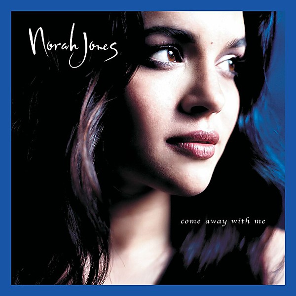

# Come Away With Me

By **Norah Jones**

## Album Data

- **Catalog:** Beets
- **Format:** Digital, Album
- **Album:** Come Away With Me
- **Artist:** Norah Jones
- **Albumartist:** Norah Jones
- **Genre:** Jazz
- **MusicBrainz Album Artist ID:** [985c709c-7771-4de3-9024-7bda29ebe3f9](https://musicbrainz.org/artist/985c709c-7771-4de3-9024-7bda29ebe3f9)
- **MusicBrainz Album ID:** [6cc6cbad-fff3-4e14-ab50-8e23db41137f](https://musicbrainz.org/release/6cc6cbad-fff3-4e14-ab50-8e23db41137f)
- **MusicBrainz Release Group ID:** [6ccac9d2-22ed-33de-bd5d-f2aadcacf7f8](https://musicbrainz.org/release-group/6ccac9d2-22ed-33de-bd5d-f2aadcacf7f8)
- **Year:** 2002
- **Catalog #:** 0946 3 74516 2 5
- **Label:** Blue Note
- **Total Tracks:** 13

## Album Tracks

### Track 01 - Wish I Could

- **Artist:** Norah Jones
- **Format:** ALAC
- **Genre:** Vocal Jazz
- **Length:** 4:18
- **MusicBrainz Track ID:** [0a87b1e1-c533-4605-83fe-d9ade1e7f579](https://musicbrainz.org/recording/0a87b1e1-c533-4605-83fe-d9ade1e7f579)
- **Title:** Wish I Could
- **Track:** 01
- **Year:** 2007

### Track 02 - Sinkin’ Soon

- **Artist:** Norah Jones
- **Format:** ALAC
- **Genre:** Vocal Jazz
- **Length:** 4:38
- **MusicBrainz Track ID:** [a2162e33-d12c-48c2-a5e6-be96cce74d96](https://musicbrainz.org/recording/a2162e33-d12c-48c2-a5e6-be96cce74d96)
- **Title:** Sinkin’ Soon
- **Track:** 02
- **Year:** 2007

### Track 03 - The Sun Doesn’t Like You

- **Artist:** Norah Jones
- **Format:** ALAC
- **Genre:** Vocal Jazz
- **Length:** 2:59
- **MusicBrainz Track ID:** [30007a79-e234-4118-993e-f5bae7b4a457](https://musicbrainz.org/recording/30007a79-e234-4118-993e-f5bae7b4a457)
- **Title:** The Sun Doesn’t Like You
- **Track:** 03
- **Year:** 2007

### Track 04 - Until the End

- **Artist:** Norah Jones
- **Format:** ALAC
- **Genre:** Vocal Jazz
- **Length:** 3:56
- **MusicBrainz Track ID:** [b294897d-ed6d-4987-a910-da03a7d5e221](https://musicbrainz.org/recording/b294897d-ed6d-4987-a910-da03a7d5e221)
- **Title:** Until the End
- **Track:** 04
- **Year:** 2007

### Track 05 - Not My Friend

- **Artist:** Norah Jones
- **Format:** ALAC
- **Genre:** Vocal Jazz
- **Length:** 2:54
- **MusicBrainz Track ID:** [9b13ee29-9ff1-4ed3-8c53-d9e631d09e74](https://musicbrainz.org/recording/9b13ee29-9ff1-4ed3-8c53-d9e631d09e74)
- **Title:** Not My Friend
- **Track:** 05
- **Year:** 2007

### Track 06 - Thinking About You

- **Artist:** Norah Jones
- **Format:** ALAC
- **Genre:** Vocal Jazz
- **Length:** 3:20
- **MusicBrainz Track ID:** [3c17bb29-a951-48af-8b57-5ad96f74dced](https://musicbrainz.org/recording/3c17bb29-a951-48af-8b57-5ad96f74dced)
- **Title:** Thinking About You
- **Track:** 06
- **Year:** 2007

### Track 07 - Broken

- **Artist:** Norah Jones
- **Format:** ALAC
- **Genre:** Vocal Jazz
- **Length:** 3:21
- **MusicBrainz Track ID:** [679e7fdb-b1c3-4950-985d-4d614f1a429e](https://musicbrainz.org/recording/679e7fdb-b1c3-4950-985d-4d614f1a429e)
- **Title:** Broken
- **Track:** 07
- **Year:** 2007

### Track 08 - My Dear Country

- **Artist:** Norah Jones
- **Format:** ALAC
- **Genre:** Vocal Jazz
- **Length:** 3:25
- **MusicBrainz Track ID:** [da1211a5-819e-4977-896d-fbb096ad1f0f](https://musicbrainz.org/recording/da1211a5-819e-4977-896d-fbb096ad1f0f)
- **Title:** My Dear Country
- **Track:** 08
- **Year:** 2007

### Track 09 - Wake Me Up

- **Artist:** Norah Jones
- **Format:** ALAC
- **Genre:** Vocal Jazz
- **Length:** 2:46
- **MusicBrainz Track ID:** [d7862c31-d5da-4446-a9c0-758594a62cc6](https://musicbrainz.org/recording/d7862c31-d5da-4446-a9c0-758594a62cc6)
- **Title:** Wake Me Up
- **Track:** 09
- **Year:** 2007

### Track 10 - Be My Somebody

- **Artist:** Norah Jones
- **Format:** ALAC
- **Genre:** Vocal Jazz
- **Length:** 3:36
- **MusicBrainz Track ID:** [1ffd0fb1-c152-42de-8df5-d8deed884eeb](https://musicbrainz.org/recording/1ffd0fb1-c152-42de-8df5-d8deed884eeb)
- **Title:** Be My Somebody
- **Track:** 10
- **Year:** 2007

### Track 11 - Little Room

- **Artist:** Norah Jones
- **Format:** ALAC
- **Genre:** Vocal Jazz
- **Length:** 2:43
- **MusicBrainz Track ID:** [b274dff2-24ed-4ce6-9888-7f0bdd1d3a3f](https://musicbrainz.org/recording/b274dff2-24ed-4ce6-9888-7f0bdd1d3a3f)
- **Title:** Little Room
- **Track:** 11
- **Year:** 2007

### Track 12 - Rosie’s Lullaby

- **Artist:** Norah Jones
- **Format:** ALAC
- **Genre:** Vocal Jazz
- **Length:** 3:56
- **MusicBrainz Track ID:** [35501767-3aa3-4c3b-9c7e-8ddc0214d028](https://musicbrainz.org/recording/35501767-3aa3-4c3b-9c7e-8ddc0214d028)
- **Title:** Rosie’s Lullaby
- **Track:** 12
- **Year:** 2007

### Track 13 - Not Too Late

- **Artist:** Norah Jones
- **Format:** ALAC
- **Genre:** Vocal Jazz
- **Length:** 3:31
- **MusicBrainz Track ID:** [71a78a61-6d8a-4dee-997e-d91f4a053edc](https://musicbrainz.org/recording/71a78a61-6d8a-4dee-997e-d91f4a053edc)
- **Title:** Not Too Late
- **Track:** 13
- **Year:** 2007

## See also

- [Not Too Late](Not_Too_Late.md)
- [Roon: Come Away With Me](../../Roon/Norah_Jones/Come_Away_With_Me.md)
- [Roon: Day Breaks](../../Roon/Norah_Jones/Day_Breaks.md)
- [Roon: Feels Like Home](../../Roon/Norah_Jones/Feels_Like_Home.md)
- [Roon: Not Too Late](../../Roon/Norah_Jones/Not_Too_Late.md)
- [Roon: Pick Me Up Off The Floor](../../Roon/Norah_Jones/Pick_Me_Up_Off_The_Floor.md)
- [Vinyl: Come Away With Me](../../Vinyl/Norah_Jones/Come_Away_With_Me.md)
- [Vinyl: ](../../Vinyl/Norah_Jones/Norah_Jones.md)
- [Vinyl: Not Too Late](../../Vinyl/Norah_Jones/Not_Too_Late.md)
