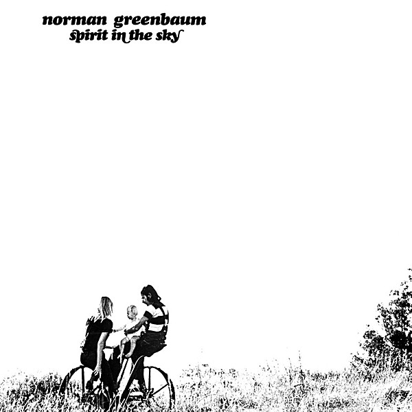

# Spirit in the Sky

By **Norman Greenbaum**

## Album Data

- **Catalog:** Beets
- **Format:** Digital, Album
- **Album:** Spirit in the Sky
- **Artist:** Norman Greenbaum
- **Albumartist:** Norman Greenbaum
- **Genre:** Folk Rock
- **MusicBrainz Album Artist ID:** [8f6ade41-0e4d-477c-9ef7-42591fed1133](https://musicbrainz.org/artist/8f6ade41-0e4d-477c-9ef7-42591fed1133)
- **MusicBrainz Album ID:** [86b5fce4-edcd-4a46-a044-db513511f2e5](https://musicbrainz.org/release/86b5fce4-edcd-4a46-a044-db513511f2e5)
- **MusicBrainz Release Group ID:** [ec530a53-897b-318e-8f0d-c46b2c031875](https://musicbrainz.org/release-group/ec530a53-897b-318e-8f0d-c46b2c031875)
- **Year:** 1969
- **Catalog #:** 
- **Label:** 
- **Total Tracks:** 00

## Album Tracks

### Track 00 - Spirit In The Sky

- **Artist:** Norman Greenbaum
- **Format:** AAC
- **Genre:** Rock
- **Length:** 3:59
- **MusicBrainz Track ID:** 
- **Title:** Spirit In The Sky
- **Track:** 00
- **Year:** 1970

## See also

- [Unknown Album](Unknown_Album.md)
- [Vinyl: ](../../Vinyl/Norman_Greenbaum/Norman_Greenbaum.md)
- [Vinyl: Spirit In The Sky](../../Vinyl/Norman_Greenbaum/Spirit_In_The_Sky.md)
