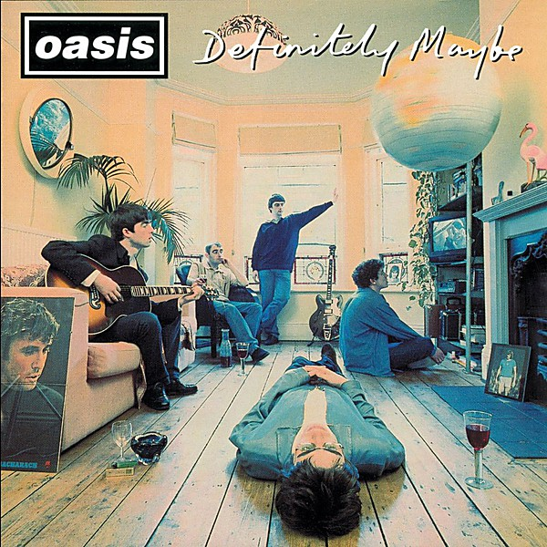

# Definitely Maybe

By **Oasis**

## Album Data

- **Catalog:** Beets
- **Format:** Digital, Album
- **Album:** Definitely Maybe
- **Artist:** Oasis
- **Albumartist:** Oasis
- **Genre:** Britpop
- **MusicBrainz Album Artist ID:** 
- **MusicBrainz Album ID:** 
- **MusicBrainz Release Group ID:** 
- **Year:** 1994
- **Catalog #:** 
- **Label:** 
- **Total Tracks:** 13

## Album Tracks

### Track 01 - Supersonic

- **Artist:** Oasis
- **Format:** ALAC
- **Genre:** Indie Rock
- **Length:** 4:44
- **MusicBrainz Track ID:** 
- **Title:** Supersonic
- **Track:** 01
- **Year:** 1994

### Track 02 - Roll With It

- **Artist:** Oasis
- **Format:** ALAC
- **Genre:** Indie Rock
- **Length:** 3:59
- **MusicBrainz Track ID:** 
- **Title:** Roll With It
- **Track:** 02
- **Year:** 1995

### Track 03 - Live Forever

- **Artist:** Oasis
- **Format:** ALAC
- **Genre:** Indie Rock
- **Length:** 4:36
- **MusicBrainz Track ID:** 
- **Title:** Live Forever
- **Track:** 03
- **Year:** 1994

### Track 04 - Wonderwall

- **Artist:** Oasis
- **Format:** ALAC
- **Genre:** Indie Rock
- **Length:** 4:19
- **MusicBrainz Track ID:** 
- **Title:** Wonderwall
- **Track:** 04
- **Year:** 1995

### Track 05 - Stop Crying Your Heart Out

- **Artist:** Oasis
- **Format:** ALAC
- **Genre:** Indie Rock
- **Length:** 5:02
- **MusicBrainz Track ID:** 
- **Title:** Stop Crying Your Heart Out
- **Track:** 05
- **Year:** 2002

### Track 06 - Cigarettes & Alcohol

- **Artist:** Oasis
- **Format:** ALAC
- **Genre:** Indie Rock
- **Length:** 4:51
- **MusicBrainz Track ID:** 
- **Title:** Cigarettes & Alcohol
- **Track:** 06
- **Year:** 1994

### Track 07 - Songbird

- **Artist:** Oasis
- **Format:** ALAC
- **Genre:** Indie Rock
- **Length:** 2:08
- **MusicBrainz Track ID:** 
- **Title:** Songbird
- **Track:** 07
- **Year:** 2002

### Track 08 - Don't Look Back In Anger

- **Artist:** Oasis
- **Format:** ALAC
- **Genre:** Indie Rock
- **Length:** 4:50
- **MusicBrainz Track ID:** 
- **Title:** Don't Look Back In Anger
- **Track:** 08
- **Year:** 1995

### Track 09 - The Hindu Times

- **Artist:** Oasis
- **Format:** ALAC
- **Genre:** Indie Rock
- **Length:** 3:52
- **MusicBrainz Track ID:** 
- **Title:** The Hindu Times
- **Track:** 09
- **Year:** 2002

### Track 10 - Stand By Me

- **Artist:** Oasis
- **Format:** ALAC
- **Genre:** Indie Rock
- **Length:** 5:59
- **MusicBrainz Track ID:** 
- **Title:** Stand By Me
- **Track:** 10
- **Year:** 1997

### Track 11 - Lord Don't Slow Me Down

- **Artist:** Oasis
- **Format:** ALAC
- **Genre:** Britpop
- **Length:** 3:19
- **MusicBrainz Track ID:** 
- **Title:** Lord Don't Slow Me Down
- **Track:** 11
- **Year:** 2007

### Track 12 - Shakermaker

- **Artist:** Oasis
- **Format:** ALAC
- **Genre:** Indie Rock
- **Length:** 5:10
- **MusicBrainz Track ID:** 
- **Title:** Shakermaker
- **Track:** 12
- **Year:** 1994

### Track 13 - All Around The World

- **Artist:** Oasis
- **Format:** ALAC
- **Genre:** Indie Rock
- **Length:** 9:41
- **MusicBrainz Track ID:** 
- **Title:** All Around The World
- **Track:** 13
- **Year:** 1997

## See also

- [Time Flies... 1994-2009 [Disc 1]](Time_Flies_1994-2009_[Disc_1].md)
- [Time Flies... 1994-2009 [Disc 2]](Time_Flies_1994-2009_[Disc_2].md)
- [(What’s the Story) Morning Glory?](What’s_the_Story_Morning_Glory.md)
