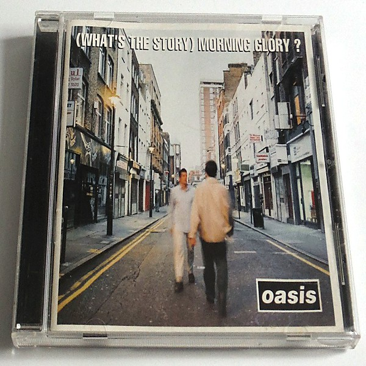

# (What’s the Story) Morning Glory?

By **Oasis**

## Album Data

- **Catalog:** Beets
- **Format:** Digital, Album
- **Album:** (What’s the Story) Morning Glory?
- **Artist:** Oasis
- **Albumartist:** Oasis
- **Genre:** Indie Rock
- **MusicBrainz Album Artist ID:** [39ab1aed-75e0-4140-bd47-540276886b60](https://musicbrainz.org/artist/39ab1aed-75e0-4140-bd47-540276886b60)
- **MusicBrainz Album ID:** [3cac3754-701c-3390-9064-2241f9c22bb6](https://musicbrainz.org/release/3cac3754-701c-3390-9064-2241f9c22bb6)
- **MusicBrainz Release Group ID:** [cc7e6348-cc55-31fa-aeb2-748a46a81cb3](https://musicbrainz.org/release-group/cc7e6348-cc55-31fa-aeb2-748a46a81cb3)
- **Year:** 1995
- **Catalog #:** 
- **Label:** 
- **Total Tracks:** 00

## Album Tracks

### Track 00 - Live Forever

- **Artist:** Oasis
- **Format:** MP3
- **Genre:** Indie Rock
- **Length:** 4:37
- **MusicBrainz Track ID:** 
- **Title:** Live Forever
- **Track:** 00
- **Year:** 1994

### Track 01 - Columbia (White Label Demo)

- **Artist:** Oasis
- **Format:** ALAC
- **Genre:** Indie Rock
- **Length:** 5:28
- **MusicBrainz Track ID:** 
- **Title:** Columbia (White Label Demo)
- **Track:** 01
- **Year:** 2014

### Track 02 - Cigarettes & Alcohol (Demo)

- **Artist:** Oasis
- **Format:** ALAC
- **Genre:** Britpop
- **Length:** 4:37
- **MusicBrainz Track ID:** 
- **Title:** Cigarettes & Alcohol (Demo)
- **Track:** 02
- **Year:** 2014

### Track 03 - Sad Song

- **Artist:** Oasis
- **Format:** ALAC
- **Genre:** Indie Rock
- **Length:** 4:29
- **MusicBrainz Track ID:** 
- **Title:** Sad Song
- **Track:** 03
- **Year:** 2014

### Track 04 - I Will Believe [Live]

- **Artist:** Oasis
- **Format:** ALAC
- **Genre:** Britpop
- **Length:** 3:48
- **MusicBrainz Track ID:** 
- **Title:** I Will Believe [Live]
- **Track:** 04
- **Year:** 2014

### Track 05 - Take Me Away

- **Artist:** Oasis
- **Format:** ALAC
- **Genre:** Britpop
- **Length:** 4:32
- **MusicBrainz Track ID:** 
- **Title:** Take Me Away
- **Track:** 05
- **Year:** 2014

### Track 06 - Alive (Demo)

- **Artist:** Oasis
- **Format:** ALAC
- **Genre:** Rock
- **Length:** 3:58
- **MusicBrainz Track ID:** 
- **Title:** Alive (Demo)
- **Track:** 06
- **Year:** 2014

### Track 07 - D'Yer Wanna Be A Spaceman?

- **Artist:** Oasis
- **Format:** ALAC
- **Genre:** Britpop
- **Length:** 2:41
- **MusicBrainz Track ID:** 
- **Title:** D'Yer Wanna Be A Spaceman?
- **Track:** 07
- **Year:** 2014

### Track 08 - Supersonic [Live]

- **Artist:** Oasis
- **Format:** ALAC
- **Genre:** Britpop
- **Length:** 5:15
- **MusicBrainz Track ID:** 
- **Title:** Supersonic [Live]
- **Track:** 08
- **Year:** 2014

### Track 09 - Up In The Sky (Acoustic)

- **Artist:** Oasis
- **Format:** ALAC
- **Genre:** Britpop
- **Length:** 3:34
- **MusicBrainz Track ID:** 
- **Title:** Up In The Sky (Acoustic)
- **Track:** 09
- **Year:** 2014

### Track 10 - Cloudburst

- **Artist:** Oasis
- **Format:** ALAC
- **Genre:** Indie Rock
- **Length:** 5:23
- **MusicBrainz Track ID:** 
- **Title:** Cloudburst
- **Track:** 10
- **Year:** 2014

### Track 11 - Fade Away

- **Artist:** Oasis
- **Format:** ALAC
- **Genre:** Indie Rock
- **Length:** 4:16
- **MusicBrainz Track ID:** 
- **Title:** Fade Away
- **Track:** 11
- **Year:** 2014

### Track 12 - Listen Up

- **Artist:** Oasis
- **Format:** ALAC
- **Genre:** Indie Rock
- **Length:** 6:42
- **MusicBrainz Track ID:** 
- **Title:** Listen Up
- **Track:** 12
- **Year:** 2014

### Track 13 - I Am The Walrus [Live]

- **Artist:** Oasis
- **Format:** ALAC
- **Genre:** Britpop
- **Length:** 8:18
- **MusicBrainz Track ID:** 
- **Title:** I Am The Walrus [Live]
- **Track:** 13
- **Year:** 2014

### Track 14 - Whatever

- **Artist:** Oasis
- **Format:** ALAC
- **Genre:** Indie Rock
- **Length:** 6:22
- **MusicBrainz Track ID:** 
- **Title:** Whatever
- **Track:** 14
- **Year:** 2014

### Track 15 - (It's Good) To Be Free

- **Artist:** Oasis
- **Format:** ALAC
- **Genre:** Britpop
- **Length:** 4:23
- **MusicBrainz Track ID:** 
- **Title:** (It's Good) To Be Free
- **Track:** 15
- **Year:** 2014

### Track 16 - Half The World Away

- **Artist:** Oasis
- **Format:** ALAC
- **Genre:** Britpop
- **Length:** 4:27
- **MusicBrainz Track ID:** 
- **Title:** Half The World Away
- **Track:** 16
- **Year:** 2014

### Track 01 - Supersonic [Live]

- **Artist:** Oasis
- **Format:** ALAC
- **Genre:** Britpop
- **Length:** 5:31
- **MusicBrainz Track ID:** 
- **Title:** Supersonic [Live]
- **Track:** 01
- **Year:** 2014

### Track 02 - Rock 'n' Roll Star (Demo)

- **Artist:** Oasis
- **Format:** ALAC
- **Genre:** Rock
- **Length:** 5:46
- **MusicBrainz Track ID:** 
- **Title:** Rock 'n' Roll Star (Demo)
- **Track:** 02
- **Year:** 2014

### Track 03 - Shakermaker [Live]

- **Artist:** Oasis
- **Format:** ALAC
- **Genre:** Britpop
- **Length:** 4:05
- **MusicBrainz Track ID:** 
- **Title:** Shakermaker [Live]
- **Track:** 03
- **Year:** 2014

### Track 04 - Columbia (Eden Studios Mix)

- **Artist:** Oasis
- **Format:** ALAC
- **Genre:** Rock
- **Length:** 5:37
- **MusicBrainz Track ID:** 
- **Title:** Columbia (Eden Studios Mix)
- **Track:** 04
- **Year:** 2014

### Track 05 - Cloudburst (Demo)

- **Artist:** Oasis
- **Format:** ALAC
- **Genre:** Rock
- **Length:** 5:10
- **MusicBrainz Track ID:** 
- **Title:** Cloudburst (Demo)
- **Track:** 05
- **Year:** 2014

### Track 06 - Strange Thing (Demo)

- **Artist:** Oasis
- **Format:** ALAC
- **Genre:** Rock
- **Length:** 5:14
- **MusicBrainz Track ID:** 
- **Title:** Strange Thing (Demo)
- **Track:** 06
- **Year:** 2014

### Track 07 - Live Forever [Live]

- **Artist:** Oasis
- **Format:** ALAC
- **Genre:** Britpop
- **Length:** 4:42
- **MusicBrainz Track ID:** 
- **Title:** Live Forever [Live]
- **Track:** 07
- **Year:** 2014

### Track 08 - Cigarettes & Alcohol [Live]

- **Artist:** Oasis
- **Format:** ALAC
- **Genre:** Britpop
- **Length:** 3:58
- **MusicBrainz Track ID:** 
- **Title:** Cigarettes & Alcohol [Live]
- **Track:** 08
- **Year:** 2014

### Track 09 - D'Yer Wanna Be A Spaceman? [Live]

- **Artist:** Oasis
- **Format:** ALAC
- **Genre:** Britpop
- **Length:** 2:46
- **MusicBrainz Track ID:** 
- **Title:** D'Yer Wanna Be A Spaceman? [Live]
- **Track:** 09
- **Year:** 2014

### Track 10 - Fade Away (Demo)

- **Artist:** Oasis
- **Format:** ALAC
- **Genre:** Rock
- **Length:** 4:23
- **MusicBrainz Track ID:** 
- **Title:** Fade Away (Demo)
- **Track:** 10
- **Year:** 2014

### Track 11 - Take Me Away [Live]

- **Artist:** Oasis
- **Format:** ALAC
- **Genre:** Britpop
- **Length:** 4:15
- **MusicBrainz Track ID:** 
- **Title:** Take Me Away [Live]
- **Track:** 11
- **Year:** 2014

### Track 12 - Sad Song [Live]

- **Artist:** Oasis
- **Format:** ALAC
- **Genre:** Britpop
- **Length:** 4:29
- **MusicBrainz Track ID:** 
- **Title:** Sad Song [Live]
- **Track:** 12
- **Year:** 2014

### Track 13 - Half The World Away [Live]

- **Artist:** Oasis
- **Format:** ALAC
- **Genre:** Britpop
- **Length:** 3:53
- **MusicBrainz Track ID:** 
- **Title:** Half The World Away [Live]
- **Track:** 13
- **Year:** 2014

### Track 14 - Digsy's Dinner [Live]

- **Artist:** Oasis
- **Format:** ALAC
- **Genre:** Britpop
- **Length:** 2:36
- **MusicBrainz Track ID:** 
- **Title:** Digsy's Dinner [Live]
- **Track:** 14
- **Year:** 2014

### Track 15 - Married With Children (Demo)

- **Artist:** Oasis
- **Format:** ALAC
- **Genre:** Rock
- **Length:** 3:16
- **MusicBrainz Track ID:** 
- **Title:** Married With Children (Demo)
- **Track:** 15
- **Year:** 2014

### Track 16 - Up In The Sky [Live]

- **Artist:** Oasis
- **Format:** ALAC
- **Genre:** Britpop
- **Length:** 3:19
- **MusicBrainz Track ID:** 
- **Title:** Up In The Sky [Live]
- **Track:** 16
- **Year:** 2014

### Track 17 - Whatever (Strings)

- **Artist:** Oasis
- **Format:** ALAC
- **Genre:** Britpop
- **Length:** 4:53
- **MusicBrainz Track ID:** 
- **Title:** Whatever (Strings)
- **Track:** 17
- **Year:** 2014

## See also

- [Definitely Maybe](Definitely_Maybe.md)
- [Time Flies... 1994-2009 [Disc 1]](Time_Flies_1994-2009_[Disc_1].md)
- [Time Flies... 1994-2009 [Disc 2]](Time_Flies_1994-2009_[Disc_2].md)
