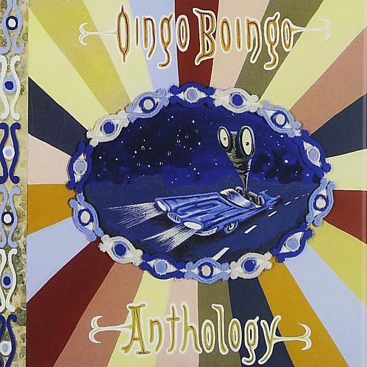

# Anthology

By **Oingo Boingo**

## Album Data

- **Catalog:** Beets
- **Format:** Digital, Album
- **Album:** Anthology
- **Artist:** Oingo Boingo
- **Albumartist:** Oingo Boingo
- **Genre:** New Wave
- **MusicBrainz Album Artist ID:** [166bc1cb-a2b7-412d-bcd5-5f439d2cf5f1](https://musicbrainz.org/artist/166bc1cb-a2b7-412d-bcd5-5f439d2cf5f1)
- **MusicBrainz Album ID:** [03cacf65-59ab-4512-806c-e182067f8d65](https://musicbrainz.org/release/03cacf65-59ab-4512-806c-e182067f8d65)
- **MusicBrainz Release Group ID:** [69ee196b-6016-3cb7-ab28-d272962a39bd](https://musicbrainz.org/release-group/69ee196b-6016-3cb7-ab28-d272962a39bd)
- **Year:** 1999
- **Catalog #:** 069 490 494 2
- **Label:** Hip‐O Records
- **Total Tracks:** 34

## Album Tracks

### Track 14 - Gratitude

- **Artist:** Danny Elfman
- **Format:** ALAC
- **Genre:** Synthpop
- **Length:** 5:14
- **MusicBrainz Track ID:** [4bb666fc-0b28-491b-80d9-656f3b8098b3](https://musicbrainz.org/recording/4bb666fc-0b28-491b-80d9-656f3b8098b3)
- **Title:** Gratitude
- **Track:** 14
- **Year:** 1999

### Track 15 - It Only Makes Me Laugh

- **Artist:** Danny Elfman
- **Format:** ALAC
- **Genre:** Classical
- **Length:** 4:05
- **MusicBrainz Track ID:** [256f63d2-81a5-495f-8faf-ed5f213f7a55](https://musicbrainz.org/recording/256f63d2-81a5-495f-8faf-ed5f213f7a55)
- **Title:** It Only Makes Me Laugh
- **Track:** 15
- **Year:** 1999

### Track 16 - Everybody Needs

- **Artist:** Danny Elfman
- **Format:** ALAC
- **Genre:** Classical
- **Length:** 3:51
- **MusicBrainz Track ID:** [72951eb2-9009-4989-a2cf-ee60cf390d23](https://musicbrainz.org/recording/72951eb2-9009-4989-a2cf-ee60cf390d23)
- **Title:** Everybody Needs
- **Track:** 16
- **Year:** 1999

### Track 01 - Intro-Tender Lumplings (live)

- **Artist:** Oingo Boingo
- **Format:** ALAC
- **Genre:** New Wave
- **Length:** 0:47
- **MusicBrainz Track ID:** [b61fb0b0-f8fe-4e9b-a342-3ca96af87f3a](https://musicbrainz.org/recording/b61fb0b0-f8fe-4e9b-a342-3ca96af87f3a)
- **Title:** Intro-Tender Lumplings (live)
- **Track:** 01
- **Year:** 1999

### Track 02 - Ain't This the Life

- **Artist:** Oingo Boingo
- **Format:** ALAC
- **Genre:** Ska
- **Length:** 3:38
- **MusicBrainz Track ID:** [19856ded-4d77-4b10-b83f-ff3338f76de4](https://musicbrainz.org/recording/19856ded-4d77-4b10-b83f-ff3338f76de4)
- **Title:** Ain't This the Life
- **Track:** 02
- **Year:** 1999

### Track 03 - Nasty Habits

- **Artist:** Oingo Boingo
- **Format:** ALAC
- **Genre:** Ska
- **Length:** 4:08
- **MusicBrainz Track ID:** [58cdb51b-8f29-4767-93f9-1dd03caf1376](https://musicbrainz.org/recording/58cdb51b-8f29-4767-93f9-1dd03caf1376)
- **Title:** Nasty Habits
- **Track:** 03
- **Year:** 1999

### Track 04 - On the Outside

- **Artist:** Oingo Boingo
- **Format:** ALAC
- **Genre:** New Wave
- **Length:** 3:51
- **MusicBrainz Track ID:** [049f0523-fc7a-43dd-ab06-8b34a3e1d06f](https://musicbrainz.org/recording/049f0523-fc7a-43dd-ab06-8b34a3e1d06f)
- **Title:** On the Outside
- **Track:** 04
- **Year:** 1999

### Track 05 - Only a Lad

- **Artist:** Oingo Boingo
- **Format:** ALAC
- **Genre:** New Wave
- **Length:** 3:57
- **MusicBrainz Track ID:** [5c407498-af0b-4c28-9dee-ae85703dca37](https://musicbrainz.org/recording/5c407498-af0b-4c28-9dee-ae85703dca37)
- **Title:** Only a Lad
- **Track:** 05
- **Year:** 1999

### Track 06 - Little Girls

- **Artist:** Oingo Boingo
- **Format:** ALAC
- **Genre:** New Wave
- **Length:** 3:36
- **MusicBrainz Track ID:** [b85c1c84-92b1-4921-a71d-964424baaf9a](https://musicbrainz.org/recording/b85c1c84-92b1-4921-a71d-964424baaf9a)
- **Title:** Little Girls
- **Track:** 06
- **Year:** 1999

### Track 07 - Grey Matter

- **Artist:** Oingo Boingo
- **Format:** ALAC
- **Genre:** Post-Punk
- **Length:** 5:52
- **MusicBrainz Track ID:** [429032e6-fd07-4cbb-bd8b-5225f93808cb](https://musicbrainz.org/recording/429032e6-fd07-4cbb-bd8b-5225f93808cb)
- **Title:** Grey Matter
- **Track:** 07
- **Year:** 1999

### Track 08 - Wild Sex (In the Working Class)

- **Artist:** Oingo Boingo
- **Format:** ALAC
- **Genre:** New Wave
- **Length:** 4:08
- **MusicBrainz Track ID:** [de7013cf-6a78-41ef-9bf5-3758052b620c](https://musicbrainz.org/recording/de7013cf-6a78-41ef-9bf5-3758052b620c)
- **Title:** Wild Sex (In the Working Class)
- **Track:** 08
- **Year:** 1999

### Track 09 - Private Life

- **Artist:** Oingo Boingo
- **Format:** ALAC
- **Genre:** Punk Rock
- **Length:** 3:17
- **MusicBrainz Track ID:** [0bb5a4ac-e642-4e4e-b41c-d1bba39e4b77](https://musicbrainz.org/recording/0bb5a4ac-e642-4e4e-b41c-d1bba39e4b77)
- **Title:** Private Life
- **Track:** 09
- **Year:** 1999

### Track 10 - No Spill Blood

- **Artist:** Oingo Boingo
- **Format:** ALAC
- **Genre:** New Wave
- **Length:** 3:41
- **MusicBrainz Track ID:** [ebb7894b-5d41-47b9-a3d4-cfeeea9470fd](https://musicbrainz.org/recording/ebb7894b-5d41-47b9-a3d4-cfeeea9470fd)
- **Title:** No Spill Blood
- **Track:** 10
- **Year:** 1999

### Track 11 - Nothing Bad Ever Happens to Me

- **Artist:** Oingo Boingo
- **Format:** ALAC
- **Genre:** New Wave
- **Length:** 3:43
- **MusicBrainz Track ID:** [b04c1303-51ba-47de-8b0c-9906da4a3c18](https://musicbrainz.org/recording/b04c1303-51ba-47de-8b0c-9906da4a3c18)
- **Title:** Nothing Bad Ever Happens to Me
- **Track:** 11
- **Year:** 1999

### Track 12 - Sweat

- **Artist:** Oingo Boingo
- **Format:** ALAC
- **Genre:** New Wave
- **Length:** 4:48
- **MusicBrainz Track ID:** [02eeb954-6a59-4b75-bdec-f48fd0d9ce1f](https://musicbrainz.org/recording/02eeb954-6a59-4b75-bdec-f48fd0d9ce1f)
- **Title:** Sweat
- **Track:** 12
- **Year:** 1999

### Track 13 - Who Do You Want to Be

- **Artist:** Oingo Boingo
- **Format:** ALAC
- **Genre:** Ska
- **Length:** 3:33
- **MusicBrainz Track ID:** [22118fb2-1696-4dd7-832b-ebff86dc9ed5](https://musicbrainz.org/recording/22118fb2-1696-4dd7-832b-ebff86dc9ed5)
- **Title:** Who Do You Want to Be
- **Track:** 13
- **Year:** 1999

### Track 17 - Dead Man's Party

- **Artist:** Oingo Boingo
- **Format:** ALAC
- **Genre:** New Wave
- **Length:** 6:20
- **MusicBrainz Track ID:** [18729faf-50e2-4217-b473-e96d518e7496](https://musicbrainz.org/recording/18729faf-50e2-4217-b473-e96d518e7496)
- **Title:** Dead Man's Party
- **Track:** 17
- **Year:** 1999

### Track 18 - Weird Science

- **Artist:** Oingo Boingo
- **Format:** ALAC
- **Genre:** New Wave
- **Length:** 6:12
- **MusicBrainz Track ID:** [4a3efd28-9a78-4330-ba12-dbbd6eb82bdb](https://musicbrainz.org/recording/4a3efd28-9a78-4330-ba12-dbbd6eb82bdb)
- **Title:** Weird Science
- **Track:** 18
- **Year:** 1999

### Track 19 - Just Another Day

- **Artist:** Oingo Boingo
- **Format:** ALAC
- **Genre:** New Wave
- **Length:** 5:14
- **MusicBrainz Track ID:** [ea06dfa1-d757-4cb3-b1cc-aa5ae28c6ad1](https://musicbrainz.org/recording/ea06dfa1-d757-4cb3-b1cc-aa5ae28c6ad1)
- **Title:** Just Another Day
- **Track:** 19
- **Year:** 1999

### Track 20 - Stay

- **Artist:** Oingo Boingo
- **Format:** ALAC
- **Genre:** New Wave
- **Length:** 3:36
- **MusicBrainz Track ID:** [6c6aef57-1f55-4d90-b4f3-85ceda21b378](https://musicbrainz.org/recording/6c6aef57-1f55-4d90-b4f3-85ceda21b378)
- **Title:** Stay
- **Track:** 20
- **Year:** 1999

### Track 21 - Not My Slave

- **Artist:** Oingo Boingo
- **Format:** ALAC
- **Genre:** New Wave
- **Length:** 4:42
- **MusicBrainz Track ID:** [53170093-a384-402a-96a4-404c912c8429](https://musicbrainz.org/recording/53170093-a384-402a-96a4-404c912c8429)
- **Title:** Not My Slave
- **Track:** 21
- **Year:** 1999

### Track 22 - Where Do All My Friends Go

- **Artist:** Oingo Boingo
- **Format:** ALAC
- **Genre:** New Wave
- **Length:** 4:29
- **MusicBrainz Track ID:** [fcfb8d74-52af-4d5f-a1e4-1743985b673b](https://musicbrainz.org/recording/fcfb8d74-52af-4d5f-a1e4-1743985b673b)
- **Title:** Where Do All My Friends Go
- **Track:** 22
- **Year:** 1999

### Track 23 - Mama

- **Artist:** Oingo Boingo
- **Format:** ALAC
- **Genre:** New Wave
- **Length:** 4:48
- **MusicBrainz Track ID:** [816f5e53-54a0-44e4-98e8-f5a233acc9db](https://musicbrainz.org/recording/816f5e53-54a0-44e4-98e8-f5a233acc9db)
- **Title:** Mama
- **Track:** 23
- **Year:** 1999

### Track 24 - Cinderella Undercover

- **Artist:** Oingo Boingo
- **Format:** ALAC
- **Genre:** New Wave
- **Length:** 4:37
- **MusicBrainz Track ID:** [caf74741-e59e-4e0a-b498-8292ab57fcdb](https://musicbrainz.org/recording/caf74741-e59e-4e0a-b498-8292ab57fcdb)
- **Title:** Cinderella Undercover
- **Track:** 24
- **Year:** 1999

### Track 25 - Flesh 'n' Blood

- **Artist:** Oingo Boingo
- **Format:** ALAC
- **Genre:** New Wave
- **Length:** 4:17
- **MusicBrainz Track ID:** [635a3073-0333-435e-8649-4f509dc27321](https://musicbrainz.org/recording/635a3073-0333-435e-8649-4f509dc27321)
- **Title:** Flesh 'n' Blood
- **Track:** 25
- **Year:** 1999

### Track 26 - When the Lights Go Out

- **Artist:** Oingo Boingo
- **Format:** ALAC
- **Genre:** New Wave
- **Length:** 4:10
- **MusicBrainz Track ID:** [1a54ae64-728a-4c5f-b1ab-44feb6c3eba9](https://musicbrainz.org/recording/1a54ae64-728a-4c5f-b1ab-44feb6c3eba9)
- **Title:** When the Lights Go Out
- **Track:** 26
- **Year:** 1999

### Track 27 - Out of Control

- **Artist:** Oingo Boingo
- **Format:** ALAC
- **Genre:** New Wave
- **Length:** 4:09
- **MusicBrainz Track ID:** [39a220db-e3af-44d0-895d-bb1fac5af86a](https://musicbrainz.org/recording/39a220db-e3af-44d0-895d-bb1fac5af86a)
- **Title:** Out of Control
- **Track:** 27
- **Year:** 1999

### Track 28 - Insanity (medium version)

- **Artist:** Oingo Boingo
- **Format:** ALAC
- **Genre:** New Wave
- **Length:** 4:56
- **MusicBrainz Track ID:** [b975f0c6-438e-4070-99f5-c520e10a2c5e](https://musicbrainz.org/recording/b975f0c6-438e-4070-99f5-c520e10a2c5e)
- **Title:** Insanity (medium version)
- **Track:** 28
- **Year:** 1999

### Track 29 - Mary

- **Artist:** Oingo Boingo
- **Format:** ALAC
- **Genre:** New Wave
- **Length:** 6:26
- **MusicBrainz Track ID:** [cfc5980a-68dc-4195-a973-b2c780375fec](https://musicbrainz.org/recording/cfc5980a-68dc-4195-a973-b2c780375fec)
- **Title:** Mary
- **Track:** 29
- **Year:** 1999

### Track 30 - We Close Our Eyes (live)

- **Artist:** Oingo Boingo
- **Format:** ALAC
- **Genre:** New Wave
- **Length:** 4:41
- **MusicBrainz Track ID:** [a7fda7b7-8c83-4058-8f80-79ee9eabee0f](https://musicbrainz.org/recording/a7fda7b7-8c83-4058-8f80-79ee9eabee0f)
- **Title:** We Close Our Eyes (live)
- **Track:** 30
- **Year:** 1999

### Track 31 - Whole Day Off (live)

- **Artist:** Oingo Boingo
- **Format:** ALAC
- **Genre:** New Wave
- **Length:** 4:37
- **MusicBrainz Track ID:** [32569d57-efa2-4d3a-a302-1932ce59fae7](https://musicbrainz.org/recording/32569d57-efa2-4d3a-a302-1932ce59fae7)
- **Title:** Whole Day Off (live)
- **Track:** 31
- **Year:** 1999

### Track 32 - Piggies (live)

- **Artist:** Oingo Boingo
- **Format:** ALAC
- **Genre:** New Wave
- **Length:** 6:54
- **MusicBrainz Track ID:** [8e8a34f8-278c-4c1b-820c-e9b3e4853e9a](https://musicbrainz.org/recording/8e8a34f8-278c-4c1b-820c-e9b3e4853e9a)
- **Title:** Piggies (live)
- **Track:** 32
- **Year:** 1999

### Track 33 - Insects (live)

- **Artist:** Oingo Boingo
- **Format:** ALAC
- **Genre:** New Wave
- **Length:** 3:25
- **MusicBrainz Track ID:** [98c02246-cc0e-480f-b634-f99865eefaaa](https://musicbrainz.org/recording/98c02246-cc0e-480f-b634-f99865eefaaa)
- **Title:** Insects (live)
- **Track:** 33
- **Year:** 1999

### Track 34 - Goodbye, Goodbye

- **Artist:** Oingo Boingo
- **Format:** ALAC
- **Genre:** Rockabilly
- **Length:** 3:30
- **MusicBrainz Track ID:** [3b2f75a9-92d5-4fc5-b253-00a135d0ce1d](https://musicbrainz.org/recording/3b2f75a9-92d5-4fc5-b253-00a135d0ce1d)
- **Title:** Goodbye, Goodbye
- **Track:** 34
- **Year:** 1999

