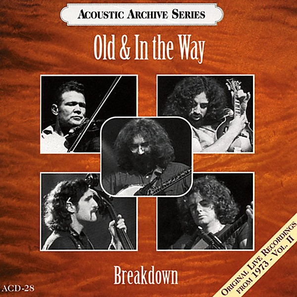

# Old & In the Way

By **Old & In the Way**

## Album Data

- **Catalog:** Beets
- **Format:** Digital, Album
- **Album:** Old & In the Way
- **Artist:** Old & In The Way
- **Albumartist:** Old & In the Way
- **Genre:** Bluegrass
- **MusicBrainz Album Artist ID:** [e3a2d328-2dbb-45d7-b9b5-548c7804f04f](https://musicbrainz.org/artist/e3a2d328-2dbb-45d7-b9b5-548c7804f04f)
- **MusicBrainz Album ID:** [5867cea3-59a3-37c8-b772-082de4200aa5](https://musicbrainz.org/release/5867cea3-59a3-37c8-b772-082de4200aa5)
- **MusicBrainz Release Group ID:** [0ac063d0-5c82-3a92-b10c-aaff9732edcd](https://musicbrainz.org/release-group/0ac063d0-5c82-3a92-b10c-aaff9732edcd)
- **Year:** 1985
- **Catalog #:** SHCD 3746
- **Label:** Sugar Hill Records
- **Total Tracks:** 10

## Album Tracks

### Track 01 - Pig in a Pen

- **Artist:** Old & In the Way
- **Format:** ALAC
- **Genre:** Bluegrass
- **Length:** 2:51
- **MusicBrainz Track ID:** [a6cb3783-4690-4f1d-b737-8a689cacd601](https://musicbrainz.org/recording/a6cb3783-4690-4f1d-b737-8a689cacd601)
- **Title:** Pig in a Pen
- **Track:** 01
- **Year:** 1985

### Track 02 - Midnight Moonlight

- **Artist:** Old & In the Way
- **Format:** ALAC
- **Genre:** Bluegrass
- **Length:** 6:12
- **MusicBrainz Track ID:** [3cb18318-836d-4bcc-95cc-07891ebd48cd](https://musicbrainz.org/recording/3cb18318-836d-4bcc-95cc-07891ebd48cd)
- **Title:** Midnight Moonlight
- **Track:** 02
- **Year:** 1985

### Track 03 - Old and in the Way

- **Artist:** Old & In the Way
- **Format:** ALAC
- **Genre:** Bluegrass
- **Length:** 3:06
- **MusicBrainz Track ID:** [3b00fead-3e7c-4d63-a392-75f749b00a84](https://musicbrainz.org/recording/3b00fead-3e7c-4d63-a392-75f749b00a84)
- **Title:** Old and in the Way
- **Track:** 03
- **Year:** 1985

### Track 04 - Knockin' on Your Door

- **Artist:** Old & In the Way
- **Format:** ALAC
- **Genre:** Bluegrass
- **Length:** 3:35
- **MusicBrainz Track ID:** [cb434dfb-6b93-47ba-a55a-5143010c86fa](https://musicbrainz.org/recording/cb434dfb-6b93-47ba-a55a-5143010c86fa)
- **Title:** Knockin' on Your Door
- **Track:** 04
- **Year:** 1985

### Track 05 - The Hobo Song

- **Artist:** Old & In the Way
- **Format:** ALAC
- **Genre:** Bluegrass
- **Length:** 5:10
- **MusicBrainz Track ID:** [56b2ad51-6d93-4bdd-9809-924539670520](https://musicbrainz.org/recording/56b2ad51-6d93-4bdd-9809-924539670520)
- **Title:** The Hobo Song
- **Track:** 05
- **Year:** 1985

### Track 06 - Panama Red

- **Artist:** Old & In the Way
- **Format:** ALAC
- **Genre:** Bluegrass
- **Length:** 2:54
- **MusicBrainz Track ID:** [29604c50-499f-446a-b26f-c467ea771de1](https://musicbrainz.org/recording/29604c50-499f-446a-b26f-c467ea771de1)
- **Title:** Panama Red
- **Track:** 06
- **Year:** 1985

### Track 07 - Wild Horses

- **Artist:** Old & In the Way
- **Format:** ALAC
- **Genre:** Bluegrass
- **Length:** 4:20
- **MusicBrainz Track ID:** [12360e53-42b8-4d46-af44-cb7fe46862ea](https://musicbrainz.org/recording/12360e53-42b8-4d46-af44-cb7fe46862ea)
- **Title:** Wild Horses
- **Track:** 07
- **Year:** 1985

### Track 08 - Kissimmee Kid

- **Artist:** Old & In the Way
- **Format:** ALAC
- **Genre:** Bluegrass
- **Length:** 3:29
- **MusicBrainz Track ID:** [a379f017-9090-4d75-b02a-ce33a782270c](https://musicbrainz.org/recording/a379f017-9090-4d75-b02a-ce33a782270c)
- **Title:** Kissimmee Kid
- **Track:** 08
- **Year:** 1985

### Track 09 - White Dove

- **Artist:** Old & In the Way
- **Format:** ALAC
- **Genre:** Bluegrass
- **Length:** 4:44
- **MusicBrainz Track ID:** [7a4315ec-6fb0-48ef-a16b-dadacc32cf95](https://musicbrainz.org/recording/7a4315ec-6fb0-48ef-a16b-dadacc32cf95)
- **Title:** White Dove
- **Track:** 09
- **Year:** 1985

### Track 10 - Land of the Navajo

- **Artist:** Old & In the Way
- **Format:** ALAC
- **Genre:** Bluegrass
- **Length:** 6:24
- **MusicBrainz Track ID:** [ea7821e2-2ae7-4c30-bd00-a5bc52d80037](https://musicbrainz.org/recording/ea7821e2-2ae7-4c30-bd00-a5bc52d80037)
- **Title:** Land of the Navajo
- **Track:** 10
- **Year:** 1985

