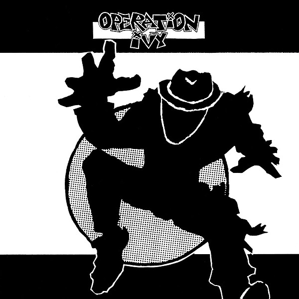

# Operation Ivy

By **Operation Ivy**

## Album Data

- **Catalog:** Beets
- **Format:** Digital, Album
- **Album:** Operation Ivy
- **Artist:** Operation Ivy
- **Albumartist:** Operation Ivy
- **Genre:** Ska Punk
- **MusicBrainz Album Artist ID:** 
- **MusicBrainz Album ID:** 
- **MusicBrainz Release Group ID:** 
- **Year:** 1999
- **Catalog #:** 
- **Label:** Def Jam
- **Total Tracks:** 27

## Album Tracks

### Track 25 - Healthy Body

- **Artist:** Operation Ivy
- **Format:** MP3
- **Genre:** Ska Punk
- **Length:** 1:42
- **MusicBrainz Track ID:** 
- **Title:** Healthy Body
- **Track:** 25
- **Year:** 1999

### Track 26 - Officer

- **Artist:** Operation Ivy
- **Format:** MP3
- **Genre:** Ska Punk
- **Length:** 2:01
- **MusicBrainz Track ID:** 
- **Title:** Officer
- **Track:** 26
- **Year:** 1999

### Track 27 - I Got No

- **Artist:** Operation Ivy
- **Format:** MP3
- **Genre:** Ska Punk
- **Length:** 1:16
- **MusicBrainz Track ID:** 
- **Title:** I Got No
- **Track:** 27
- **Year:** 1999

