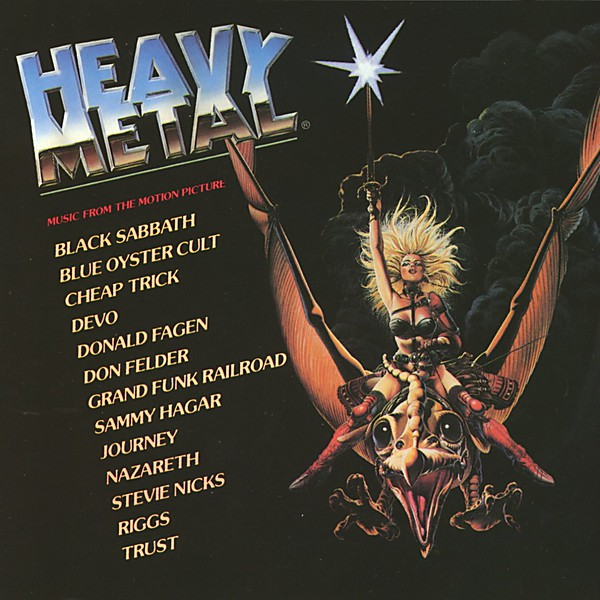

# Heavy Metal

By **Original Soundtrack**

## Album Data

- **Catalog:** Beets
- **Format:** Digital, Album
- **Album:** Heavy Metal
- **Artist:** Original Soundtrack
- **Albumartist:** Original Soundtrack
- **Genre:** Emo
- **MusicBrainz Album Artist ID:** 
- **MusicBrainz Album ID:** 
- **MusicBrainz Release Group ID:** 
- **Year:** 1981
- **Catalog #:** 
- **Label:** 
- **Total Tracks:** 00

## Album Tracks

### Track 09 - What U Lookin' At?

- **Artist:** Uncle Kracker
- **Format:** AAC
- **Genre:** Hip Hop
- **Length:** 5:12
- **MusicBrainz Track ID:** 
- **Title:** What U Lookin' At?
- **Track:** 09
- **Year:** 2000

## See also

- [Cheetah Girls [EP]](Cheetah_Girls_[EP].md)
- [Mission Impossible 2](Mission_Impossible_2.md)
