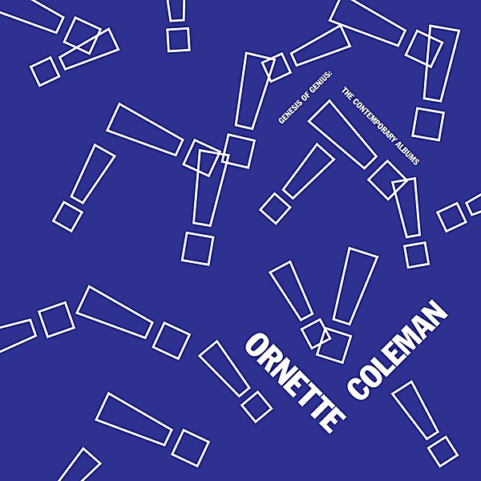

# Tomorrow Is the Question!

By **Ornette Coleman**

## Album Data

- **Catalog:** Beets
- **Format:** Digital, Album
- **Album:** Tomorrow Is the Question!
- **Artist:** Ornette Coleman
- **Albumartist:** Ornette Coleman
- **Genre:** Jazz
- **MusicBrainz Album Artist ID:** [169c0d1b-fcb8-4a43-9097-829aa7b39205](https://musicbrainz.org/artist/169c0d1b-fcb8-4a43-9097-829aa7b39205)
- **MusicBrainz Album ID:** [ee48de7c-9f31-4655-8ad2-6ebc83bee895](https://musicbrainz.org/release/ee48de7c-9f31-4655-8ad2-6ebc83bee895)
- **MusicBrainz Release Group ID:** [97d0eec5-13fb-3c1d-88e1-bc30cc8cf5d0](https://musicbrainz.org/release-group/97d0eec5-13fb-3c1d-88e1-bc30cc8cf5d0)
- **Year:** 1991
- **Catalog #:** 
- **Label:** 
- **Total Tracks:** 09

## Album Tracks

### Track 01 - Tomorrow Is the Question!

- **Artist:** Ornette Coleman
- **Format:** ALAC
- **Genre:** Free Jazz
- **Length:** 3:12
- **MusicBrainz Track ID:** [c954ea58-7fdf-4996-a45c-c96aaaf12cd6](https://musicbrainz.org/recording/c954ea58-7fdf-4996-a45c-c96aaaf12cd6)
- **Title:** Tomorrow Is the Question!
- **Track:** 01
- **Year:** 1991

### Track 02 - Tears Inside

- **Artist:** Ornette Coleman
- **Format:** ALAC
- **Genre:** Free Jazz
- **Length:** 5:04
- **MusicBrainz Track ID:** [a404a132-d59b-4516-9d77-3977f5c36028](https://musicbrainz.org/recording/a404a132-d59b-4516-9d77-3977f5c36028)
- **Title:** Tears Inside
- **Track:** 02
- **Year:** 1991

### Track 03 - Mind and Time

- **Artist:** Ornette Coleman
- **Format:** ALAC
- **Genre:** Hard Bop
- **Length:** 3:11
- **MusicBrainz Track ID:** [7fe6c11e-5bcd-42b0-b20d-81a865165cd4](https://musicbrainz.org/recording/7fe6c11e-5bcd-42b0-b20d-81a865165cd4)
- **Title:** Mind and Time
- **Track:** 03
- **Year:** 1991

### Track 04 - Compassion

- **Artist:** Ornette Coleman
- **Format:** ALAC
- **Genre:** Free Jazz
- **Length:** 4:39
- **MusicBrainz Track ID:** [c81d4919-5fc4-4975-bd76-5d08f78caed1](https://musicbrainz.org/recording/c81d4919-5fc4-4975-bd76-5d08f78caed1)
- **Title:** Compassion
- **Track:** 04
- **Year:** 1991

### Track 05 - Giggin'

- **Artist:** Ornette Coleman
- **Format:** ALAC
- **Genre:** Free Jazz
- **Length:** 3:22
- **MusicBrainz Track ID:** [9bcb59a3-8010-4b7c-975c-b622f321d4ce](https://musicbrainz.org/recording/9bcb59a3-8010-4b7c-975c-b622f321d4ce)
- **Title:** Giggin'
- **Track:** 05
- **Year:** 1991

### Track 06 - Rejoicing

- **Artist:** Ornette Coleman
- **Format:** ALAC
- **Genre:** Free Jazz
- **Length:** 4:03
- **MusicBrainz Track ID:** [c8a132dc-f98e-4cb6-b126-6dc4e654b4bd](https://musicbrainz.org/recording/c8a132dc-f98e-4cb6-b126-6dc4e654b4bd)
- **Title:** Rejoicing
- **Track:** 06
- **Year:** 1991

### Track 07 - Lorraine

- **Artist:** Ornette Coleman
- **Format:** ALAC
- **Genre:** Free Jazz
- **Length:** 5:59
- **MusicBrainz Track ID:** [d0b7d8bd-6684-4f1c-8137-85afae1da416](https://musicbrainz.org/recording/d0b7d8bd-6684-4f1c-8137-85afae1da416)
- **Title:** Lorraine
- **Track:** 07
- **Year:** 1991

### Track 08 - Turnaround

- **Artist:** Ornette Coleman
- **Format:** ALAC
- **Genre:** Free Jazz
- **Length:** 7:58
- **MusicBrainz Track ID:** [4a08c9c0-3437-413f-992d-1d51333de0b8](https://musicbrainz.org/recording/4a08c9c0-3437-413f-992d-1d51333de0b8)
- **Title:** Turnaround
- **Track:** 08
- **Year:** 1991

### Track 09 - Endless

- **Artist:** Ornette Coleman
- **Format:** ALAC
- **Genre:** Free Jazz
- **Length:** 5:17
- **MusicBrainz Track ID:** [e730f0f5-c441-4390-a26a-f1df77a0dc58](https://musicbrainz.org/recording/e730f0f5-c441-4390-a26a-f1df77a0dc58)
- **Title:** Endless
- **Track:** 09
- **Year:** 1991

