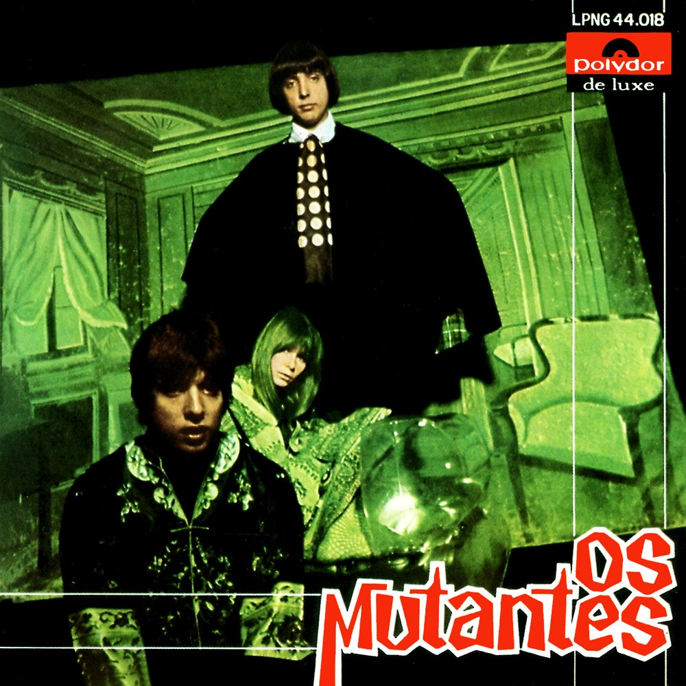

# Os Mutantes

By **Os Mutantes**

## Album Data

- **Catalog:** Beets
- **Format:** Digital, Album
- **Album:** Os Mutantes
- **Artist:** Os Mutantes
- **Albumartist:** Os Mutantes
- **Genre:** Tropicalia
- **MusicBrainz Album Artist ID:** [a3212186-5da5-4e84-a935-6952b3e14921](https://musicbrainz.org/artist/a3212186-5da5-4e84-a935-6952b3e14921)
- **MusicBrainz Album ID:** [e7e214a1-b5c5-319a-8534-4dd5e4b73191](https://musicbrainz.org/release/e7e214a1-b5c5-319a-8534-4dd5e4b73191)
- **MusicBrainz Release Group ID:** [f3578417-4c90-3891-a2cf-d1eab06cc084](https://musicbrainz.org/release-group/f3578417-4c90-3891-a2cf-d1eab06cc084)
- **Year:** 1999
- **Catalog #:** FJORD 001
- **Label:** Omplatten
- **Total Tracks:** 11

## Album Tracks

### Track 01 - Panis et circenses

- **Artist:** Os Mutantes
- **Format:** MP3
- **Genre:** Tropicalia
- **Length:** 3:36
- **MusicBrainz Track ID:** [044beefa-11f4-42aa-ab7b-b15af6f174e4](https://musicbrainz.org/recording/044beefa-11f4-42aa-ab7b-b15af6f174e4)
- **Title:** Panis et circenses
- **Track:** 01
- **Year:** 1999

### Track 02 - A minha menina

- **Artist:** Os Mutantes
- **Format:** MP3
- **Genre:** Tropicalia
- **Length:** 4:41
- **MusicBrainz Track ID:** [0f5e6382-4e62-49f2-a658-b08fc661b879](https://musicbrainz.org/recording/0f5e6382-4e62-49f2-a658-b08fc661b879)
- **Title:** A minha menina
- **Track:** 02
- **Year:** 1999

### Track 03 - O relógio

- **Artist:** Os Mutantes
- **Format:** MP3
- **Genre:** Tropicalia
- **Length:** 3:29
- **MusicBrainz Track ID:** [51d3e365-9725-4371-aad8-0301175e59d7](https://musicbrainz.org/recording/51d3e365-9725-4371-aad8-0301175e59d7)
- **Title:** O relógio
- **Track:** 03
- **Year:** 1999

### Track 04 - Adeus Maria Fulô

- **Artist:** Os Mutantes
- **Format:** MP3
- **Genre:** Tropicalia
- **Length:** 3:04
- **MusicBrainz Track ID:** [884544e9-f194-43eb-8443-2bd4040826e5](https://musicbrainz.org/recording/884544e9-f194-43eb-8443-2bd4040826e5)
- **Title:** Adeus Maria Fulô
- **Track:** 04
- **Year:** 1999

### Track 05 - Baby

- **Artist:** Os Mutantes
- **Format:** MP3
- **Genre:** Tropicalia
- **Length:** 3:00
- **MusicBrainz Track ID:** [30d35628-287d-49f1-b768-136bd1c0d956](https://musicbrainz.org/recording/30d35628-287d-49f1-b768-136bd1c0d956)
- **Title:** Baby
- **Track:** 05
- **Year:** 1999

### Track 06 - Senhor F

- **Artist:** Os Mutantes
- **Format:** MP3
- **Genre:** Tropicalia
- **Length:** 2:33
- **MusicBrainz Track ID:** [21bf7e5f-a616-4b12-a693-5f9c607fb948](https://musicbrainz.org/recording/21bf7e5f-a616-4b12-a693-5f9c607fb948)
- **Title:** Senhor F
- **Track:** 06
- **Year:** 1999

### Track 07 - Bat macumba

- **Artist:** Os Mutantes
- **Format:** MP3
- **Genre:** Tropicalia
- **Length:** 3:08
- **MusicBrainz Track ID:** [fdea0cfc-aa36-4804-97da-23a8c537d29c](https://musicbrainz.org/recording/fdea0cfc-aa36-4804-97da-23a8c537d29c)
- **Title:** Bat macumba
- **Track:** 07
- **Year:** 1999

### Track 08 - Le premier bonheur du jour

- **Artist:** Os Mutantes
- **Format:** MP3
- **Genre:** Tropicalia
- **Length:** 3:35
- **MusicBrainz Track ID:** [c3883b82-df4a-4123-9502-a024dad0aebc](https://musicbrainz.org/recording/c3883b82-df4a-4123-9502-a024dad0aebc)
- **Title:** Le premier bonheur du jour
- **Track:** 08
- **Year:** 1999

### Track 09 - Trem fantasma

- **Artist:** Os Mutantes
- **Format:** MP3
- **Genre:** Tropicalia
- **Length:** 3:15
- **MusicBrainz Track ID:** [a8f6d903-bedf-4c81-9ed9-82bf29718f21](https://musicbrainz.org/recording/a8f6d903-bedf-4c81-9ed9-82bf29718f21)
- **Title:** Trem fantasma
- **Track:** 09
- **Year:** 1999

### Track 10 - Tempo no tempo

- **Artist:** Os Mutantes
- **Format:** MP3
- **Genre:** Tropicalia
- **Length:** 1:46
- **MusicBrainz Track ID:** [cfaa6281-7cf3-4e79-8ed7-df5a0e92489d](https://musicbrainz.org/recording/cfaa6281-7cf3-4e79-8ed7-df5a0e92489d)
- **Title:** Tempo no tempo
- **Track:** 10
- **Year:** 1999

### Track 11 - Ave Gengis Khan

- **Artist:** Os Mutantes
- **Format:** MP3
- **Genre:** Tropicalia
- **Length:** 3:46
- **MusicBrainz Track ID:** [edc1fbf1-c7f7-437c-a4e1-a73dd8eaf90a](https://musicbrainz.org/recording/edc1fbf1-c7f7-437c-a4e1-a73dd8eaf90a)
- **Title:** Ave Gengis Khan
- **Track:** 11
- **Year:** 1999

## See also

- [Roon: Os Mutantes](../../Roon/Os_Mutantes/Os_Mutantes.md)
