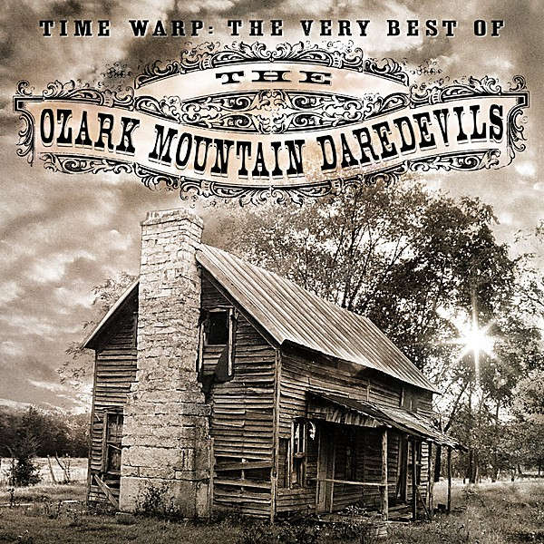

# The Quilt Album

By **Ozark Mountain Daredevils**

## Album Data

- **Catalog:** Beets
- **Format:** Digital, Album
- **Album:** The Quilt Album
- **Artist:** Ozark Mountain Daredevils
- **Albumartist:** Ozark Mountain Daredevils
- **Genre:** Southern Rock
- **MusicBrainz Album Artist ID:** 
- **MusicBrainz Album ID:** 
- **MusicBrainz Release Group ID:** 
- **Year:** 0000
- **Catalog #:** 
- **Label:** 
- **Total Tracks:** 00

## Album Tracks

### Track 03 - If You Wanna Get to Heaven

- **Artist:** Ozark Mountain Daredevils
- **Format:** AAC
- **Genre:** Southern Rock
- **Length:** 3:10
- **MusicBrainz Track ID:** 
- **Title:** If You Wanna Get to Heaven
- **Track:** 03
- **Year:** 0000

### Track 04 - Chicken Train

- **Artist:** Ozark Mountain Daredevils
- **Format:** AAC
- **Genre:** Southern Rock
- **Length:** 3:43
- **MusicBrainz Track ID:** 
- **Title:** Chicken Train
- **Track:** 04
- **Year:** 0000

## See also

- [Roon: It'll Shine When It Shines](../../Roon/Ozark_Mountain_Daredevils/Itll_Shine_When_It_Shines.md)
- [Roon: It's Alive](../../Roon/Ozark_Mountain_Daredevils/Its_Alive.md)
- [Roon: Ozark Mountain Daredevils](../../Roon/Ozark_Mountain_Daredevils/Ozark_Mountain_Daredevils.md)
- [Roon: The Car Over The Lake Album](../../Roon/Ozark_Mountain_Daredevils/The_Car_Over_The_Lake_Album.md)
