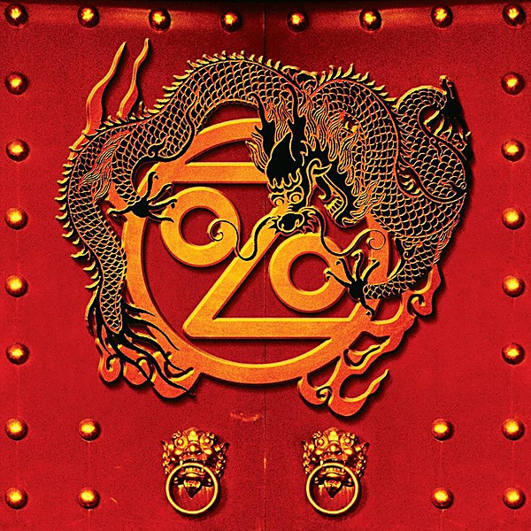

# Don’t Mess With the Dragon

By **Ozomatli**

## Album Data

- **Catalog:** Beets
- **Format:** Digital, Album
- **Album:** Don’t Mess With the Dragon
- **Artist:** Ozomatli
- **Albumartist:** Ozomatli
- **Genre:** Funk
- **MusicBrainz Album Artist ID:** [7e54639b-ee66-4452-a612-918d4c3c73c4](https://musicbrainz.org/artist/7e54639b-ee66-4452-a612-918d4c3c73c4)
- **MusicBrainz Album ID:** [5d60200a-9e9f-4529-ae96-732e90ac0baa](https://musicbrainz.org/release/5d60200a-9e9f-4529-ae96-732e90ac0baa)
- **MusicBrainz Release Group ID:** [51a91120-f68e-3a34-af61-58cff940e304](https://musicbrainz.org/release-group/51a91120-f68e-3a34-af61-58cff940e304)
- **Year:** 2007
- **Catalog #:** 0694931162
- **Label:** Interscope Records
- **Total Tracks:** 11

## Album Tracks

### Track 01 - Pá Lante

- **Artist:** Ozomatli
- **Format:** ALAC
- **Genre:** Funk
- **Length:** 5:05
- **MusicBrainz Track ID:** [1f3e41e3-75ad-4329-8631-a07628f7b14f](https://musicbrainz.org/recording/1f3e41e3-75ad-4329-8631-a07628f7b14f)
- **Title:** Pá Lante
- **Track:** 01
- **Year:** 2001

### Track 05 - Guerrillero

- **Artist:** Ozomatli
- **Format:** ALAC
- **Genre:** World Fusion
- **Length:** 4:31
- **MusicBrainz Track ID:** [907b22f7-eb1c-44df-a5b9-5e2102255671](https://musicbrainz.org/recording/907b22f7-eb1c-44df-a5b9-5e2102255671)
- **Title:** Guerrillero
- **Track:** 05
- **Year:** 2001

### Track 07 - Pensativo (interlude)

- **Artist:** Ozomatli
- **Format:** ALAC
- **Genre:** World Fusion
- **Length:** 2:35
- **MusicBrainz Track ID:** [faf4d0b3-f4d0-4f4c-98c6-bc3da2183b38](https://musicbrainz.org/recording/faf4d0b3-f4d0-4f4c-98c6-bc3da2183b38)
- **Title:** Pensativo (interlude)
- **Track:** 07
- **Year:** 2001

### Track 08 - Timido

- **Artist:** Ozomatli
- **Format:** ALAC
- **Genre:** World Fusion
- **Length:** 5:20
- **MusicBrainz Track ID:** [ec3e4a23-c267-4545-bc62-9fa7bfda2cbc](https://musicbrainz.org/recording/ec3e4a23-c267-4545-bc62-9fa7bfda2cbc)
- **Title:** Timido
- **Track:** 08
- **Year:** 2001

### Track 10 - Mi alma

- **Artist:** Ozomatli
- **Format:** ALAC
- **Genre:** World Fusion
- **Length:** 5:11
- **MusicBrainz Track ID:** [1aa52a51-2340-4f15-99c3-38da9b4c513a](https://musicbrainz.org/recording/1aa52a51-2340-4f15-99c3-38da9b4c513a)
- **Title:** Mi alma
- **Track:** 10
- **Year:** 2001

### Track 11 - Sueños en realidad

- **Artist:** Ozomatli
- **Format:** ALAC
- **Genre:** Funk
- **Length:** 3:21
- **MusicBrainz Track ID:** [74475a5e-6773-4dc2-91ac-3cc16793ab03](https://musicbrainz.org/recording/74475a5e-6773-4dc2-91ac-3cc16793ab03)
- **Title:** Sueños en realidad
- **Track:** 11
- **Year:** 2001

### Track 06 - Embrace the Chaos

- **Artist:** Ozomatli feat. Common
- **Format:** ALAC
- **Genre:** Funk
- **Length:** 4:20
- **MusicBrainz Track ID:** [e032cf87-5461-45a0-b9b5-09d690b9f1fd](https://musicbrainz.org/recording/e032cf87-5461-45a0-b9b5-09d690b9f1fd)
- **Title:** Embrace the Chaos
- **Track:** 06
- **Year:** 2001

### Track 02 - 1234

- **Artist:** Ozomatli feat. De La Soul
- **Format:** ALAC
- **Genre:** Funk
- **Length:** 3:09
- **MusicBrainz Track ID:** [54e4f4f0-4547-45ed-a30d-6803558123ac](https://musicbrainz.org/recording/54e4f4f0-4547-45ed-a30d-6803558123ac)
- **Title:** 1234
- **Track:** 02
- **Year:** 2001

### Track 03 - Dos cosas ciertas

- **Artist:** Ozomatli feat. Kanetic Source
- **Format:** ALAC
- **Genre:** Funk
- **Length:** 3:30
- **MusicBrainz Track ID:** [62e26b23-ffa6-4fd2-84bd-872c106bf894](https://musicbrainz.org/recording/62e26b23-ffa6-4fd2-84bd-872c106bf894)
- **Title:** Dos cosas ciertas
- **Track:** 03
- **Year:** 2001

### Track 04 - Vocal Artillery

- **Artist:** Ozomatli feat. Medusa, will.i.am & Kanetic Source
- **Format:** ALAC
- **Genre:** Funk
- **Length:** 5:01
- **MusicBrainz Track ID:** [04dc22e5-155e-4414-ae45-0235833bc497](https://musicbrainz.org/recording/04dc22e5-155e-4414-ae45-0235833bc497)
- **Title:** Vocal Artillery
- **Track:** 04
- **Year:** 2001

### Track 09 - Lo que dice

- **Artist:** Ozomatli feat. Justin Porée & Kanetic Source
- **Format:** ALAC
- **Genre:** Funk
- **Length:** 3:22
- **MusicBrainz Track ID:** [d0aff175-4aad-49b4-b015-f6357b15e6b6](https://musicbrainz.org/recording/d0aff175-4aad-49b4-b015-f6357b15e6b6)
- **Title:** Lo que dice
- **Track:** 09
- **Year:** 2001

## See also

- [Embrace the Chaos](Embrace_the_Chaos.md)
- [Street Signs](Street_Signs.md)
- [Roon: Don't Mess With The Dragon (Album Version)](../../Roon/Ozomatli/Dont_Mess_With_The_Dragon_Album_Version.md)
- [Roon: Don't Mess With The Dragon (Rhapsody Exclusive)](../../Roon/Ozomatli/Dont_Mess_With_The_Dragon_Rhapsody_Exclusive.md)
- [Roon: Street Signs](../../Roon/Ozomatli/Street_Signs.md)
