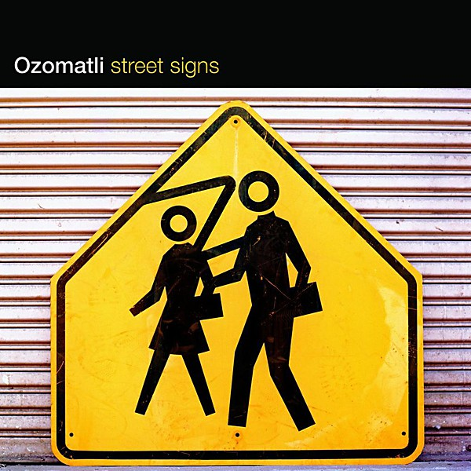

# Street Signs

By **Ozomatli**

## Album Data

- **Catalog:** Beets
- **Format:** Digital, Album
- **Album:** Street Signs
- **Artist:** Ozomatli
- **Albumartist:** Ozomatli
- **Genre:** Latin Pop
- **MusicBrainz Album Artist ID:** 
- **MusicBrainz Album ID:** 
- **MusicBrainz Release Group ID:** 
- **Year:** 2006
- **Catalog #:** 
- **Label:** 
- **Total Tracks:** 13

## Album Tracks

### Track 01 - Believe

- **Artist:** Ozomatli
- **Format:** AAC
- **Genre:** World Fusion
- **Length:** 5:02
- **MusicBrainz Track ID:** 
- **Title:** Believe
- **Track:** 01
- **Year:** 2006

### Track 02 - Love And Hope

- **Artist:** Ozomatli
- **Format:** ALAC
- **Genre:** World Fusion
- **Length:** 4:24
- **MusicBrainz Track ID:** 
- **Title:** Love And Hope
- **Track:** 02
- **Year:** 2006

### Track 03 - Street Signs

- **Artist:** Ozomatli
- **Format:** AAC
- **Genre:** World Fusion
- **Length:** 3:44
- **MusicBrainz Track ID:** 
- **Title:** Street Signs
- **Track:** 03
- **Year:** 2006

### Track 04 - (Who Discovered) America?

- **Artist:** Ozomatli
- **Format:** AAC
- **Genre:** Funk
- **Length:** 4:35
- **MusicBrainz Track ID:** 
- **Title:** (Who Discovered) America?
- **Track:** 04
- **Year:** 2006

### Track 05 - Who's To Blame

- **Artist:** Ozomatli
- **Format:** AAC
- **Genre:** World Fusion
- **Length:** 3:13
- **MusicBrainz Track ID:** 
- **Title:** Who's To Blame
- **Track:** 05
- **Year:** 2006

### Track 06 - Te Estoy Buscando

- **Artist:** Ozomatli
- **Format:** AAC
- **Genre:** World Fusion
- **Length:** 3:50
- **MusicBrainz Track ID:** 
- **Title:** Te Estoy Buscando
- **Track:** 06
- **Year:** 2006

### Track 07 - Saturday Night

- **Artist:** Ozomatli
- **Format:** ALAC
- **Genre:** Funk
- **Length:** 3:59
- **MusicBrainz Track ID:** 
- **Title:** Saturday Night
- **Track:** 07
- **Year:** 2006

### Track 08 - Dejame En Paz

- **Artist:** Ozomatli
- **Format:** AAC
- **Genre:** Ska
- **Length:** 3:28
- **MusicBrainz Track ID:** 
- **Title:** Dejame En Paz
- **Track:** 08
- **Year:** 2006

### Track 08 - Déjame En Paz

- **Artist:** Ozomatli
- **Format:** ALAC
- **Genre:** Ska
- **Length:** 3:29
- **MusicBrainz Track ID:** 
- **Title:** Déjame En Paz
- **Track:** 08
- **Year:** 2004

### Track 09 - Santiago

- **Artist:** Ozomatli
- **Format:** AAC
- **Genre:** World Fusion
- **Length:** 5:10
- **MusicBrainz Track ID:** 
- **Title:** Santiago
- **Track:** 09
- **Year:** 2006

### Track 10 - Ya Viene El Sol [The Beatle Bob Remix]

- **Artist:** Ozomatli
- **Format:** ALAC
- **Genre:** Latin Pop
- **Length:** 3:39
- **MusicBrainz Track ID:** 
- **Title:** Ya Viene El Sol [The Beatle Bob Remix]
- **Track:** 10
- **Year:** 2004

### Track 10 - Ya Viene El Sol

- **Artist:** Ozomatli
- **Format:** AAC
- **Genre:** Latin Pop
- **Length:** 3:38
- **MusicBrainz Track ID:** 
- **Title:** Ya Viene El Sol
- **Track:** 10
- **Year:** 2006

### Track 11 - Dona Isabelle

- **Artist:** Ozomatli
- **Format:** AAC
- **Genre:** Latin Pop
- **Length:** 1:05
- **MusicBrainz Track ID:** 
- **Title:** Dona Isabelle
- **Track:** 11
- **Year:** 2006

### Track 11 - Doña Isabelle

- **Artist:** Ozomatli
- **Format:** ALAC
- **Genre:** Latin Pop
- **Length:** 1:05
- **MusicBrainz Track ID:** 
- **Title:** Doña Isabelle
- **Track:** 11
- **Year:** 2004

### Track 12 - Nadie Te Tira

- **Artist:** Ozomatli
- **Format:** AAC
- **Genre:** World Fusion
- **Length:** 4:47
- **MusicBrainz Track ID:** 
- **Title:** Nadie Te Tira
- **Track:** 12
- **Year:** 2006

### Track 13 - Cuando Canto

- **Artist:** Ozomatli
- **Format:** AAC
- **Genre:** World Fusion
- **Length:** 4:41
- **MusicBrainz Track ID:** 
- **Title:** Cuando Canto
- **Track:** 13
- **Year:** 2006

## See also

- [Don’t Mess With the Dragon](Don’t_Mess_With_the_Dragon.md)
- [Embrace the Chaos](Embrace_the_Chaos.md)
- [Roon: Don't Mess With The Dragon (Album Version)](../../Roon/Ozomatli/Dont_Mess_With_The_Dragon_Album_Version.md)
- [Roon: Don't Mess With The Dragon (Rhapsody Exclusive)](../../Roon/Ozomatli/Dont_Mess_With_The_Dragon_Rhapsody_Exclusive.md)
- [Roon: Street Signs](../../Roon/Ozomatli/Street_Signs.md)
