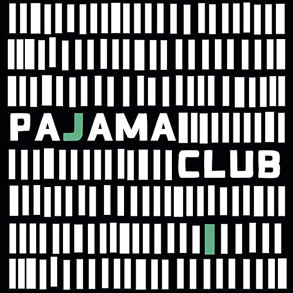

# Pajama Club

By **Pajama Club**

## Album Data

- **Catalog:** Beets
- **Format:** Digital, Album
- **Album:** Pajama Club
- **Artist:** Pajama Club
- **Albumartist:** Pajama Club
- **Genre:** Garage Rock
- **MusicBrainz Album Artist ID:** [3934946e-9a2e-4f32-994f-c3c4cc16e04c](https://musicbrainz.org/artist/3934946e-9a2e-4f32-994f-c3c4cc16e04c)
- **MusicBrainz Album ID:** [f978b310-079e-46f1-a27a-225b76473fe1](https://musicbrainz.org/release/f978b310-079e-46f1-a27a-225b76473fe1)
- **MusicBrainz Release Group ID:** [5ce9059e-fcd8-4aaf-a159-c5aa58a64b4b](https://musicbrainz.org/release-group/5ce9059e-fcd8-4aaf-a159-c5aa58a64b4b)
- **Year:** 2011
- **Catalog #:** LRPJC011CD
- **Label:** Lester
- **Total Tracks:** 11

## Album Tracks

### Track 01 - Tell Me What You Want

- **Artist:** Pajama Club
- **Format:** AAC
- **Genre:** Garage Rock
- **Length:** 3:35
- **MusicBrainz Track ID:** [813ac29f-47dc-494e-adde-6d31b2b950e4](https://musicbrainz.org/recording/813ac29f-47dc-494e-adde-6d31b2b950e4)
- **Title:** Tell Me What You Want
- **Track:** 01
- **Year:** 2011

### Track 02 - Can't Put It Down Until It Ends

- **Artist:** Pajama Club
- **Format:** AAC
- **Genre:** Garage Rock
- **Length:** 3:51
- **MusicBrainz Track ID:** [d840b033-63be-4ffd-8ac1-4087d71a88c2](https://musicbrainz.org/recording/d840b033-63be-4ffd-8ac1-4087d71a88c2)
- **Title:** Can't Put It Down Until It Ends
- **Track:** 02
- **Year:** 2011

### Track 03 - These Are Conditions

- **Artist:** Pajama Club
- **Format:** AAC
- **Genre:** Garage Rock
- **Length:** 2:38
- **MusicBrainz Track ID:** [ffb449de-b2df-44e8-be83-e27cb869f495](https://musicbrainz.org/recording/ffb449de-b2df-44e8-be83-e27cb869f495)
- **Title:** These Are Conditions
- **Track:** 03
- **Year:** 2011

### Track 04 - From a Friend to a Friend

- **Artist:** Pajama Club
- **Format:** AAC
- **Genre:** Garage Rock
- **Length:** 5:15
- **MusicBrainz Track ID:** [61d58abb-fe6d-4d38-92f7-72ee409efd07](https://musicbrainz.org/recording/61d58abb-fe6d-4d38-92f7-72ee409efd07)
- **Title:** From a Friend to a Friend
- **Track:** 04
- **Year:** 2011

### Track 05 - Golden Child

- **Artist:** Pajama Club
- **Format:** AAC
- **Genre:** Garage Rock
- **Length:** 3:18
- **MusicBrainz Track ID:** [438abfcc-a104-48d8-b299-567f3acf170f](https://musicbrainz.org/recording/438abfcc-a104-48d8-b299-567f3acf170f)
- **Title:** Golden Child
- **Track:** 05
- **Year:** 2011

### Track 06 - Daylight

- **Artist:** Pajama Club
- **Format:** AAC
- **Genre:** Garage Rock
- **Length:** 3:53
- **MusicBrainz Track ID:** [c154ce5c-b5f1-4bf8-b841-6939247ce5be](https://musicbrainz.org/recording/c154ce5c-b5f1-4bf8-b841-6939247ce5be)
- **Title:** Daylight
- **Track:** 06
- **Year:** 2011

### Track 07 - Go Kart

- **Artist:** Pajama Club
- **Format:** AAC
- **Genre:** Garage Rock
- **Length:** 3:46
- **MusicBrainz Track ID:** [8fc063ba-0b8a-459b-8d19-9162e097a50d](https://musicbrainz.org/recording/8fc063ba-0b8a-459b-8d19-9162e097a50d)
- **Title:** Go Kart
- **Track:** 07
- **Year:** 2011

### Track 08 - Dead Leg

- **Artist:** Pajama Club
- **Format:** AAC
- **Genre:** Garage Rock
- **Length:** 3:37
- **MusicBrainz Track ID:** [c602693e-0fce-4e47-b142-41f3997eba20](https://musicbrainz.org/recording/c602693e-0fce-4e47-b142-41f3997eba20)
- **Title:** Dead Leg
- **Track:** 08
- **Year:** 2011

### Track 09 - TNT for 2

- **Artist:** Pajama Club
- **Format:** AAC
- **Genre:** Garage Rock
- **Length:** 4:33
- **MusicBrainz Track ID:** [0ddf86af-e643-4ed6-af56-b7db1b6c3a12](https://musicbrainz.org/recording/0ddf86af-e643-4ed6-af56-b7db1b6c3a12)
- **Title:** TNT for 2
- **Track:** 09
- **Year:** 2011

### Track 10 - The Game We Love to Play

- **Artist:** Pajama Club
- **Format:** AAC
- **Genre:** Garage Rock
- **Length:** 3:42
- **MusicBrainz Track ID:** [b2d01e25-9f5c-4060-aa2d-41f97c57bf2f](https://musicbrainz.org/recording/b2d01e25-9f5c-4060-aa2d-41f97c57bf2f)
- **Title:** The Game We Love to Play
- **Track:** 10
- **Year:** 2011

### Track 11 - Diamonds in Her Eyes

- **Artist:** Pajama Club
- **Format:** AAC
- **Genre:** Garage Rock
- **Length:** 5:14
- **MusicBrainz Track ID:** [3bbdd1a9-81d0-478e-bfe4-0bd5e2b8289a](https://musicbrainz.org/recording/3bbdd1a9-81d0-478e-bfe4-0bd5e2b8289a)
- **Title:** Diamonds in Her Eyes
- **Track:** 11
- **Year:** 2011

