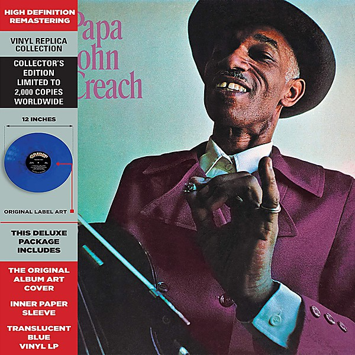

# Papa John Creach

By **Papa John Creach**

## Album Data

- **Catalog:** Beets
- **Format:** Digital, Album
- **Album:** Papa John Creach
- **Artist:** Papa John Creach
- **Albumartist:** Papa John Creach
- **Genre:** Jazz Fusion
- **MusicBrainz Album Artist ID:** 
- **MusicBrainz Album ID:** 
- **MusicBrainz Release Group ID:** 
- **Year:** 0000
- **Catalog #:** 
- **Label:** 
- **Total Tracks:** 00

## Album Tracks

### Track 00 - The Janitor Drives A Cadillac

- **Artist:** Papa John Creach
- **Format:** AAC
- **Genre:** Jazz Fusion
- **Length:** 2:49
- **MusicBrainz Track ID:** 
- **Title:** The Janitor Drives A Cadillac
- **Track:** 00
- **Year:** 0000

### Track 01 - The Janitor Drives A Cadillac

- **Artist:** Papa John Creach
- **Format:** MP3
- **Genre:** Jazz Fusion
- **Length:** 2:47
- **MusicBrainz Track ID:** 
- **Title:** The Janitor Drives A Cadillac
- **Track:** 01
- **Year:** 1971

### Track 02 - St. Louis Blues

- **Artist:** Papa John Creach
- **Format:** MP3
- **Genre:** Jazz Fusion
- **Length:** 4:36
- **MusicBrainz Track ID:** 
- **Title:** St. Louis Blues
- **Track:** 02
- **Year:** 1971

### Track 03 - Papa John's Down Home Blues

- **Artist:** Papa John Creach
- **Format:** MP3
- **Genre:** Jazz Fusion
- **Length:** 2:43
- **MusicBrainz Track ID:** 
- **Title:** Papa John's Down Home Blues
- **Track:** 03
- **Year:** 1971

### Track 04 - Plunk A Little Funk

- **Artist:** Papa John Creach
- **Format:** MP3
- **Genre:** Jazz Fusion
- **Length:** 5:07
- **MusicBrainz Track ID:** 
- **Title:** Plunk A Little Funk
- **Track:** 04
- **Year:** 1971

### Track 05 - Over The Rainbow

- **Artist:** Papa John Creach
- **Format:** MP3
- **Genre:** Jazz Fusion
- **Length:** 3:26
- **MusicBrainz Track ID:** 
- **Title:** Over The Rainbow
- **Track:** 05
- **Year:** 1971

### Track 06 - String Jet Rock

- **Artist:** Papa John Creach
- **Format:** MP3
- **Genre:** Jazz Fusion
- **Length:** 3:44
- **MusicBrainz Track ID:** 
- **Title:** String Jet Rock
- **Track:** 06
- **Year:** 1971

### Track 07 - Danny Boy

- **Artist:** Papa John Creach
- **Format:** MP3
- **Genre:** Jazz Fusion
- **Length:** 3:58
- **MusicBrainz Track ID:** 
- **Title:** Danny Boy
- **Track:** 07
- **Year:** 1971

### Track 08 - Human Spring

- **Artist:** Papa John Creach
- **Format:** MP3
- **Genre:** Jazz Fusion
- **Length:** 2:54
- **MusicBrainz Track ID:** 
- **Title:** Human Spring
- **Track:** 08
- **Year:** 1971

### Track 09 - Soul Fever

- **Artist:** Papa John Creach
- **Format:** MP3
- **Genre:** Jazz Fusion
- **Length:** 4:10
- **MusicBrainz Track ID:** 
- **Title:** Soul Fever
- **Track:** 09
- **Year:** 1971

### Track 10 - Everytime I Hear Her Name

- **Artist:** Papa John Creach
- **Format:** MP3
- **Genre:** Jazz Fusion
- **Length:** 4:49
- **MusicBrainz Track ID:** 
- **Title:** Everytime I Hear Her Name
- **Track:** 10
- **Year:** 1971

