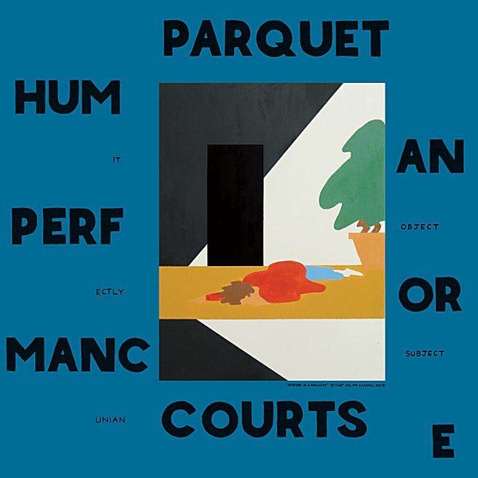

# Human Performance

By **Parquet Courts**

## Album Data

- **Catalog:** Beets
- **Format:** Digital, Album
- **Album:** Human Performance
- **Artist:** Parquet Courts
- **Albumartist:** Parquet Courts
- **Genre:** Indie Rock
- **MusicBrainz Album Artist ID:** [e01755e3-58ab-4a5b-a9e9-a0a3bd3dff4c](https://musicbrainz.org/artist/e01755e3-58ab-4a5b-a9e9-a0a3bd3dff4c)
- **MusicBrainz Album ID:** [cd3ca3d6-8f45-494f-8249-1af38eafbd40](https://musicbrainz.org/release/cd3ca3d6-8f45-494f-8249-1af38eafbd40)
- **MusicBrainz Release Group ID:** [3353a8a0-a5ab-4970-b34e-090afcc2bba7](https://musicbrainz.org/release-group/3353a8a0-a5ab-4970-b34e-090afcc2bba7)
- **Year:** 2016
- **Catalog #:** RTRADCD810
- **Label:** Rough Trade
- **Total Tracks:** 13

## Album Tracks

### Track 01 - Dust

- **Artist:** Parquet Courts
- **Format:** ALAC
- **Genre:** Indie Rock
- **Length:** 3:57
- **MusicBrainz Track ID:** [a075bc8e-e4ef-488b-8d5a-0ce2cb113c6e](https://musicbrainz.org/recording/a075bc8e-e4ef-488b-8d5a-0ce2cb113c6e)
- **Title:** Dust
- **Track:** 01
- **Year:** 2016

### Track 02 - Human Performance

- **Artist:** Parquet Courts
- **Format:** ALAC
- **Genre:** Indie Rock
- **Length:** 4:15
- **MusicBrainz Track ID:** [6154afb7-7ff0-435c-9a99-2eb8546b8978](https://musicbrainz.org/recording/6154afb7-7ff0-435c-9a99-2eb8546b8978)
- **Title:** Human Performance
- **Track:** 02
- **Year:** 2016

### Track 03 - Outside

- **Artist:** Parquet Courts
- **Format:** ALAC
- **Genre:** Indie Rock
- **Length:** 1:45
- **MusicBrainz Track ID:** [230f058f-4fcc-49d9-94ef-c1b02081e3d6](https://musicbrainz.org/recording/230f058f-4fcc-49d9-94ef-c1b02081e3d6)
- **Title:** Outside
- **Track:** 03
- **Year:** 2016

### Track 04 - I Was Just Here

- **Artist:** Parquet Courts
- **Format:** ALAC
- **Genre:** Indie Rock
- **Length:** 1:48
- **MusicBrainz Track ID:** [3ccf37c9-5dcc-4362-9b06-6c9946c7b571](https://musicbrainz.org/recording/3ccf37c9-5dcc-4362-9b06-6c9946c7b571)
- **Title:** I Was Just Here
- **Track:** 04
- **Year:** 2016

### Track 05 - Paraphrased

- **Artist:** Parquet Courts
- **Format:** ALAC
- **Genre:** Indie Rock
- **Length:** 3:01
- **MusicBrainz Track ID:** [829fbf0e-2692-4d6a-a144-f034edd2ee64](https://musicbrainz.org/recording/829fbf0e-2692-4d6a-a144-f034edd2ee64)
- **Title:** Paraphrased
- **Track:** 05
- **Year:** 2016

### Track 06 - Captive of the Sun

- **Artist:** Parquet Courts
- **Format:** ALAC
- **Genre:** Indie Rock
- **Length:** 2:03
- **MusicBrainz Track ID:** [52d93dc0-6e84-4482-9d82-4e12f570c632](https://musicbrainz.org/recording/52d93dc0-6e84-4482-9d82-4e12f570c632)
- **Title:** Captive of the Sun
- **Track:** 06
- **Year:** 2016

### Track 07 - Steady on My Mind

- **Artist:** Parquet Courts
- **Format:** ALAC
- **Genre:** Indie Rock
- **Length:** 3:38
- **MusicBrainz Track ID:** [27bc930c-1ce0-4f3e-a394-e57e4497dab7](https://musicbrainz.org/recording/27bc930c-1ce0-4f3e-a394-e57e4497dab7)
- **Title:** Steady on My Mind
- **Track:** 07
- **Year:** 2016

### Track 08 - One Man No City

- **Artist:** Parquet Courts
- **Format:** ALAC
- **Genre:** Indie Rock
- **Length:** 6:24
- **MusicBrainz Track ID:** [5354a38e-0e8b-4a05-90c3-291e66b4073e](https://musicbrainz.org/recording/5354a38e-0e8b-4a05-90c3-291e66b4073e)
- **Title:** One Man No City
- **Track:** 08
- **Year:** 2016

### Track 09 - Berlin Got Blurry

- **Artist:** Parquet Courts
- **Format:** ALAC
- **Genre:** Indie Rock
- **Length:** 3:26
- **MusicBrainz Track ID:** [9679fd56-e3fd-4012-870a-a9531b8813a1](https://musicbrainz.org/recording/9679fd56-e3fd-4012-870a-a9531b8813a1)
- **Title:** Berlin Got Blurry
- **Track:** 09
- **Year:** 2016

### Track 10 - Keep It Even

- **Artist:** Parquet Courts
- **Format:** ALAC
- **Genre:** Indie Rock
- **Length:** 2:47
- **MusicBrainz Track ID:** [f2bdcfd0-7493-4a0c-9731-48810c7bec54](https://musicbrainz.org/recording/f2bdcfd0-7493-4a0c-9731-48810c7bec54)
- **Title:** Keep It Even
- **Track:** 10
- **Year:** 2016

### Track 11 - Two Dead Cops

- **Artist:** Parquet Courts
- **Format:** ALAC
- **Genre:** Indie Rock
- **Length:** 3:05
- **MusicBrainz Track ID:** [adf75949-ba8f-451d-b61c-a76be33e7d41](https://musicbrainz.org/recording/adf75949-ba8f-451d-b61c-a76be33e7d41)
- **Title:** Two Dead Cops
- **Track:** 11
- **Year:** 2016

### Track 12 - Pathos Prairie

- **Artist:** Parquet Courts
- **Format:** ALAC
- **Genre:** Indie Rock
- **Length:** 2:51
- **MusicBrainz Track ID:** [a99e4666-6a43-4bc8-9fa7-03cc958c11a5](https://musicbrainz.org/recording/a99e4666-6a43-4bc8-9fa7-03cc958c11a5)
- **Title:** Pathos Prairie
- **Track:** 12
- **Year:** 2016

### Track 13 - It’s Gonna Happen

- **Artist:** Parquet Courts
- **Format:** ALAC
- **Genre:** Indie Rock
- **Length:** 3:20
- **MusicBrainz Track ID:** [4729b598-665a-4248-a000-6a601eea1cc8](https://musicbrainz.org/recording/4729b598-665a-4248-a000-6a601eea1cc8)
- **Title:** It’s Gonna Happen
- **Track:** 13
- **Year:** 2016

## See also

- [CD: Human Performance](../../CD/Parquet_Courts/Human_Performance.md)
- [CD: ](../../CD/Parquet_Courts/Parquet_Courts.md)
- [Roon: Milano](../../Roon/Parquet_Courts/Milano.md)
