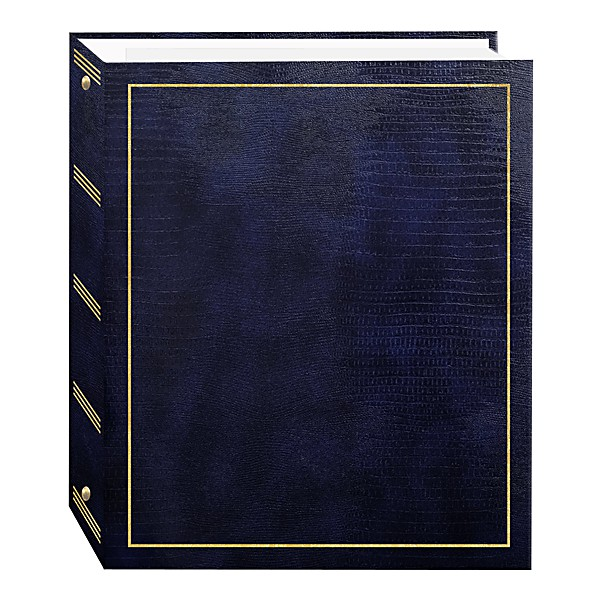

# Unknown Album

By **Pat Boone**

## Album Data

- **Catalog:** Beets
- **Format:** Digital, Album
- **Album:** Unknown Album
- **Artist:** Pat Boone
- **Albumartist:** Pat Boone
- **Genre:** Swing
- **MusicBrainz Album Artist ID:** 
- **MusicBrainz Album ID:** 
- **MusicBrainz Release Group ID:** 
- **Year:** 0000
- **Catalog #:** 
- **Label:** 
- **Total Tracks:** 00

## Album Tracks

### Track 00 - April Love

- **Artist:** Pat Boone
- **Format:** AAC
- **Genre:** Pop
- **Length:** 2:45
- **MusicBrainz Track ID:** 
- **Title:** April Love
- **Track:** 00
- **Year:** 0000

### Track 01 - Moody River

- **Artist:** Pat Boone
- **Format:** AAC
- **Genre:** Close Harmony
- **Length:** 2:38
- **MusicBrainz Track ID:** 
- **Title:** Moody River
- **Track:** 01
- **Year:** 0000

