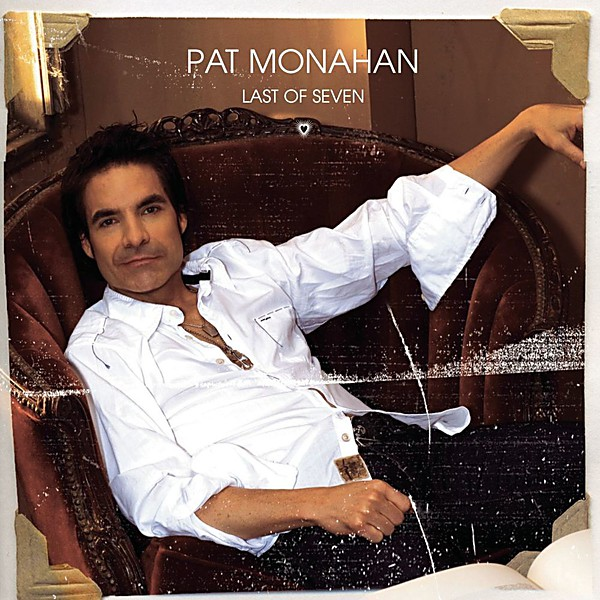

# Last of Seven

By **Pat Monahan**

## Album Data

- **Catalog:** Beets
- **Format:** Digital, Album
- **Album:** Last of Seven
- **Artist:** Pat Monahan
- **Albumartist:** Pat Monahan
- **Genre:** Pop
- **MusicBrainz Album Artist ID:** [5b7e7e75-9590-4fd7-9cb0-89771c7f428f](https://musicbrainz.org/artist/5b7e7e75-9590-4fd7-9cb0-89771c7f428f)
- **MusicBrainz Album ID:** [9817988a-116b-4edb-bda5-7bcfb565e697](https://musicbrainz.org/release/9817988a-116b-4edb-bda5-7bcfb565e697)
- **MusicBrainz Release Group ID:** [1759f0a0-3037-38e6-9dad-14e7e9361478](https://musicbrainz.org/release-group/1759f0a0-3037-38e6-9dad-14e7e9361478)
- **Year:** 2007
- **Catalog #:** 
- **Label:** Sony BMG Music Entertainment
- **Total Tracks:** 14

## Album Tracks

### Track 01 - Last of Seven

- **Artist:** Pat Monahan
- **Format:** ALAC
- **Genre:** Britpop
- **Length:** 0:41
- **MusicBrainz Track ID:** [2d2dcb27-ccbc-4639-b48f-eb736b613e8d](https://musicbrainz.org/recording/2d2dcb27-ccbc-4639-b48f-eb736b613e8d)
- **Title:** Last of Seven
- **Track:** 01
- **Year:** 2007

### Track 02 - Her Eyes

- **Artist:** Pat Monahan
- **Format:** ALAC
- **Genre:** Pop Rock
- **Length:** 3:16
- **MusicBrainz Track ID:** [e6501291-fa95-4200-887d-48c1f7d7db2b](https://musicbrainz.org/recording/e6501291-fa95-4200-887d-48c1f7d7db2b)
- **Title:** Her Eyes
- **Track:** 02
- **Year:** 2007

### Track 03 - Two Ways to Say Goodbye

- **Artist:** Pat Monahan
- **Format:** ALAC
- **Genre:** Soft Rock
- **Length:** 3:42
- **MusicBrainz Track ID:** [48bebb94-917b-4bdf-bcd0-cc100ce4b02f](https://musicbrainz.org/recording/48bebb94-917b-4bdf-bcd0-cc100ce4b02f)
- **Title:** Two Ways to Say Goodbye
- **Track:** 03
- **Year:** 2007

### Track 04 - Someday

- **Artist:** Pat Monahan
- **Format:** ALAC
- **Genre:** Pop Rock
- **Length:** 3:28
- **MusicBrainz Track ID:** [ab7cb399-8c92-484f-8fa0-e26e230fba51](https://musicbrainz.org/recording/ab7cb399-8c92-484f-8fa0-e26e230fba51)
- **Title:** Someday
- **Track:** 04
- **Year:** 2007

### Track 05 - Cowboys and Indians

- **Artist:** Pat Monahan
- **Format:** ALAC
- **Genre:** Pop Rock
- **Length:** 3:57
- **MusicBrainz Track ID:** [86a1b35c-db93-4be5-8895-3f34d2321f44](https://musicbrainz.org/recording/86a1b35c-db93-4be5-8895-3f34d2321f44)
- **Title:** Cowboys and Indians
- **Track:** 05
- **Year:** 2007

### Track 06 - Ooh My My

- **Artist:** Pat Monahan
- **Format:** ALAC
- **Genre:** Soft Rock
- **Length:** 3:30
- **MusicBrainz Track ID:** [3977e893-391a-4d7a-a164-7f51fdd7519d](https://musicbrainz.org/recording/3977e893-391a-4d7a-a164-7f51fdd7519d)
- **Title:** Ooh My My
- **Track:** 06
- **Year:** 2007

### Track 07 - Thinkin' Bout You

- **Artist:** Pat Monahan
- **Format:** ALAC
- **Genre:** Alternative Rock
- **Length:** 4:22
- **MusicBrainz Track ID:** [03d159c1-d9f3-4611-af70-f3b80f99467c](https://musicbrainz.org/recording/03d159c1-d9f3-4611-af70-f3b80f99467c)
- **Title:** Thinkin' Bout You
- **Track:** 07
- **Year:** 2007

### Track 08 - Raise Your Hands

- **Artist:** Pat Monahan
- **Format:** ALAC
- **Genre:** Pop
- **Length:** 3:19
- **MusicBrainz Track ID:** [bf61b8bf-df67-41f6-a5f9-b09a8075b83c](https://musicbrainz.org/recording/bf61b8bf-df67-41f6-a5f9-b09a8075b83c)
- **Title:** Raise Your Hands
- **Track:** 08
- **Year:** 2007

### Track 09 - Always Midnight

- **Artist:** Pat Monahan
- **Format:** ALAC
- **Genre:** Rock
- **Length:** 3:19
- **MusicBrainz Track ID:** [1fcc251c-88d7-4e15-94f4-7ff22c1f0cb7](https://musicbrainz.org/recording/1fcc251c-88d7-4e15-94f4-7ff22c1f0cb7)
- **Title:** Always Midnight
- **Track:** 09
- **Year:** 2007

### Track 10 - Great Escape

- **Artist:** Pat Monahan
- **Format:** ALAC
- **Genre:** Soft Rock
- **Length:** 4:10
- **MusicBrainz Track ID:** [8be2ef35-88eb-4aaa-8e31-a149600c1403](https://musicbrainz.org/recording/8be2ef35-88eb-4aaa-8e31-a149600c1403)
- **Title:** Great Escape
- **Track:** 10
- **Year:** 2007

### Track 11 - Ripple In the Water

- **Artist:** Pat Monahan
- **Format:** ALAC
- **Genre:** Pop
- **Length:** 3:27
- **MusicBrainz Track ID:** [4036ef75-ff24-4044-b47b-54a57230ae6f](https://musicbrainz.org/recording/4036ef75-ff24-4044-b47b-54a57230ae6f)
- **Title:** Ripple In the Water
- **Track:** 11
- **Year:** 2007

### Track 12 - Girlfriend

- **Artist:** Pat Monahan
- **Format:** ALAC
- **Genre:** Soft Rock
- **Length:** 3:59
- **MusicBrainz Track ID:** [d07e2e83-83cd-4e7a-a6b5-22cf6d0211c4](https://musicbrainz.org/recording/d07e2e83-83cd-4e7a-a6b5-22cf6d0211c4)
- **Title:** Girlfriend
- **Track:** 12
- **Year:** 2007

### Track 13 - Pirate On the Run

- **Artist:** Pat Monahan
- **Format:** ALAC
- **Genre:** Soft Rock
- **Length:** 2:52
- **MusicBrainz Track ID:** [cc6bf3da-8044-4d62-916b-173ffc378ab0](https://musicbrainz.org/recording/cc6bf3da-8044-4d62-916b-173ffc378ab0)
- **Title:** Pirate On the Run
- **Track:** 13
- **Year:** 2007

### Track 14 - Shine

- **Artist:** Pat Monahan
- **Format:** ALAC
- **Genre:** Pop
- **Length:** 4:10
- **MusicBrainz Track ID:** [7bd9eb1a-2e58-4c5f-93b5-635525827d9f](https://musicbrainz.org/recording/7bd9eb1a-2e58-4c5f-93b5-635525827d9f)
- **Title:** Shine
- **Track:** 14
- **Year:** 2007

