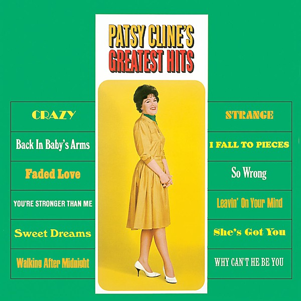

# Patsy Cline's Greatest Hits

By **Patsy Cline**

## Album Data

- **Catalog:** Beets
- **Format:** Digital, Album
- **Album:** Patsy Cline's Greatest Hits
- **Artist:** Patsy Cline
- **Albumartist:** Patsy Cline
- **Genre:** Classic Country
- **MusicBrainz Album Artist ID:** [ad82dd72-0df3-4a09-8d7a-1af9c9e80522](https://musicbrainz.org/artist/ad82dd72-0df3-4a09-8d7a-1af9c9e80522)
- **MusicBrainz Album ID:** [c8d70b71-af0d-465c-ab82-f8e9ec03519e](https://musicbrainz.org/release/c8d70b71-af0d-465c-ab82-f8e9ec03519e)
- **MusicBrainz Release Group ID:** [26239187-b3f4-3bac-b3cd-538a93b3fcf1](https://musicbrainz.org/release-group/26239187-b3f4-3bac-b3cd-538a93b3fcf1)
- **Year:** 1967
- **Catalog #:** DL 74854
- **Label:** Decca Records
- **Total Tracks:** 12

## Album Tracks

### Track 01 - Walkin’ After Midnight

- **Artist:** Patsy Cline
- **Format:** MP3
- **Genre:** Classic Country
- **Length:** 2:01
- **MusicBrainz Track ID:** [d5c377d0-6eac-4b9d-acab-07a0880da2ee](https://musicbrainz.org/recording/d5c377d0-6eac-4b9d-acab-07a0880da2ee)
- **Title:** Walkin’ After Midnight
- **Track:** 01
- **Year:** 1967

### Track 02 - Sweet Dreams (of You)

- **Artist:** Patsy Cline
- **Format:** MP3
- **Genre:** Classic Country
- **Length:** 2:35
- **MusicBrainz Track ID:** [6c30f0e9-4082-400b-9a10-23e0372e0fbf](https://musicbrainz.org/recording/6c30f0e9-4082-400b-9a10-23e0372e0fbf)
- **Title:** Sweet Dreams (of You)
- **Track:** 02
- **Year:** 1967

### Track 03 - Crazy

- **Artist:** Patsy Cline
- **Format:** MP3
- **Genre:** Classic Country
- **Length:** 2:44
- **MusicBrainz Track ID:** [c27bebb2-ba64-429e-ae24-5aa51041fe47](https://musicbrainz.org/recording/c27bebb2-ba64-429e-ae24-5aa51041fe47)
- **Title:** Crazy
- **Track:** 03
- **Year:** 1967

### Track 04 - I Fall to Pieces

- **Artist:** Patsy Cline
- **Format:** MP3
- **Genre:** Classic Country
- **Length:** 2:50
- **MusicBrainz Track ID:** [76a7b010-7e43-4681-ac97-e0e273ba4bb3](https://musicbrainz.org/recording/76a7b010-7e43-4681-ac97-e0e273ba4bb3)
- **Title:** I Fall to Pieces
- **Track:** 04
- **Year:** 1967

### Track 05 - So Wrong

- **Artist:** Patsy Cline
- **Format:** MP3
- **Genre:** Classic Country
- **Length:** 3:02
- **MusicBrainz Track ID:** [c862799d-698b-4b74-b922-ad42a74b5f33](https://musicbrainz.org/recording/c862799d-698b-4b74-b922-ad42a74b5f33)
- **Title:** So Wrong
- **Track:** 05
- **Year:** 1967

### Track 06 - Strange

- **Artist:** Patsy Cline
- **Format:** MP3
- **Genre:** Classic Country
- **Length:** 2:12
- **MusicBrainz Track ID:** [0c3e032c-e96c-4568-9677-93c3564a4ce7](https://musicbrainz.org/recording/0c3e032c-e96c-4568-9677-93c3564a4ce7)
- **Title:** Strange
- **Track:** 06
- **Year:** 1967

### Track 07 - Back in Baby’s Arms

- **Artist:** Patsy Cline
- **Format:** MP3
- **Genre:** Classic Country
- **Length:** 2:05
- **MusicBrainz Track ID:** [1b2bbd8a-9149-45ef-8e10-f13eeceef578](https://musicbrainz.org/recording/1b2bbd8a-9149-45ef-8e10-f13eeceef578)
- **Title:** Back in Baby’s Arms
- **Track:** 07
- **Year:** 1967

### Track 08 - She’s Got You

- **Artist:** Patsy Cline
- **Format:** MP3
- **Genre:** Country
- **Length:** 3:02
- **MusicBrainz Track ID:** [1176d2aa-397c-4189-9bdd-35b0eca8fc05](https://musicbrainz.org/recording/1176d2aa-397c-4189-9bdd-35b0eca8fc05)
- **Title:** She’s Got You
- **Track:** 08
- **Year:** 1967

### Track 09 - Faded Love

- **Artist:** Patsy Cline
- **Format:** MP3
- **Genre:** Classic Country
- **Length:** 3:44
- **MusicBrainz Track ID:** [c767efde-28d3-46bf-b0f1-2c6c9251fa08](https://musicbrainz.org/recording/c767efde-28d3-46bf-b0f1-2c6c9251fa08)
- **Title:** Faded Love
- **Track:** 09
- **Year:** 1967

### Track 10 - Why Can’t He Be You

- **Artist:** Patsy Cline
- **Format:** MP3
- **Genre:** Country
- **Length:** 3:28
- **MusicBrainz Track ID:** [b6060fb2-d83e-4650-881e-7019fdffe4b7](https://musicbrainz.org/recording/b6060fb2-d83e-4650-881e-7019fdffe4b7)
- **Title:** Why Can’t He Be You
- **Track:** 10
- **Year:** 1967

### Track 11 - You’re Stronger Than Me

- **Artist:** Patsy Cline
- **Format:** MP3
- **Genre:** Country
- **Length:** 2:55
- **MusicBrainz Track ID:** [1f9582b9-deac-417c-9141-40e22338cb75](https://musicbrainz.org/recording/1f9582b9-deac-417c-9141-40e22338cb75)
- **Title:** You’re Stronger Than Me
- **Track:** 11
- **Year:** 1967

### Track 12 - Leavin’ On Your Mind

- **Artist:** Patsy Cline
- **Format:** MP3
- **Genre:** Classic Country
- **Length:** 2:26
- **MusicBrainz Track ID:** [c6874c9b-b7a6-44c2-9ed7-1acea7f77998](https://musicbrainz.org/recording/c6874c9b-b7a6-44c2-9ed7-1acea7f77998)
- **Title:** Leavin’ On Your Mind
- **Track:** 12
- **Year:** 1967

