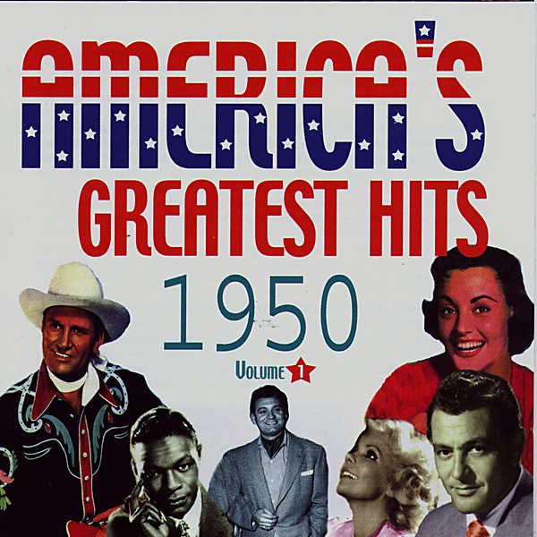

# 1950

By **Patti Page**

## Album Data

- **Catalog:** Beets
- **Format:** Digital, Album
- **Album:** 1950
- **Artist:** Patti Page
- **Albumartist:** Patti Page
- **Genre:** Pop
- **MusicBrainz Album Artist ID:** 
- **MusicBrainz Album ID:** 
- **MusicBrainz Release Group ID:** 
- **Year:** 1950
- **Catalog #:** 
- **Label:** 
- **Total Tracks:** 00

## Album Tracks

### Track 00 - Tennessee Waltz

- **Artist:** Patti Page
- **Format:** AAC
- **Genre:** Jazz
- **Length:** 3:07
- **MusicBrainz Track ID:** 
- **Title:** Tennessee Waltz
- **Track:** 00
- **Year:** 0000

## See also

- [Golden Hits](Golden_Hits.md)
- [Unknown Album](Unknown_Album.md)
- [Roon: Golden Hits](../../Roon/Patti_Page/Golden_Hits.md)
