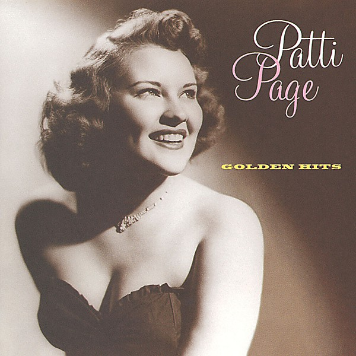

# Golden Hits

By **Patti Page**

## Album Data

- **Catalog:** Beets
- **Format:** Digital, Album
- **Album:** Golden Hits
- **Artist:** Patti Page
- **Albumartist:** Patti Page
- **Genre:** Pop
- **MusicBrainz Album Artist ID:** [46bd1529-4301-4d10-9124-17d9e858034e](https://musicbrainz.org/artist/46bd1529-4301-4d10-9124-17d9e858034e)
- **MusicBrainz Album ID:** [b30b9bf6-04ba-44e4-a7d5-87a56bb4cf4a](https://musicbrainz.org/release/b30b9bf6-04ba-44e4-a7d5-87a56bb4cf4a)
- **MusicBrainz Release Group ID:** [26143d05-9ef9-4e3c-8495-75b74590a00f](https://musicbrainz.org/release-group/26143d05-9ef9-4e3c-8495-75b74590a00f)
- **Year:** 1960
- **Catalog #:** 
- **Label:** 
- **Total Tracks:** 00

## Album Tracks

### Track 00 - All My Love

- **Artist:** Patti Page
- **Format:** AAC
- **Genre:** Pop
- **Length:** 3:18
- **MusicBrainz Track ID:** 
- **Title:** All My Love
- **Track:** 00
- **Year:** 1950

## See also

- [1950](1950.md)
- [Unknown Album](Unknown_Album.md)
- [Roon: Golden Hits](../../Roon/Patti_Page/Golden_Hits.md)
