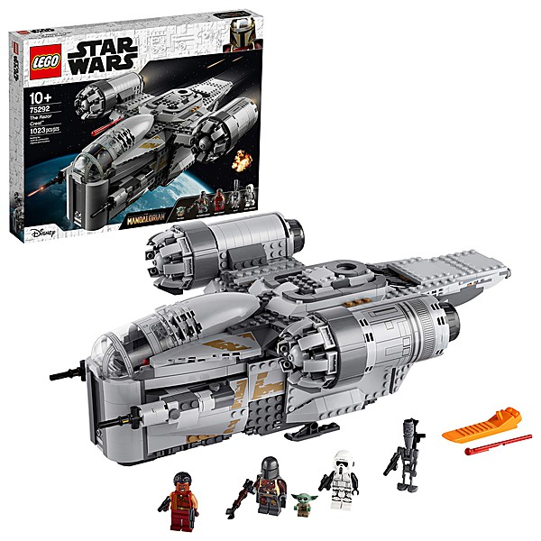

# Land (1975-2002) [Disc 1]

By **Patti Smith**

## Album Data

- **Catalog:** Beets
- **Format:** Digital, Album
- **Album:** Land (1975-2002) [Disc 1]
- **Artist:** Patti Smith
- **Albumartist:** Patti Smith
- **Genre:** Punk Rock
- **MusicBrainz Album Artist ID:** 
- **MusicBrainz Album ID:** 
- **MusicBrainz Release Group ID:** 
- **Year:** 1979
- **Catalog #:** 
- **Label:** 
- **Total Tracks:** 13

## Album Tracks

### Track 01 - Piss Factory (Track)

- **Artist:** Patti Smith
- **Format:** AAC
- **Genre:** Art Punk
- **Length:** 5:03
- **MusicBrainz Track ID:** 
- **Title:** Piss Factory (Track)
- **Track:** 01
- **Year:** 1974

### Track 02 - Redondo Beach (Demo)

- **Artist:** Patti Smith
- **Format:** AAC
- **Genre:** Rock
- **Length:** 3:44
- **MusicBrainz Track ID:** 
- **Title:** Redondo Beach (Demo)
- **Track:** 02
- **Year:** 1975

### Track 03 - Distant Fingers (Demo)

- **Artist:** Patti Smith
- **Format:** AAC
- **Genre:** Rock
- **Length:** 4:56
- **MusicBrainz Track ID:** 
- **Title:** Distant Fingers (Demo)
- **Track:** 03
- **Year:** 1975

### Track 04 - 25th Floor [Live]

- **Artist:** Patti Smith
- **Format:** AAC
- **Genre:** Hardcore Punk
- **Length:** 5:43
- **MusicBrainz Track ID:** 
- **Title:** 25th Floor [Live]
- **Track:** 04
- **Year:** 1978

### Track 05 - Come Back Little Sheba (Outtake)

- **Artist:** Patti Smith
- **Format:** AAC
- **Genre:** Punk Rock
- **Length:** 2:36
- **MusicBrainz Track ID:** 
- **Title:** Come Back Little Sheba (Outtake)
- **Track:** 05
- **Year:** 1996

### Track 06 - Wander I Go (Track)

- **Artist:** Patti Smith
- **Format:** AAC
- **Genre:** Rock
- **Length:** 4:56
- **MusicBrainz Track ID:** 
- **Title:** Wander I Go (Track)
- **Track:** 06
- **Year:** 1996

### Track 07 - Dead City [Live]

- **Artist:** Patti Smith
- **Format:** AAC
- **Genre:** Punk Rock
- **Length:** 4:34
- **MusicBrainz Track ID:** 
- **Title:** Dead City [Live]
- **Track:** 07
- **Year:** 2001

### Track 08 - Spell [Live]

- **Artist:** Patti Smith
- **Format:** AAC
- **Genre:** Punk Rock
- **Length:** 6:40
- **MusicBrainz Track ID:** 
- **Title:** Spell [Live]
- **Track:** 08
- **Year:** 2001

### Track 09 - Wing [Live]

- **Artist:** Patti Smith
- **Format:** AAC
- **Genre:** Alternative Rock
- **Length:** 5:05
- **MusicBrainz Track ID:** 
- **Title:** Wing [Live]
- **Track:** 09
- **Year:** 2001

### Track 10 - Boy Cried Wolf [Live]

- **Artist:** Patti Smith
- **Format:** AAC
- **Genre:** Punk Rock
- **Length:** 5:49
- **MusicBrainz Track ID:** 
- **Title:** Boy Cried Wolf [Live]
- **Track:** 10
- **Year:** 2001

### Track 11 - Birdland [Live]

- **Artist:** Patti Smith
- **Format:** AAC
- **Genre:** Punk Rock
- **Length:** 9:42
- **MusicBrainz Track ID:** 
- **Title:** Birdland [Live]
- **Track:** 11
- **Year:** 2001

### Track 12 - Higher Learning

- **Artist:** Patti Smith
- **Format:** AAC
- **Genre:** Punk Rock
- **Length:** 7:21
- **MusicBrainz Track ID:** 
- **Title:** Higher Learning
- **Track:** 12
- **Year:** 2001

### Track 13 - Notes To The Future [Live]

- **Artist:** Patti Smith
- **Format:** AAC
- **Genre:** Punk Rock
- **Length:** 6:05
- **MusicBrainz Track ID:** 
- **Title:** Notes To The Future [Live]
- **Track:** 13
- **Year:** 2002

## See also

- [Land (1975-2002) [Disc 2]](Land_1975-2002_[Disc_2].md)
- [Land (1975–2002)](Land_1975–2002.md)
- [CD: Land ( 1975-2002 ) (Disc 1)](../../CD/Patti_Smith/Land__1975-2002__Disc_1.md)
- [CD: Land ( 1975-2002 ) (Disc 2)](../../CD/Patti_Smith/Land__1975-2002__Disc_2.md)
- [CD: ](../../CD/Patti_Smith/Patti_Smith.md)
- [Roon: Land (1975-2002)](../../Roon/Patti_Smith/Land_1975-2002.md)
