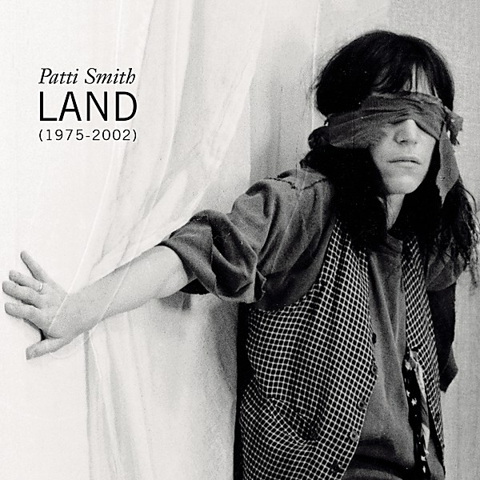

# Land (1975–2002)

By **Patti Smith**

## Album Data

- **Catalog:** Beets
- **Format:** Digital, Album
- **Album:** Land (1975–2002)
- **Artist:** Patti Smith
- **Albumartist:** Patti Smith
- **Genre:** Punk Rock
- **MusicBrainz Album Artist ID:** [d135874d-9cae-4fef-97e3-36acbd9f5a26](https://musicbrainz.org/artist/d135874d-9cae-4fef-97e3-36acbd9f5a26)
- **MusicBrainz Album ID:** [c4cf7967-de52-3a6e-8100-a60c981b48fa](https://musicbrainz.org/release/c4cf7967-de52-3a6e-8100-a60c981b48fa)
- **MusicBrainz Release Group ID:** [df830fdd-a0ab-3014-8f4c-355eaed71903](https://musicbrainz.org/release-group/df830fdd-a0ab-3014-8f4c-355eaed71903)
- **Year:** 2002
- **Catalog #:** 07822 14708 2
- **Label:** Arista
- **Total Tracks:** 30

## Album Tracks

### Track 04 - Gloria

- **Artist:** Patti Smith
- **Format:** AAC
- **Genre:** Punk Rock
- **Length:** 5:52
- **MusicBrainz Track ID:** [06821d3d-c57c-466a-b0aa-060344945c2f](https://musicbrainz.org/recording/06821d3d-c57c-466a-b0aa-060344945c2f)
- **Title:** Gloria
- **Track:** 04
- **Year:** 2002

### Track 06 - Free Money

- **Artist:** Patti Smith
- **Format:** AAC
- **Genre:** Punk Rock
- **Length:** 3:52
- **MusicBrainz Track ID:** [7ae62d96-b59a-44ad-b300-b11c4ac1469e](https://musicbrainz.org/recording/7ae62d96-b59a-44ad-b300-b11c4ac1469e)
- **Title:** Free Money
- **Track:** 06
- **Year:** 2002

### Track 07 - People Have the Power

- **Artist:** Patti Smith
- **Format:** AAC
- **Genre:** Alternative Rock
- **Length:** 5:09
- **MusicBrainz Track ID:** [1b7cabaf-2462-48b0-b62e-22c21594522b](https://musicbrainz.org/recording/1b7cabaf-2462-48b0-b62e-22c21594522b)
- **Title:** People Have the Power
- **Track:** 07
- **Year:** 2002

### Track 10 - Summer Cannibals

- **Artist:** Patti Smith
- **Format:** AAC
- **Genre:** Alternative Rock
- **Length:** 4:10
- **MusicBrainz Track ID:** [b7eadd8e-8905-4e98-9606-78c46302333d](https://musicbrainz.org/recording/b7eadd8e-8905-4e98-9606-78c46302333d)
- **Title:** Summer Cannibals
- **Track:** 10
- **Year:** 2002

### Track 13 - 1959

- **Artist:** Patti Smith
- **Format:** AAC
- **Genre:** Punk Rock
- **Length:** 3:58
- **MusicBrainz Track ID:** [88ab89cc-6e3c-4972-a5d5-370494a17beb](https://musicbrainz.org/recording/88ab89cc-6e3c-4972-a5d5-370494a17beb)
- **Title:** 1959
- **Track:** 13
- **Year:** 2002

### Track 14 - Beneath the Southern Cross

- **Artist:** Patti Smith
- **Format:** AAC
- **Genre:** Punk Rock
- **Length:** 4:36
- **MusicBrainz Track ID:** [dfc0e952-c063-42bf-b208-f330be044798](https://musicbrainz.org/recording/dfc0e952-c063-42bf-b208-f330be044798)
- **Title:** Beneath the Southern Cross
- **Track:** 14
- **Year:** 2002

### Track 15 - Glitter in Their Eyes

- **Artist:** Patti Smith
- **Format:** AAC
- **Genre:** Progressive Rock
- **Length:** 3:03
- **MusicBrainz Track ID:** [c60f1666-eb3d-46f5-99a3-08a0f52bb2c4](https://musicbrainz.org/recording/c60f1666-eb3d-46f5-99a3-08a0f52bb2c4)
- **Title:** Glitter in Their Eyes
- **Track:** 15
- **Year:** 2002

### Track 16 - Paths That Cross

- **Artist:** Patti Smith
- **Format:** AAC
- **Genre:** Alternative Rock
- **Length:** 4:20
- **MusicBrainz Track ID:** [a381b156-9dfd-429d-bfe3-bdcc5339d411](https://musicbrainz.org/recording/a381b156-9dfd-429d-bfe3-bdcc5339d411)
- **Title:** Paths That Cross
- **Track:** 16
- **Year:** 2002

### Track 17 - When Doves Cry

- **Artist:** Patti Smith
- **Format:** AAC
- **Genre:** Rock
- **Length:** 4:59
- **MusicBrainz Track ID:** [dc2ba387-f596-469e-b362-e7a92a342d0a](https://musicbrainz.org/recording/dc2ba387-f596-469e-b362-e7a92a342d0a)
- **Title:** When Doves Cry
- **Track:** 17
- **Year:** 2002

### Track 18 - Piss Factory

- **Artist:** Patti Smith
- **Format:** AAC
- **Genre:** Art Punk
- **Length:** 5:03
- **MusicBrainz Track ID:** [800e63ca-c522-4905-9328-79a21dc5f16d](https://musicbrainz.org/recording/800e63ca-c522-4905-9328-79a21dc5f16d)
- **Title:** Piss Factory
- **Track:** 18
- **Year:** 2002

### Track 19 - Redondo Beach (demo)

- **Artist:** Patti Smith
- **Format:** AAC
- **Genre:** Rock
- **Length:** 3:44
- **MusicBrainz Track ID:** [30c121d2-2f68-4c78-adf9-588ea802d9cb](https://musicbrainz.org/recording/30c121d2-2f68-4c78-adf9-588ea802d9cb)
- **Title:** Redondo Beach (demo)
- **Track:** 19
- **Year:** 2002

### Track 20 - Distant Fingers (demo)

- **Artist:** Patti Smith
- **Format:** AAC
- **Genre:** Rock
- **Length:** 4:56
- **MusicBrainz Track ID:** [6d89d287-bed6-407b-8671-9f13f07e4474](https://musicbrainz.org/recording/6d89d287-bed6-407b-8671-9f13f07e4474)
- **Title:** Distant Fingers (demo)
- **Track:** 20
- **Year:** 2002

### Track 21 - 25th Floor (live)

- **Artist:** Patti Smith
- **Format:** AAC
- **Genre:** Hardcore Punk
- **Length:** 5:43
- **MusicBrainz Track ID:** [34d501c1-7e1e-4202-8812-c6cbf8e51e0b](https://musicbrainz.org/recording/34d501c1-7e1e-4202-8812-c6cbf8e51e0b)
- **Title:** 25th Floor (live)
- **Track:** 21
- **Year:** 2002

### Track 22 - Come Back Little Sheba

- **Artist:** Patti Smith
- **Format:** AAC
- **Genre:** Punk Rock
- **Length:** 2:35
- **MusicBrainz Track ID:** [aeaae24b-585e-4350-913d-9b9f42f6ad44](https://musicbrainz.org/recording/aeaae24b-585e-4350-913d-9b9f42f6ad44)
- **Title:** Come Back Little Sheba
- **Track:** 22
- **Year:** 2002

### Track 23 - Wander I Go

- **Artist:** Patti Smith
- **Format:** AAC
- **Genre:** Punk Rock
- **Length:** 4:55
- **MusicBrainz Track ID:** [7a80dc02-83a3-4328-8ee5-a259ea2f8dac](https://musicbrainz.org/recording/7a80dc02-83a3-4328-8ee5-a259ea2f8dac)
- **Title:** Wander I Go
- **Track:** 23
- **Year:** 2002

### Track 24 - Dead City (live)

- **Artist:** Patti Smith
- **Format:** AAC
- **Genre:** Punk Rock
- **Length:** 4:34
- **MusicBrainz Track ID:** [e43d3a9f-c61e-49a3-889c-78dec251ea26](https://musicbrainz.org/recording/e43d3a9f-c61e-49a3-889c-78dec251ea26)
- **Title:** Dead City (live)
- **Track:** 24
- **Year:** 2002

### Track 25 - Spell (live)

- **Artist:** Patti Smith
- **Format:** AAC
- **Genre:** Alternative Rock
- **Length:** 6:40
- **MusicBrainz Track ID:** [11369bf5-b85d-4412-a522-c4698161d3c1](https://musicbrainz.org/recording/11369bf5-b85d-4412-a522-c4698161d3c1)
- **Title:** Spell (live)
- **Track:** 25
- **Year:** 2002

### Track 26 - Wing (live)

- **Artist:** Patti Smith
- **Format:** AAC
- **Genre:** Alternative Rock
- **Length:** 5:05
- **MusicBrainz Track ID:** [da04ef2f-52f6-4606-934c-f48999604a82](https://musicbrainz.org/recording/da04ef2f-52f6-4606-934c-f48999604a82)
- **Title:** Wing (live)
- **Track:** 26
- **Year:** 2002

### Track 27 - Boy Cried Wolf (live)

- **Artist:** Patti Smith
- **Format:** AAC
- **Genre:** Hard Rock
- **Length:** 5:49
- **MusicBrainz Track ID:** [15c18b3f-bfca-43f2-a669-6332ef7f3ec8](https://musicbrainz.org/recording/15c18b3f-bfca-43f2-a669-6332ef7f3ec8)
- **Title:** Boy Cried Wolf (live)
- **Track:** 27
- **Year:** 2002

### Track 28 - Birdland (live)

- **Artist:** Patti Smith
- **Format:** AAC
- **Genre:** Punk Rock
- **Length:** 9:40
- **MusicBrainz Track ID:** [f9021227-21bd-47b7-94a0-ca62fc15650f](https://musicbrainz.org/recording/f9021227-21bd-47b7-94a0-ca62fc15650f)
- **Title:** Birdland (live)
- **Track:** 28
- **Year:** 2002

### Track 29 - Higher Learning / Contemplation

- **Artist:** Patti Smith
- **Format:** AAC
- **Genre:** Punk Rock
- **Length:** 7:19
- **MusicBrainz Track ID:** [77bc22f2-fd53-45d3-923c-26382c0b2755](https://musicbrainz.org/recording/77bc22f2-fd53-45d3-923c-26382c0b2755)
- **Title:** Higher Learning / Contemplation
- **Track:** 29
- **Year:** 2002

### Track 30 - Notes to the Future (live)

- **Artist:** Patti Smith
- **Format:** AAC
- **Genre:** Punk Rock
- **Length:** 6:05
- **MusicBrainz Track ID:** [41bea2a1-181c-4d2a-a959-e2c21fb63c11](https://musicbrainz.org/recording/41bea2a1-181c-4d2a-a959-e2c21fb63c11)
- **Title:** Notes to the Future (live)
- **Track:** 30
- **Year:** 2002

### Track 01 - Dancing Barefoot

- **Artist:** Patti Smith Group
- **Format:** AAC
- **Genre:** Rock
- **Length:** 4:16
- **MusicBrainz Track ID:** [c0e620c5-d5ba-4186-867e-5860bb816cc6](https://musicbrainz.org/recording/c0e620c5-d5ba-4186-867e-5860bb816cc6)
- **Title:** Dancing Barefoot
- **Track:** 01
- **Year:** 2002

### Track 02 - Babelogue

- **Artist:** Patti Smith Group
- **Format:** AAC
- **Genre:** Alternative Rock
- **Length:** 1:32
- **MusicBrainz Track ID:** [84590c5f-c505-4060-a0c6-3f3bb3dc8ae0](https://musicbrainz.org/recording/84590c5f-c505-4060-a0c6-3f3bb3dc8ae0)
- **Title:** Babelogue
- **Track:** 02
- **Year:** 2002

### Track 03 - Rock n Roll Nigger

- **Artist:** Patti Smith Group
- **Format:** AAC
- **Genre:** Punk Rock
- **Length:** 3:21
- **MusicBrainz Track ID:** [1b9639b3-02ad-4c98-a51b-fef73e128fec](https://musicbrainz.org/recording/1b9639b3-02ad-4c98-a51b-fef73e128fec)
- **Title:** Rock n Roll Nigger
- **Track:** 03
- **Year:** 2002

### Track 05 - Pissing in a River

- **Artist:** Patti Smith Group
- **Format:** AAC
- **Genre:** Art Rock
- **Length:** 4:52
- **MusicBrainz Track ID:** [e01170c7-720d-455d-83ff-d5c864cd1070](https://musicbrainz.org/recording/e01170c7-720d-455d-83ff-d5c864cd1070)
- **Title:** Pissing in a River
- **Track:** 05
- **Year:** 2002

### Track 08 - Because the Night

- **Artist:** Patti Smith Group
- **Format:** AAC
- **Genre:** Rock
- **Length:** 3:24
- **MusicBrainz Track ID:** [f6655c59-8b0f-475e-8962-516ee897e7bb](https://musicbrainz.org/recording/f6655c59-8b0f-475e-8962-516ee897e7bb)
- **Title:** Because the Night
- **Track:** 08
- **Year:** 2002

### Track 09 - Frederick

- **Artist:** Patti Smith Group
- **Format:** AAC
- **Genre:** New Wave
- **Length:** 3:02
- **MusicBrainz Track ID:** [3f09dbc0-13f2-48eb-8c45-ee18025df4ec](https://musicbrainz.org/recording/3f09dbc0-13f2-48eb-8c45-ee18025df4ec)
- **Title:** Frederick
- **Track:** 09
- **Year:** 2002

### Track 11 - Ghost Dance

- **Artist:** Patti Smith Group
- **Format:** AAC
- **Genre:** Rock
- **Length:** 4:43
- **MusicBrainz Track ID:** [65865536-228d-4cc1-befe-2708ed2dc9b8](https://musicbrainz.org/recording/65865536-228d-4cc1-befe-2708ed2dc9b8)
- **Title:** Ghost Dance
- **Track:** 11
- **Year:** 2002

### Track 12 - Ain’t It Strange

- **Artist:** Patti Smith Group
- **Format:** AAC
- **Genre:** Punk Rock
- **Length:** 6:35
- **MusicBrainz Track ID:** [b5c4fee1-c685-45e5-9d67-e4f87b8d39b1](https://musicbrainz.org/recording/b5c4fee1-c685-45e5-9d67-e4f87b8d39b1)
- **Title:** Ain’t It Strange
- **Track:** 12
- **Year:** 2002

## See also

- [Land (1975-2002) [Disc 1]](Land_1975-2002_[Disc_1].md)
- [Land (1975-2002) [Disc 2]](Land_1975-2002_[Disc_2].md)
- [CD: Land ( 1975-2002 ) (Disc 1)](../../CD/Patti_Smith/Land__1975-2002__Disc_1.md)
- [CD: Land ( 1975-2002 ) (Disc 2)](../../CD/Patti_Smith/Land__1975-2002__Disc_2.md)
- [CD: ](../../CD/Patti_Smith/Patti_Smith.md)
- [Roon: Land (1975-2002)](../../Roon/Patti_Smith/Land_1975-2002.md)
