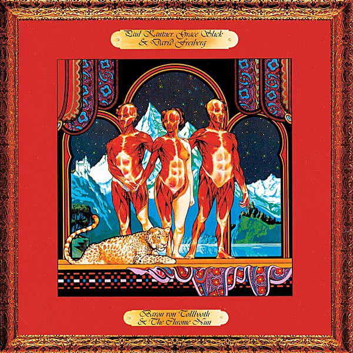

# Baron Von Tollbooth & the Chrome Nun

By **Paul Kantner, Grace Slick**

## Album Data

- **Catalog:** Beets
- **Format:** Digital, Album
- **Album:** Baron Von Tollbooth & the Chrome Nun
- **Artist:** Paul Kantner, Grace Slick
- **Albumartist:** Paul Kantner, Grace Slick
- **Genre:** Psychedelic Rock
- **MusicBrainz Album Artist ID:** 
- **MusicBrainz Album ID:** 
- **MusicBrainz Release Group ID:** 
- **Year:** 1973
- **Catalog #:** 
- **Label:** 
- **Total Tracks:** 10

## Album Tracks

### Track 01 - Ballad of the Chrome Nun

- **Artist:** Paul Kantner, Grace Slick
- **Format:** ALAC
- **Genre:** Psychedelic Rock
- **Length:** 4:00
- **MusicBrainz Track ID:** 
- **Title:** Ballad of the Chrome Nun
- **Track:** 01
- **Year:** 1973

### Track 02 - Fat

- **Artist:** Paul Kantner, Grace Slick
- **Format:** ALAC
- **Genre:** Psychedelic Rock
- **Length:** 3:14
- **MusicBrainz Track ID:** 
- **Title:** Fat
- **Track:** 02
- **Year:** 1973

### Track 03 - Flowers of the Night

- **Artist:** Paul Kantner, Grace Slick
- **Format:** ALAC
- **Genre:** Psychedelic Rock
- **Length:** 4:17
- **MusicBrainz Track ID:** 
- **Title:** Flowers of the Night
- **Track:** 03
- **Year:** 1973

### Track 04 - Walkin'

- **Artist:** Paul Kantner, Grace Slick
- **Format:** ALAC
- **Genre:** Psychedelic Rock
- **Length:** 2:31
- **MusicBrainz Track ID:** 
- **Title:** Walkin'
- **Track:** 04
- **Year:** 1973

### Track 05 - Your Mind Has Left Your Body

- **Artist:** Paul Kantner, Grace Slick
- **Format:** ALAC
- **Genre:** Psychedelic Rock
- **Length:** 5:47
- **MusicBrainz Track ID:** 
- **Title:** Your Mind Has Left Your Body
- **Track:** 05
- **Year:** 1973

### Track 06 - Across the Board

- **Artist:** Paul Kantner, Grace Slick
- **Format:** ALAC
- **Genre:** Psychedelic Rock
- **Length:** 4:37
- **MusicBrainz Track ID:** 
- **Title:** Across the Board
- **Track:** 06
- **Year:** 1973

### Track 07 - Harp Tree Lament

- **Artist:** Paul Kantner, Grace Slick
- **Format:** ALAC
- **Genre:** Psychedelic Rock
- **Length:** 3:38
- **MusicBrainz Track ID:** 
- **Title:** Harp Tree Lament
- **Track:** 07
- **Year:** 1973

### Track 08 - White Boy (Transcaucasian Airmachine Blues)

- **Artist:** Paul Kantner, Grace Slick
- **Format:** ALAC
- **Genre:** Psychedelic Rock
- **Length:** 4:16
- **MusicBrainz Track ID:** 
- **Title:** White Boy (Transcaucasian Airmachine Blues)
- **Track:** 08
- **Year:** 1973

### Track 09 - Fishman

- **Artist:** Paul Kantner, Grace Slick
- **Format:** ALAC
- **Genre:** Psychedelic Rock
- **Length:** 2:43
- **MusicBrainz Track ID:** 
- **Title:** Fishman
- **Track:** 09
- **Year:** 1973

### Track 10 - Sketches of China

- **Artist:** Paul Kantner, Grace Slick
- **Format:** ALAC
- **Genre:** Psychedelic Rock
- **Length:** 5:15
- **MusicBrainz Track ID:** 
- **Title:** Sketches of China
- **Track:** 10
- **Year:** 1973

## See also

- [Sunfighter](Sunfighter.md)
- [CD: Baron Von Tollbooth & The Chrome Nun](../../CD/Paul_Kantner_and_Grace_Slick/Baron_Von_Tollbooth_and_The_Chrome_Nun.md)
- [CD: ](../../CD/Paul_Kantner_and_Grace_Slick/Paul_Kantner_and_Grace_Slick.md)
- [CD: Sunfighter](../../CD/Paul_Kantner_and_Grace_Slick/Sunfighter.md)
