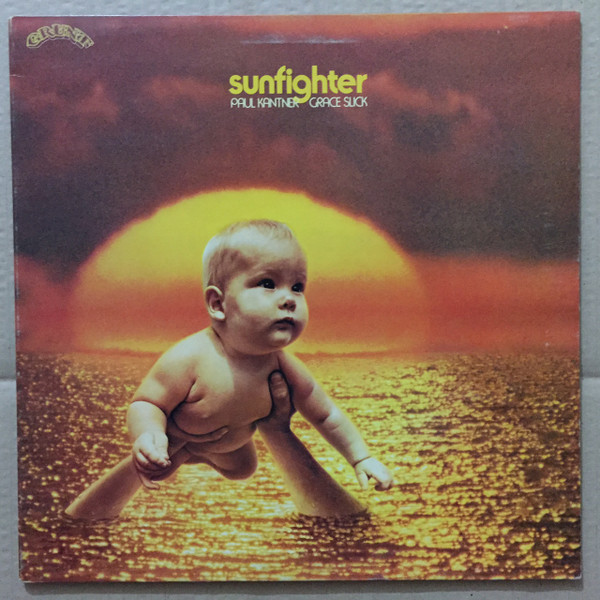

# Sunfighter

By **Paul Kantner & Grace Slick**

## Album Data

- **Catalog:** Beets
- **Format:** Digital, Album
- **Album:** Sunfighter
- **Artist:** Paul Kantner & Grace Slick
- **Albumartist:** Paul Kantner & Grace Slick
- **Genre:** Psychedelic Rock
- **MusicBrainz Album Artist ID:** [bfe46b8e-0c14-41c3-9ffe-c7ce3b53d226](https://musicbrainz.org/artist/bfe46b8e-0c14-41c3-9ffe-c7ce3b53d226)
- **MusicBrainz Album ID:** [26d86465-968d-3750-8b04-3cc66faad515](https://musicbrainz.org/release/26d86465-968d-3750-8b04-3cc66faad515)
- **MusicBrainz Release Group ID:** [329a859a-cddb-3827-af1b-d354f5720352](https://musicbrainz.org/release-group/329a859a-cddb-3827-af1b-d354f5720352)
- **Year:** 1997
- **Catalog #:** 67421-2
- **Label:** RCA
- **Total Tracks:** 12

## Album Tracks

### Track 01 - Silver Spoon

- **Artist:** Paul Kantner & Grace Slick
- **Format:** ALAC
- **Genre:** Psychedelic Rock
- **Length:** 5:43
- **MusicBrainz Track ID:** [cd98a235-4739-402e-9d22-063855be8021](https://musicbrainz.org/recording/cd98a235-4739-402e-9d22-063855be8021)
- **Title:** Silver Spoon
- **Track:** 01
- **Year:** 1997

### Track 02 - Diana (Part 1)

- **Artist:** Paul Kantner & Grace Slick
- **Format:** ALAC
- **Genre:** Psychedelic Rock
- **Length:** 0:52
- **MusicBrainz Track ID:** [e1baa4c1-b1fd-4c25-8b64-31ebe11167ec](https://musicbrainz.org/recording/e1baa4c1-b1fd-4c25-8b64-31ebe11167ec)
- **Title:** Diana (Part 1)
- **Track:** 02
- **Year:** 1997

### Track 03 - Sunfighter

- **Artist:** Paul Kantner & Grace Slick
- **Format:** ALAC
- **Genre:** Psychedelic Rock
- **Length:** 3:56
- **MusicBrainz Track ID:** [507e7907-83cb-4c33-900c-8a082c37a442](https://musicbrainz.org/recording/507e7907-83cb-4c33-900c-8a082c37a442)
- **Title:** Sunfighter
- **Track:** 03
- **Year:** 1997

### Track 04 - Titanic

- **Artist:** Paul Kantner & Grace Slick
- **Format:** ALAC
- **Genre:** Psychedelic Rock
- **Length:** 2:33
- **MusicBrainz Track ID:** [4b5ab8be-d746-4afc-bdff-4a12767a8396](https://musicbrainz.org/recording/4b5ab8be-d746-4afc-bdff-4a12767a8396)
- **Title:** Titanic
- **Track:** 04
- **Year:** 1997

### Track 05 - Look at the Wood

- **Artist:** Paul Kantner & Grace Slick
- **Format:** ALAC
- **Genre:** Psychedelic Rock
- **Length:** 2:12
- **MusicBrainz Track ID:** [5ec2ae3b-c0f2-4952-8df7-ef95cb6663b0](https://musicbrainz.org/recording/5ec2ae3b-c0f2-4952-8df7-ef95cb6663b0)
- **Title:** Look at the Wood
- **Track:** 05
- **Year:** 1997

### Track 06 - When I Was a Boy I Watched the Wolves

- **Artist:** Paul Kantner & Grace Slick
- **Format:** ALAC
- **Genre:** Psychedelic Rock
- **Length:** 5:03
- **MusicBrainz Track ID:** [9e16dd3e-171c-45ee-a799-ff1f59e66605](https://musicbrainz.org/recording/9e16dd3e-171c-45ee-a799-ff1f59e66605)
- **Title:** When I Was a Boy I Watched the Wolves
- **Track:** 06
- **Year:** 1997

### Track 07 - Million

- **Artist:** Paul Kantner & Grace Slick
- **Format:** ALAC
- **Genre:** Psychedelic Rock
- **Length:** 4:06
- **MusicBrainz Track ID:** [e0ba441e-fe75-4664-8b27-01154ba7f27c](https://musicbrainz.org/recording/e0ba441e-fe75-4664-8b27-01154ba7f27c)
- **Title:** Million
- **Track:** 07
- **Year:** 1997

### Track 08 - China

- **Artist:** Paul Kantner & Grace Slick
- **Format:** ALAC
- **Genre:** Psychedelic Rock
- **Length:** 3:20
- **MusicBrainz Track ID:** [f6646197-cc54-45dc-87b9-4738a2b67c4b](https://musicbrainz.org/recording/f6646197-cc54-45dc-87b9-4738a2b67c4b)
- **Title:** China
- **Track:** 08
- **Year:** 1997

### Track 09 - Earth Mother

- **Artist:** Paul Kantner & Grace Slick
- **Format:** ALAC
- **Genre:** Psychedelic Rock
- **Length:** 3:21
- **MusicBrainz Track ID:** [9c73f228-d74e-4c65-a8df-9b673beb50b8](https://musicbrainz.org/recording/9c73f228-d74e-4c65-a8df-9b673beb50b8)
- **Title:** Earth Mother
- **Track:** 09
- **Year:** 1997

### Track 10 - Diana (Part 2)

- **Artist:** Paul Kantner & Grace Slick
- **Format:** ALAC
- **Genre:** Psychedelic Rock
- **Length:** 1:03
- **MusicBrainz Track ID:** [f1ff23f1-2fd4-4ff5-a95c-aafedfa7f62d](https://musicbrainz.org/recording/f1ff23f1-2fd4-4ff5-a95c-aafedfa7f62d)
- **Title:** Diana (Part 2)
- **Track:** 10
- **Year:** 1997

### Track 11 - Universal Copernican Mumbles

- **Artist:** Paul Kantner & Grace Slick
- **Format:** ALAC
- **Genre:** Psychedelic Rock
- **Length:** 2:04
- **MusicBrainz Track ID:** [b6757003-5692-48bd-a72d-33cf233a5e64](https://musicbrainz.org/recording/b6757003-5692-48bd-a72d-33cf233a5e64)
- **Title:** Universal Copernican Mumbles
- **Track:** 11
- **Year:** 1997

### Track 12 - Holding Together

- **Artist:** Paul Kantner & Grace Slick
- **Format:** ALAC
- **Genre:** Psychedelic Rock
- **Length:** 7:42
- **MusicBrainz Track ID:** [0b696b95-e3f5-444a-8cda-16778fc2ea27](https://musicbrainz.org/recording/0b696b95-e3f5-444a-8cda-16778fc2ea27)
- **Title:** Holding Together
- **Track:** 12
- **Year:** 1997

## See also

- [Baron Von Tollbooth & the Chrome Nun](Baron_Von_Tollbooth_and_the_Chrome_Nun.md)
- [CD: Baron Von Tollbooth & The Chrome Nun](../../CD/Paul_Kantner_and_Grace_Slick/Baron_Von_Tollbooth_and_The_Chrome_Nun.md)
- [CD: ](../../CD/Paul_Kantner_and_Grace_Slick/Paul_Kantner_and_Grace_Slick.md)
- [CD: Sunfighter](../../CD/Paul_Kantner_and_Grace_Slick/Sunfighter.md)
