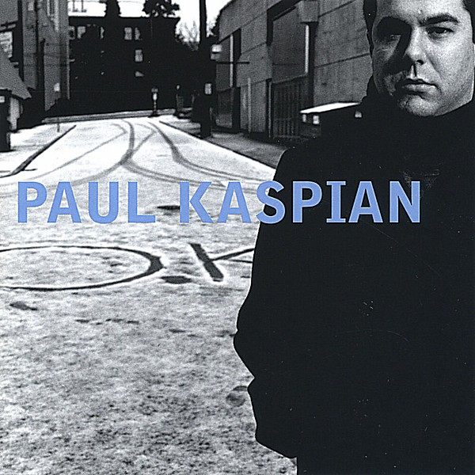

# O.K.

By **Paul Kaspian**

## Album Data

- **Catalog:** Beets
- **Format:** Digital, Album
- **Album:** O.K.
- **Artist:** Paul Kaspian
- **Albumartist:** Paul Kaspian
- **Genre:** Unknown
- **MusicBrainz Album Artist ID:** 
- **MusicBrainz Album ID:** 
- **MusicBrainz Release Group ID:** 
- **Year:** 0000
- **Catalog #:** 
- **Label:** 
- **Total Tracks:** 00

## Album Tracks

### Track 01 - Anything

- **Artist:** Paul Kaspian
- **Format:** MP3
- **Genre:** Unknown
- **Length:** 3:24
- **MusicBrainz Track ID:** 
- **Title:** Anything
- **Track:** 01
- **Year:** 0000

### Track 02 - I Know

- **Artist:** Paul Kaspian
- **Format:** MP3
- **Genre:** Unknown
- **Length:** 4:14
- **MusicBrainz Track ID:** 
- **Title:** I Know
- **Track:** 02
- **Year:** 0000

### Track 03 - Pretty

- **Artist:** Paul Kaspian
- **Format:** MP3
- **Genre:** Unknown
- **Length:** 2:45
- **MusicBrainz Track ID:** 
- **Title:** Pretty
- **Track:** 03
- **Year:** 0000

### Track 04 - Little Piece

- **Artist:** Paul Kaspian
- **Format:** MP3
- **Genre:** Unknown
- **Length:** 2:04
- **MusicBrainz Track ID:** 
- **Title:** Little Piece
- **Track:** 04
- **Year:** 0000

### Track 05 - Paper Doll

- **Artist:** Paul Kaspian
- **Format:** MP3
- **Genre:** Unknown
- **Length:** 2:55
- **MusicBrainz Track ID:** 
- **Title:** Paper Doll
- **Track:** 05
- **Year:** 0000

### Track 06 - American Dream

- **Artist:** Paul Kaspian
- **Format:** MP3
- **Genre:** Unknown
- **Length:** 3:09
- **MusicBrainz Track ID:** 
- **Title:** American Dream
- **Track:** 06
- **Year:** 0000

### Track 07 - Inside Out

- **Artist:** Paul Kaspian
- **Format:** MP3
- **Genre:** Unknown
- **Length:** 3:03
- **MusicBrainz Track ID:** 
- **Title:** Inside Out
- **Track:** 07
- **Year:** 0000

### Track 08 - More

- **Artist:** Paul Kaspian
- **Format:** MP3
- **Genre:** Unknown
- **Length:** 3:09
- **MusicBrainz Track ID:** 
- **Title:** More
- **Track:** 08
- **Year:** 0000

### Track 09 - To Death

- **Artist:** Paul Kaspian
- **Format:** MP3
- **Genre:** Unknown
- **Length:** 3:21
- **MusicBrainz Track ID:** 
- **Title:** To Death
- **Track:** 09
- **Year:** 0000

### Track 10 - Down

- **Artist:** Paul Kaspian
- **Format:** MP3
- **Genre:** Unknown
- **Length:** 3:31
- **MusicBrainz Track ID:** 
- **Title:** Down
- **Track:** 10
- **Year:** 0000

### Track 11 - Second Kiss

- **Artist:** Paul Kaspian
- **Format:** MP3
- **Genre:** Unknown
- **Length:** 2:24
- **MusicBrainz Track ID:** 
- **Title:** Second Kiss
- **Track:** 11
- **Year:** 0000

## See also

- [Roon: O.K.](../../Roon/Paul_Kaspian/OK.md)
