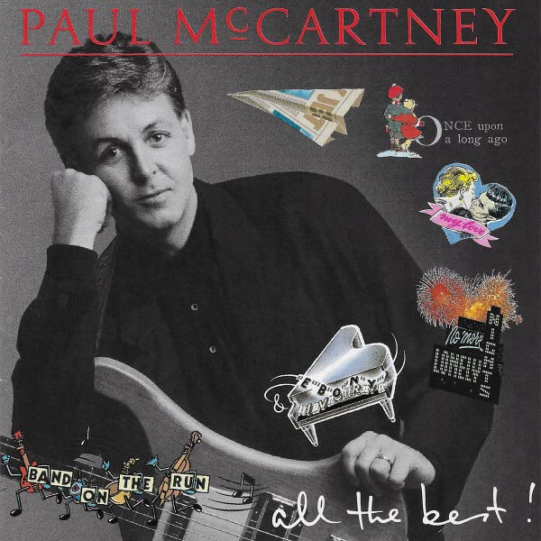

# All the Best

By **Paul McCartney**

## Album Data

- **Catalog:** Beets
- **Format:** Digital, Album
- **Album:** All the Best
- **Artist:** Paul Mccartney
- **Albumartist:** Paul McCartney
- **Genre:** Rock
- **MusicBrainz Album Artist ID:** 
- **MusicBrainz Album ID:** 
- **MusicBrainz Release Group ID:** 
- **Year:** 1987
- **Catalog #:** 
- **Label:** 
- **Total Tracks:** 13

## Album Tracks

### Track 05 - Hot as Sun / Glasses

- **Artist:** Paul McCartney
- **Format:** AAC
- **Genre:** Rock
- **Length:** 2:07
- **MusicBrainz Track ID:** [a6a6eabe-6d63-4791-8c4d-d7a620be1dbb](https://musicbrainz.org/recording/a6a6eabe-6d63-4791-8c4d-d7a620be1dbb)
- **Title:** Hot as Sun / Glasses
- **Track:** 05
- **Year:** 2011

### Track 12 - Maybe I'm Amazed

- **Artist:** Paul McCartney
- **Format:** AAC
- **Genre:** Soft Rock
- **Length:** 3:50
- **MusicBrainz Track ID:** [05cc0bd7-2930-4ebd-9aa3-b7a897127c81](https://musicbrainz.org/recording/05cc0bd7-2930-4ebd-9aa3-b7a897127c81)
- **Title:** Maybe I'm Amazed
- **Track:** 12
- **Year:** 2011

### Track 13 - Kreen‐Akrore

- **Artist:** Paul McCartney
- **Format:** AAC
- **Genre:** Soft Rock
- **Length:** 4:15
- **MusicBrainz Track ID:** [6d22b73b-7ca3-482e-9458-d174270cdd70](https://musicbrainz.org/recording/6d22b73b-7ca3-482e-9458-d174270cdd70)
- **Title:** Kreen‐Akrore
- **Track:** 13
- **Year:** 2011

### Track 01 - The Lovely Linda

- **Artist:** Paul McCartney
- **Format:** AAC
- **Genre:** Soft Rock
- **Length:** 0:45
- **MusicBrainz Track ID:** 
- **Title:** The Lovely Linda
- **Track:** 01
- **Year:** 2011

### Track 02 - That Would Be Something

- **Artist:** Paul McCartney
- **Format:** AAC
- **Genre:** Soft Rock
- **Length:** 2:38
- **MusicBrainz Track ID:** 
- **Title:** That Would Be Something
- **Track:** 02
- **Year:** 2011

### Track 03 - Valentine Day

- **Artist:** Paul McCartney
- **Format:** AAC
- **Genre:** Soft Rock
- **Length:** 1:43
- **MusicBrainz Track ID:** 
- **Title:** Valentine Day
- **Track:** 03
- **Year:** 2011

### Track 04 - Every Night

- **Artist:** Paul McCartney
- **Format:** AAC
- **Genre:** Soft Rock
- **Length:** 2:39
- **MusicBrainz Track ID:** 
- **Title:** Every Night
- **Track:** 04
- **Year:** 2011

### Track 05 - Hot as Sun/Glasses

- **Artist:** Paul Mccartney
- **Format:** ALAC
- **Genre:** Soft Rock
- **Length:** 2:08
- **MusicBrainz Track ID:** 
- **Title:** Hot as Sun/Glasses
- **Track:** 05
- **Year:** 1970

### Track 06 - Junk

- **Artist:** Paul McCartney
- **Format:** AAC
- **Genre:** Soft Rock
- **Length:** 1:55
- **MusicBrainz Track ID:** 
- **Title:** Junk
- **Track:** 06
- **Year:** 2011

### Track 07 - Man We Was Lonely

- **Artist:** Paul McCartney
- **Format:** AAC
- **Genre:** Soft Rock
- **Length:** 2:59
- **MusicBrainz Track ID:** 
- **Title:** Man We Was Lonely
- **Track:** 07
- **Year:** 2011

### Track 08 - Oo You

- **Artist:** Paul McCartney
- **Format:** AAC
- **Genre:** Soul
- **Length:** 2:49
- **MusicBrainz Track ID:** 
- **Title:** Oo You
- **Track:** 08
- **Year:** 2011

### Track 09 - Momma Miss America

- **Artist:** Paul McCartney
- **Format:** AAC
- **Genre:** Soft Rock
- **Length:** 4:04
- **MusicBrainz Track ID:** 
- **Title:** Momma Miss America
- **Track:** 09
- **Year:** 2011

### Track 10 - Teddy Boy

- **Artist:** Paul McCartney
- **Format:** AAC
- **Genre:** Soft Rock
- **Length:** 2:24
- **MusicBrainz Track ID:** 
- **Title:** Teddy Boy
- **Track:** 10
- **Year:** 2011

### Track 11 - Singalong Junk

- **Artist:** Paul McCartney
- **Format:** AAC
- **Genre:** Soft Rock
- **Length:** 2:36
- **MusicBrainz Track ID:** 
- **Title:** Singalong Junk
- **Track:** 11
- **Year:** 2011

### Track 12 - Maybe I'm Amazed

- **Artist:** Paul Mccartney
- **Format:** ALAC
- **Genre:** Soft Rock
- **Length:** 3:55
- **MusicBrainz Track ID:** 
- **Title:** Maybe I'm Amazed
- **Track:** 12
- **Year:** 1970

## See also

- [McCartney](McCartney.md)
- [Memory Almost Full](Memory_Almost_Full.md)
- [New](New.md)
- [Pure McCartney](Pure_McCartney.md)
- [RAM](RAM_2.md)
- [RAM](RAM.md)
- [CD: Mccartney](../../CD/Paul_McCartney/Mccartney.md)
- [CD: ](../../CD/Paul_McCartney/Paul_McCartney.md)
- [CD: Ram](../../CD/Paul_McCartney/Ram.md)
- [Roon: Band On The Run](../../Roon/Paul_McCartney/Band_On_The_Run.md)
- [Roon: McCartney (Archive Collection)](../../Roon/Paul_McCartney/McCartney_Archive_Collection.md)
- [Roon: NEW (Deluxe Edition)](../../Roon/Paul_McCartney/NEW_Deluxe_Edition.md)
- [Roon: Pure McCartney](../../Roon/Paul_McCartney/Pure_McCartney.md)
- [Roon: Ram (Archive Collection)](../../Roon/Paul_McCartney/Ram_Archive_Collection.md)
- [Roon: Wings At The Speed Of Sound (Archive Collection)](../../Roon/Paul_McCartney/Wings_At_The_Speed_Of_Sound_Archive_Collection.md)
- [Roon: Wings Over America (Live / Remastered)](../../Roon/Paul_McCartney/Wings_Over_America_Live_-_Remastered.md)
- [Roon: Wingspan](../../Roon/Paul_McCartney/Wingspan.md)
- [Vinyl: McCartney](../../Vinyl/Paul_McCartney/McCartney.md)
- [Vinyl: ](../../Vinyl/Paul_McCartney/Paul_McCartney.md)
- [Vinyl: Press To Play](../../Vinyl/Paul_McCartney/Press_To_Play.md)
