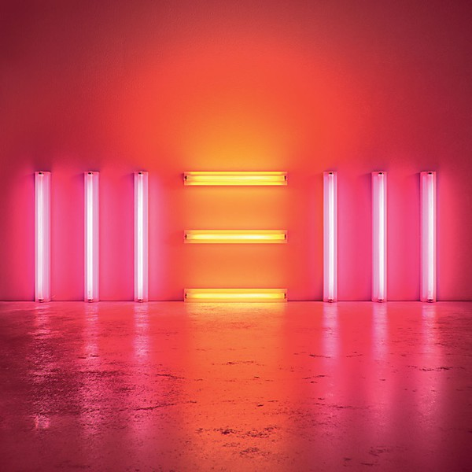

# New

By **Paul McCartney**

## Album Data

- **Catalog:** Beets
- **Format:** Digital, Album
- **Album:** New
- **Artist:** Paul Mccartney
- **Albumartist:** Paul McCartney
- **Genre:** Rock
- **MusicBrainz Album Artist ID:** [ba550d0e-adac-4864-b88b-407cab5e76af](https://musicbrainz.org/artist/ba550d0e-adac-4864-b88b-407cab5e76af)
- **MusicBrainz Album ID:** [13e6505e-9209-43d0-89a5-6bb6563f1431](https://musicbrainz.org/release/13e6505e-9209-43d0-89a5-6bb6563f1431)
- **MusicBrainz Release Group ID:** [4247618e-45af-4080-95f0-43e1a7d77ea6](https://musicbrainz.org/release-group/4247618e-45af-4080-95f0-43e1a7d77ea6)
- **Year:** 2013
- **Catalog #:** 888072386990
- **Label:** Concord Music Group
- **Total Tracks:** 67

## Album Tracks

### Track 31 - Sing the Changes

- **Artist:** The Fireman
- **Format:** ALAC
- **Genre:** Alternative Rock
- **Length:** 3:45
- **MusicBrainz Track ID:** [9efbf594-6175-4398-8e4c-f95db747294d](https://musicbrainz.org/recording/9efbf594-6175-4398-8e4c-f95db747294d)
- **Title:** Sing the Changes
- **Track:** 31
- **Year:** 2016

### Track 01 - Maybe I’m Amazed

- **Artist:** Paul McCartney
- **Format:** ALAC
- **Genre:** Pop Rock
- **Length:** 3:51
- **MusicBrainz Track ID:** [3f285d0c-4530-48a3-8307-425043972e77](https://musicbrainz.org/recording/3f285d0c-4530-48a3-8307-425043972e77)
- **Title:** Maybe I’m Amazed
- **Track:** 01
- **Year:** 2016

### Track 08 - The Song We Were Singing

- **Artist:** Paul McCartney
- **Format:** ALAC
- **Genre:** Rock
- **Length:** 3:55
- **MusicBrainz Track ID:** [39ef6ad2-3c6d-485c-8117-45dc7d5595c8](https://musicbrainz.org/recording/39ef6ad2-3c6d-485c-8117-45dc7d5595c8)
- **Title:** The Song We Were Singing
- **Track:** 08
- **Year:** 2016

### Track 10 - Early Days

- **Artist:** Paul McCartney
- **Format:** ALAC
- **Genre:** Indie Rock
- **Length:** 4:08
- **MusicBrainz Track ID:** [7f5cbb89-9a22-4b1d-8a9c-cb9e0df08b1b](https://musicbrainz.org/recording/7f5cbb89-9a22-4b1d-8a9c-cb9e0df08b1b)
- **Title:** Early Days
- **Track:** 10
- **Year:** 2016

### Track 13 - Flaming Pie

- **Artist:** Paul McCartney
- **Format:** ALAC
- **Genre:** Rock
- **Length:** 2:31
- **MusicBrainz Track ID:** [a97c207a-bf8a-4ea4-aefc-bd719db19f84](https://musicbrainz.org/recording/a97c207a-bf8a-4ea4-aefc-bd719db19f84)
- **Title:** Flaming Pie
- **Track:** 13
- **Year:** 2016

### Track 14 - Jenny Wren

- **Artist:** Paul McCartney
- **Format:** ALAC
- **Genre:** Soft Rock
- **Length:** 3:48
- **MusicBrainz Track ID:** [8fb048e2-00e5-48c9-8e87-f9ce9048fb8f](https://musicbrainz.org/recording/8fb048e2-00e5-48c9-8e87-f9ce9048fb8f)
- **Title:** Jenny Wren
- **Track:** 14
- **Year:** 2016

### Track 17 - New

- **Artist:** Paul McCartney
- **Format:** ALAC
- **Genre:** Britpop
- **Length:** 2:58
- **MusicBrainz Track ID:** [4aea73f4-c7d9-462a-927c-79e672caf0c0](https://musicbrainz.org/recording/4aea73f4-c7d9-462a-927c-79e672caf0c0)
- **Title:** New
- **Track:** 17
- **Year:** 2016

### Track 19 - English Tea

- **Artist:** Paul McCartney
- **Format:** ALAC
- **Genre:** Rock
- **Length:** 2:14
- **MusicBrainz Track ID:** [2412c613-1f1c-485c-a342-ae174e4ac8a1](https://musicbrainz.org/recording/2412c613-1f1c-485c-a342-ae174e4ac8a1)
- **Title:** English Tea
- **Track:** 19
- **Year:** 2016

### Track 21 - Save Us

- **Artist:** Paul McCartney
- **Format:** ALAC
- **Genre:** Britpop
- **Length:** 2:41
- **MusicBrainz Track ID:** [4ae86e42-ebab-4f0d-9908-8d83e31e0413](https://musicbrainz.org/recording/4ae86e42-ebab-4f0d-9908-8d83e31e0413)
- **Title:** Save Us
- **Track:** 21
- **Year:** 2016

### Track 26 - Calico Skies

- **Artist:** Paul McCartney
- **Format:** ALAC
- **Genre:** Rock
- **Length:** 2:32
- **MusicBrainz Track ID:** [34e156ec-9c5e-49bd-8824-b5ad2e130815](https://musicbrainz.org/recording/34e156ec-9c5e-49bd-8824-b5ad2e130815)
- **Title:** Calico Skies
- **Track:** 26
- **Year:** 2016

### Track 28 - Waterfalls

- **Artist:** Paul McCartney
- **Format:** ALAC
- **Genre:** Soft Rock
- **Length:** 4:45
- **MusicBrainz Track ID:** [1d2d44b8-a04a-4c5a-993b-2a311dc13880](https://musicbrainz.org/recording/1d2d44b8-a04a-4c5a-993b-2a311dc13880)
- **Title:** Waterfalls
- **Track:** 28
- **Year:** 2016

### Track 30 - Appreciate

- **Artist:** Paul McCartney
- **Format:** ALAC
- **Genre:** Synthpop
- **Length:** 4:29
- **MusicBrainz Track ID:** [94114f63-c5e1-45d3-a4ec-8e2ffbbe4a9e](https://musicbrainz.org/recording/94114f63-c5e1-45d3-a4ec-8e2ffbbe4a9e)
- **Title:** Appreciate
- **Track:** 30
- **Year:** 2016

### Track 33 - Every Night

- **Artist:** Paul McCartney
- **Format:** ALAC
- **Genre:** Soft Rock
- **Length:** 2:34
- **MusicBrainz Track ID:** [8d1d2ea2-775c-4ff5-b3a6-02322aa2af93](https://musicbrainz.org/recording/8d1d2ea2-775c-4ff5-b3a6-02322aa2af93)
- **Title:** Every Night
- **Track:** 33
- **Year:** 2016

### Track 37 - My Valentine

- **Artist:** Paul McCartney
- **Format:** ALAC
- **Genre:** Pop Rock
- **Length:** 3:16
- **MusicBrainz Track ID:** [e38d2cc8-25ee-4dfd-8fa0-2fd4f7a2d8ea](https://musicbrainz.org/recording/e38d2cc8-25ee-4dfd-8fa0-2fd4f7a2d8ea)
- **Title:** My Valentine
- **Track:** 37
- **Year:** 2016

### Track 38 - Pipes of Peace

- **Artist:** Paul McCartney
- **Format:** ALAC
- **Genre:** Soft Rock
- **Length:** 3:56
- **MusicBrainz Track ID:** [5642afa2-f5a6-49b1-99cc-09fa48a00321](https://musicbrainz.org/recording/5642afa2-f5a6-49b1-99cc-09fa48a00321)
- **Title:** Pipes of Peace
- **Track:** 38
- **Year:** 2016

### Track 39 - The World Tonight

- **Artist:** Paul McCartney
- **Format:** ALAC
- **Genre:** Rock
- **Length:** 4:06
- **MusicBrainz Track ID:** [c921deba-0776-43ba-b48d-0ee7d55b7f7a](https://musicbrainz.org/recording/c921deba-0776-43ba-b48d-0ee7d55b7f7a)
- **Title:** The World Tonight
- **Track:** 39
- **Year:** 2016

### Track 40 - Souvenir

- **Artist:** Paul McCartney
- **Format:** ALAC
- **Genre:** Soul
- **Length:** 3:39
- **MusicBrainz Track ID:** [894661c5-5203-4909-8bad-bac64234968f](https://musicbrainz.org/recording/894661c5-5203-4909-8bad-bac64234968f)
- **Title:** Souvenir
- **Track:** 40
- **Year:** 2016

### Track 41 - Dance Tonight

- **Artist:** Paul McCartney
- **Format:** ALAC
- **Genre:** Rock
- **Length:** 2:56
- **MusicBrainz Track ID:** [d1792138-07fd-4648-ae93-ca8924e2a8e2](https://musicbrainz.org/recording/d1792138-07fd-4648-ae93-ca8924e2a8e2)
- **Title:** Dance Tonight
- **Track:** 41
- **Year:** 2016

### Track 43 - Fine Line

- **Artist:** Paul McCartney
- **Format:** ALAC
- **Genre:** Britpop
- **Length:** 3:07
- **MusicBrainz Track ID:** [5ecb8859-b340-43ac-95e6-4b06ff7db6d6](https://musicbrainz.org/recording/5ecb8859-b340-43ac-95e6-4b06ff7db6d6)
- **Title:** Fine Line
- **Track:** 43
- **Year:** 2016

### Track 44 - Here Today

- **Artist:** Paul McCartney
- **Format:** ALAC
- **Genre:** Soft Rock
- **Length:** 2:29
- **MusicBrainz Track ID:** [ee0c8848-8394-4b90-bd7e-e80ef2383dd4](https://musicbrainz.org/recording/ee0c8848-8394-4b90-bd7e-e80ef2383dd4)
- **Title:** Here Today
- **Track:** 44
- **Year:** 2016

### Track 45 - Press

- **Artist:** Paul McCartney
- **Format:** ALAC
- **Genre:** Soft Rock
- **Length:** 4:47
- **MusicBrainz Track ID:** [cc0ac9de-be9c-401d-9f40-544c8dc74c65](https://musicbrainz.org/recording/cc0ac9de-be9c-401d-9f40-544c8dc74c65)
- **Title:** Press
- **Track:** 45
- **Year:** 2016

### Track 46 - Wanderlust

- **Artist:** Paul McCartney
- **Format:** ALAC
- **Genre:** Soft Rock
- **Length:** 3:51
- **MusicBrainz Track ID:** [85cfd3c3-e2b3-4682-96d4-7fbda6f9bb7d](https://musicbrainz.org/recording/85cfd3c3-e2b3-4682-96d4-7fbda6f9bb7d)
- **Title:** Wanderlust
- **Track:** 46
- **Year:** 2016

### Track 47 - Winedark Open Sea

- **Artist:** Paul McCartney
- **Format:** ALAC
- **Genre:** Soft Rock
- **Length:** 5:27
- **MusicBrainz Track ID:** [9e72843e-8f19-45ce-900e-6af7d276e5ac](https://musicbrainz.org/recording/9e72843e-8f19-45ce-900e-6af7d276e5ac)
- **Title:** Winedark Open Sea
- **Track:** 47
- **Year:** 2016

### Track 48 - Beautiful Night

- **Artist:** Paul McCartney
- **Format:** ALAC
- **Genre:** Soft Rock
- **Length:** 5:07
- **MusicBrainz Track ID:** [c8d29f2b-9faa-449b-9736-bf8a5d7447e4](https://musicbrainz.org/recording/c8d29f2b-9faa-449b-9736-bf8a5d7447e4)
- **Title:** Beautiful Night
- **Track:** 48
- **Year:** 2016

### Track 50 - Queenie Eye

- **Artist:** Paul McCartney
- **Format:** ALAC
- **Genre:** Britpop
- **Length:** 3:49
- **MusicBrainz Track ID:** [3a5831c7-3b2e-4038-893e-d7b13e0bf847](https://musicbrainz.org/recording/3a5831c7-3b2e-4038-893e-d7b13e0bf847)
- **Title:** Queenie Eye
- **Track:** 50
- **Year:** 2016

### Track 52 - Coming Up

- **Artist:** Paul McCartney
- **Format:** ALAC
- **Genre:** Soft Rock
- **Length:** 3:53
- **MusicBrainz Track ID:** [cd7dc999-5ca1-41a2-a5b0-8271ab36d87e](https://musicbrainz.org/recording/cd7dc999-5ca1-41a2-a5b0-8271ab36d87e)
- **Title:** Coming Up
- **Track:** 52
- **Year:** 2016

### Track 53 - Too Much Rain

- **Artist:** Paul McCartney
- **Format:** ALAC
- **Genre:** Britpop
- **Length:** 3:26
- **MusicBrainz Track ID:** [9d44edca-146b-4d74-8e24-9efd4c53c6b3](https://musicbrainz.org/recording/9d44edca-146b-4d74-8e24-9efd4c53c6b3)
- **Title:** Too Much Rain
- **Track:** 53
- **Year:** 2016

### Track 54 - Good Times Coming / Feel the Sun

- **Artist:** Paul McCartney
- **Format:** ALAC
- **Genre:** Rock
- **Length:** 4:56
- **MusicBrainz Track ID:** [a864a89c-21a7-4c8f-9b1b-76e954a66251](https://musicbrainz.org/recording/a864a89c-21a7-4c8f-9b1b-76e954a66251)
- **Title:** Good Times Coming / Feel the Sun
- **Track:** 54
- **Year:** 2016

### Track 58 - Little Willow

- **Artist:** Paul McCartney
- **Format:** ALAC
- **Genre:** Rock
- **Length:** 2:58
- **MusicBrainz Track ID:** [42fc6c39-f548-4e31-a19f-8b8a2d93e74f](https://musicbrainz.org/recording/42fc6c39-f548-4e31-a19f-8b8a2d93e74f)
- **Title:** Little Willow
- **Track:** 58
- **Year:** 2016

### Track 59 - Only Mama Knows

- **Artist:** Paul McCartney
- **Format:** ALAC
- **Genre:** Soft Rock
- **Length:** 4:19
- **MusicBrainz Track ID:** [05d85bce-254a-468d-93c5-5db8847fd440](https://musicbrainz.org/recording/05d85bce-254a-468d-93c5-5db8847fd440)
- **Title:** Only Mama Knows
- **Track:** 59
- **Year:** 2016

### Track 62 - No More Lonely Nights

- **Artist:** Paul McCartney
- **Format:** ALAC
- **Genre:** Soft Rock
- **Length:** 4:43
- **MusicBrainz Track ID:** [f0595bfa-fee6-403c-8496-18be60251200](https://musicbrainz.org/recording/f0595bfa-fee6-403c-8496-18be60251200)
- **Title:** No More Lonely Nights
- **Track:** 62
- **Year:** 2016

### Track 63 - Great Day

- **Artist:** Paul McCartney
- **Format:** ALAC
- **Genre:** Rock
- **Length:** 2:09
- **MusicBrainz Track ID:** [f7966966-da31-4c90-a957-64bfa1c29b10](https://musicbrainz.org/recording/f7966966-da31-4c90-a957-64bfa1c29b10)
- **Title:** Great Day
- **Track:** 63
- **Year:** 2016

### Track 65 - Temporary Secretary

- **Artist:** Paul McCartney
- **Format:** ALAC
- **Genre:** Synthpop
- **Length:** 3:16
- **MusicBrainz Track ID:** [61779e8e-c08c-40c4-8362-2177164ee781](https://musicbrainz.org/recording/61779e8e-c08c-40c4-8362-2177164ee781)
- **Title:** Temporary Secretary
- **Track:** 65
- **Year:** 2016

### Track 66 - Hope for the Future

- **Artist:** Paul McCartney
- **Format:** ALAC
- **Genre:** Rock
- **Length:** 4:09
- **MusicBrainz Track ID:** [d194c71c-dd82-49ba-8967-4e92706f7339](https://musicbrainz.org/recording/d194c71c-dd82-49ba-8967-4e92706f7339)
- **Title:** Hope for the Future
- **Track:** 66
- **Year:** 2016

### Track 67 - Junk

- **Artist:** Paul McCartney
- **Format:** ALAC
- **Genre:** Soft Rock
- **Length:** 1:57
- **MusicBrainz Track ID:** [1db3462d-60b2-4b50-bbfd-777db5ce1c32](https://musicbrainz.org/recording/1db3462d-60b2-4b50-bbfd-777db5ce1c32)
- **Title:** Junk
- **Track:** 67
- **Year:** 2016

### Track 36 - Say Say Say (2015 remix)

- **Artist:** Paul McCartney & Michael Jackson
- **Format:** ALAC
- **Genre:** Soul
- **Length:** 3:41
- **MusicBrainz Track ID:** [9ef62a42-831a-4444-b3f9-f1b8ec849a88](https://musicbrainz.org/recording/9ef62a42-831a-4444-b3f9-f1b8ec849a88)
- **Title:** Say Say Say (2015 remix)
- **Track:** 36
- **Year:** 2016

### Track 42 - Ebony and Ivory

- **Artist:** Paul McCartney & Stevie Wonder
- **Format:** ALAC
- **Genre:** Pop
- **Length:** 3:46
- **MusicBrainz Track ID:** [43d52425-24bd-4afa-8579-a8327f45fcea](https://musicbrainz.org/recording/43d52425-24bd-4afa-8579-a8327f45fcea)
- **Title:** Ebony and Ivory
- **Track:** 42
- **Year:** 2016

### Track 02 - Heart of the Country

- **Artist:** Paul McCartney and Linda McCartney
- **Format:** ALAC
- **Genre:** Rock
- **Length:** 2:24
- **MusicBrainz Track ID:** [248c7ba4-52e6-40b5-b7a6-1a9635f65c3f](https://musicbrainz.org/recording/248c7ba4-52e6-40b5-b7a6-1a9635f65c3f)
- **Title:** Heart of the Country
- **Track:** 02
- **Year:** 2016

### Track 06 - Dear Boy

- **Artist:** Paul McCartney and Linda McCartney
- **Format:** ALAC
- **Genre:** Rock
- **Length:** 2:15
- **MusicBrainz Track ID:** [75434d5b-a26f-4a33-9d7e-992efac5e6af](https://musicbrainz.org/recording/75434d5b-a26f-4a33-9d7e-992efac5e6af)
- **Title:** Dear Boy
- **Track:** 06
- **Year:** 2016

### Track 09 - Uncle Albert / Admiral Halsey

- **Artist:** Paul McCartney and Linda McCartney
- **Format:** ALAC
- **Genre:** Pop Rock
- **Length:** 4:56
- **MusicBrainz Track ID:** [59b16358-a3c5-427d-ab77-b9ce3c1e91ef](https://musicbrainz.org/recording/59b16358-a3c5-427d-ab77-b9ce3c1e91ef)
- **Title:** Uncle Albert / Admiral Halsey
- **Track:** 09
- **Year:** 2016

### Track 12 - Another Day

- **Artist:** Paul McCartney and Linda McCartney
- **Format:** ALAC
- **Genre:** Rock
- **Length:** 3:43
- **MusicBrainz Track ID:** [c74f6e34-fd63-45cd-9350-c1134888cb7d](https://musicbrainz.org/recording/c74f6e34-fd63-45cd-9350-c1134888cb7d)
- **Title:** Another Day
- **Track:** 12
- **Year:** 2016

### Track 15 - Too Many People

- **Artist:** Paul McCartney and Linda McCartney
- **Format:** ALAC
- **Genre:** Big Beat
- **Length:** 4:11
- **MusicBrainz Track ID:** [d9c6ba9d-c20c-45c4-8f20-408ed9331c1d](https://musicbrainz.org/recording/d9c6ba9d-c20c-45c4-8f20-408ed9331c1d)
- **Title:** Too Many People
- **Track:** 15
- **Year:** 2016

### Track 61 - The Back Seat of My Car

- **Artist:** Paul McCartney and Linda McCartney
- **Format:** ALAC
- **Genre:** Rock
- **Length:** 4:31
- **MusicBrainz Track ID:** [95e9dfc2-e103-4b7c-af0d-f71dde49363f](https://musicbrainz.org/recording/95e9dfc2-e103-4b7c-af0d-f71dde49363f)
- **Title:** The Back Seat of My Car
- **Track:** 61
- **Year:** 2016

### Track 51 - We All Stand Together

- **Artist:** Paul McCartney and the Frog Chorus
- **Format:** ALAC
- **Genre:** Rock
- **Length:** 4:24
- **MusicBrainz Track ID:** [4a6ec10d-624e-4ce9-9556-d742c0afa4f9](https://musicbrainz.org/recording/4a6ec10d-624e-4ce9-9556-d742c0afa4f9)
- **Title:** We All Stand Together
- **Track:** 51
- **Year:** 2016

### Track 03 - Jet

- **Artist:** Paul McCartney and Wings
- **Format:** ALAC
- **Genre:** Rock
- **Length:** 4:09
- **MusicBrainz Track ID:** [32809cb7-a074-4e6d-92d7-ef5625bc530f](https://musicbrainz.org/recording/32809cb7-a074-4e6d-92d7-ef5625bc530f)
- **Title:** Jet
- **Track:** 03
- **Year:** 2016

### Track 11 - Big Barn Bed

- **Artist:** Paul McCartney and Wings
- **Format:** ALAC
- **Genre:** Rock
- **Length:** 3:51
- **MusicBrainz Track ID:** [f6a22de4-eddb-410f-8dd4-a9c0fe6cd838](https://musicbrainz.org/recording/f6a22de4-eddb-410f-8dd4-a9c0fe6cd838)
- **Title:** Big Barn Bed
- **Track:** 11
- **Year:** 2016

### Track 16 - Let Me Roll It

- **Artist:** Paul McCartney and Wings
- **Format:** ALAC
- **Genre:** Soft Rock
- **Length:** 4:50
- **MusicBrainz Track ID:** [01f610a3-7667-431e-93b4-7632d9f3ef1b](https://musicbrainz.org/recording/01f610a3-7667-431e-93b4-7632d9f3ef1b)
- **Title:** Let Me Roll It
- **Track:** 16
- **Year:** 2016

### Track 18 - Live and Let Die

- **Artist:** Paul McCartney and Wings
- **Format:** ALAC
- **Genre:** Rock
- **Length:** 3:14
- **MusicBrainz Track ID:** [34bdcc1e-d718-4be9-8275-6146f8bf0b37](https://musicbrainz.org/recording/34bdcc1e-d718-4be9-8275-6146f8bf0b37)
- **Title:** Live and Let Die
- **Track:** 18
- **Year:** 2016

### Track 22 - My Love

- **Artist:** Paul McCartney and Wings
- **Format:** ALAC
- **Genre:** Soft Rock
- **Length:** 4:10
- **MusicBrainz Track ID:** [1ab21787-65c9-4645-aa19-80ae5f471b57](https://musicbrainz.org/recording/1ab21787-65c9-4645-aa19-80ae5f471b57)
- **Title:** My Love
- **Track:** 22
- **Year:** 2016

### Track 25 - Nineteen Hundred and Eighty Five

- **Artist:** Paul McCartney and Wings
- **Format:** ALAC
- **Genre:** Soul
- **Length:** 5:31
- **MusicBrainz Track ID:** [7db57fbb-dbcd-485a-ba31-943764135615](https://musicbrainz.org/recording/7db57fbb-dbcd-485a-ba31-943764135615)
- **Title:** Nineteen Hundred and Eighty Five
- **Track:** 25
- **Year:** 2016

### Track 27 - Hi, Hi, Hi

- **Artist:** Paul McCartney and Wings
- **Format:** ALAC
- **Genre:** Rock
- **Length:** 3:09
- **MusicBrainz Track ID:** [3ca1acb6-4e0e-4808-967a-36ac9f908258](https://musicbrainz.org/recording/3ca1acb6-4e0e-4808-967a-36ac9f908258)
- **Title:** Hi, Hi, Hi
- **Track:** 27
- **Year:** 2016

### Track 29 - Band on the Run

- **Artist:** Paul McCartney and Wings
- **Format:** ALAC
- **Genre:** Soft Rock
- **Length:** 5:13
- **MusicBrainz Track ID:** [db6c7347-34e9-4023-acf4-a1ce6d0f409b](https://musicbrainz.org/recording/db6c7347-34e9-4023-acf4-a1ce6d0f409b)
- **Title:** Band on the Run
- **Track:** 29
- **Year:** 2016

### Track 34 - Junior’s Farm

- **Artist:** Paul McCartney and Wings
- **Format:** ALAC
- **Genre:** Rock
- **Length:** 4:22
- **MusicBrainz Track ID:** [4cedcac0-0218-43c0-8376-0252830b3fbf](https://musicbrainz.org/recording/4cedcac0-0218-43c0-8376-0252830b3fbf)
- **Title:** Junior’s Farm
- **Track:** 34
- **Year:** 2016

### Track 35 - Mrs Vandebilt

- **Artist:** Paul McCartney and Wings
- **Format:** ALAC
- **Genre:** Rock
- **Length:** 4:40
- **MusicBrainz Track ID:** [8d4b591f-f3c7-46dd-93f5-4d8554072b51](https://musicbrainz.org/recording/8d4b591f-f3c7-46dd-93f5-4d8554072b51)
- **Title:** Mrs Vandebilt
- **Track:** 35
- **Year:** 2016

### Track 04 - Warm and Beautiful

- **Artist:** Wings
- **Format:** ALAC
- **Genre:** Rock
- **Length:** 3:14
- **MusicBrainz Track ID:** [e3948b97-607e-4d02-9ec2-c48b8a4e5841](https://musicbrainz.org/recording/e3948b97-607e-4d02-9ec2-c48b8a4e5841)
- **Title:** Warm and Beautiful
- **Track:** 04
- **Year:** 2016

### Track 05 - Listen to What the Man Said

- **Artist:** Wings
- **Format:** ALAC
- **Genre:** Rock
- **Length:** 4:03
- **MusicBrainz Track ID:** [c5af1cb4-2169-4f7c-beb6-606f0da110b3](https://musicbrainz.org/recording/c5af1cb4-2169-4f7c-beb6-606f0da110b3)
- **Title:** Listen to What the Man Said
- **Track:** 05
- **Year:** 2016

### Track 07 - Silly Love Songs

- **Artist:** Wings
- **Format:** ALAC
- **Genre:** Soft Rock
- **Length:** 5:55
- **MusicBrainz Track ID:** [804faa86-7dc5-49b3-a151-9382e58f2eeb](https://musicbrainz.org/recording/804faa86-7dc5-49b3-a151-9382e58f2eeb)
- **Title:** Silly Love Songs
- **Track:** 07
- **Year:** 2016

### Track 20 - Mull of Kintyre

- **Artist:** Wings
- **Format:** ALAC
- **Genre:** Soft Rock
- **Length:** 4:45
- **MusicBrainz Track ID:** [80effee3-06bf-4ea2-b4c3-296428df7415](https://musicbrainz.org/recording/80effee3-06bf-4ea2-b4c3-296428df7415)
- **Title:** Mull of Kintyre
- **Track:** 20
- **Year:** 2016

### Track 23 - Bip Bop

- **Artist:** Wings
- **Format:** ALAC
- **Genre:** Rock
- **Length:** 4:13
- **MusicBrainz Track ID:** [ec41e67a-4aa8-49a7-a783-e6820411ef0b](https://musicbrainz.org/recording/ec41e67a-4aa8-49a7-a783-e6820411ef0b)
- **Title:** Bip Bop
- **Track:** 23
- **Year:** 2016

### Track 24 - Let ’em In

- **Artist:** Wings
- **Format:** ALAC
- **Genre:** Soft Rock
- **Length:** 5:11
- **MusicBrainz Track ID:** [c1848ac5-5553-4869-aab9-2548dcd0ec63](https://musicbrainz.org/recording/c1848ac5-5553-4869-aab9-2548dcd0ec63)
- **Title:** Let ’em In
- **Track:** 24
- **Year:** 2016

### Track 32 - Arrow Through Me

- **Artist:** Wings
- **Format:** ALAC
- **Genre:** Boogie
- **Length:** 3:38
- **MusicBrainz Track ID:** [cb0af6b7-420a-4356-8ab0-96800148df41](https://musicbrainz.org/recording/cb0af6b7-420a-4356-8ab0-96800148df41)
- **Title:** Arrow Through Me
- **Track:** 32
- **Year:** 2016

### Track 49 - Girlfriend

- **Artist:** Wings
- **Format:** ALAC
- **Genre:** Rock
- **Length:** 4:42
- **MusicBrainz Track ID:** [2b66cbd1-9028-49b5-b198-5091285c6c92](https://musicbrainz.org/recording/2b66cbd1-9028-49b5-b198-5091285c6c92)
- **Title:** Girlfriend
- **Track:** 49
- **Year:** 2016

### Track 55 - Goodnight Tonight

- **Artist:** Wings
- **Format:** ALAC
- **Genre:** Soft Rock
- **Length:** 4:22
- **MusicBrainz Track ID:** [1d51498a-43df-49dd-82d0-126dea09da47](https://musicbrainz.org/recording/1d51498a-43df-49dd-82d0-126dea09da47)
- **Title:** Goodnight Tonight
- **Track:** 55
- **Year:** 2016

### Track 56 - Baby’s Request

- **Artist:** Wings
- **Format:** ALAC
- **Genre:** Soft Rock
- **Length:** 2:51
- **MusicBrainz Track ID:** [a86f35ed-b7bf-413a-8636-3d18bcbd0e1d](https://musicbrainz.org/recording/a86f35ed-b7bf-413a-8636-3d18bcbd0e1d)
- **Title:** Baby’s Request
- **Track:** 56
- **Year:** 2016

### Track 57 - With a Little Luck

- **Artist:** Wings
- **Format:** ALAC
- **Genre:** Soft Rock
- **Length:** 3:13
- **MusicBrainz Track ID:** [4cca7173-012f-43ed-8c18-91fef50f2b44](https://musicbrainz.org/recording/4cca7173-012f-43ed-8c18-91fef50f2b44)
- **Title:** With a Little Luck
- **Track:** 57
- **Year:** 2016

### Track 60 - Don’t Let It Bring You Down

- **Artist:** Wings
- **Format:** ALAC
- **Genre:** Soft Rock
- **Length:** 4:36
- **MusicBrainz Track ID:** [b1ce9fb5-d393-4f5a-91c1-a617b7711d88](https://musicbrainz.org/recording/b1ce9fb5-d393-4f5a-91c1-a617b7711d88)
- **Title:** Don’t Let It Bring You Down
- **Track:** 60
- **Year:** 2016

### Track 64 - Venus and Mars / Rock Show

- **Artist:** Wings
- **Format:** ALAC
- **Genre:** Soft Rock
- **Length:** 3:47
- **MusicBrainz Track ID:** [62213b73-9bd6-4389-b161-4f67e59b562d](https://musicbrainz.org/recording/62213b73-9bd6-4389-b161-4f67e59b562d)
- **Title:** Venus and Mars / Rock Show
- **Track:** 64
- **Year:** 2016

## See also

- [All the Best](All_the_Best.md)
- [McCartney](McCartney.md)
- [Memory Almost Full](Memory_Almost_Full.md)
- [Pure McCartney](Pure_McCartney.md)
- [RAM](RAM_2.md)
- [RAM](RAM.md)
- [CD: Mccartney](../../CD/Paul_McCartney/Mccartney.md)
- [CD: ](../../CD/Paul_McCartney/Paul_McCartney.md)
- [CD: Ram](../../CD/Paul_McCartney/Ram.md)
- [Roon: Band On The Run](../../Roon/Paul_McCartney/Band_On_The_Run.md)
- [Roon: McCartney (Archive Collection)](../../Roon/Paul_McCartney/McCartney_Archive_Collection.md)
- [Roon: NEW (Deluxe Edition)](../../Roon/Paul_McCartney/NEW_Deluxe_Edition.md)
- [Roon: Pure McCartney](../../Roon/Paul_McCartney/Pure_McCartney.md)
- [Roon: Ram (Archive Collection)](../../Roon/Paul_McCartney/Ram_Archive_Collection.md)
- [Roon: Wings At The Speed Of Sound (Archive Collection)](../../Roon/Paul_McCartney/Wings_At_The_Speed_Of_Sound_Archive_Collection.md)
- [Roon: Wings Over America (Live / Remastered)](../../Roon/Paul_McCartney/Wings_Over_America_Live_-_Remastered.md)
- [Roon: Wingspan](../../Roon/Paul_McCartney/Wingspan.md)
- [Vinyl: McCartney](../../Vinyl/Paul_McCartney/McCartney.md)
- [Vinyl: ](../../Vinyl/Paul_McCartney/Paul_McCartney.md)
- [Vinyl: Press To Play](../../Vinyl/Paul_McCartney/Press_To_Play.md)
