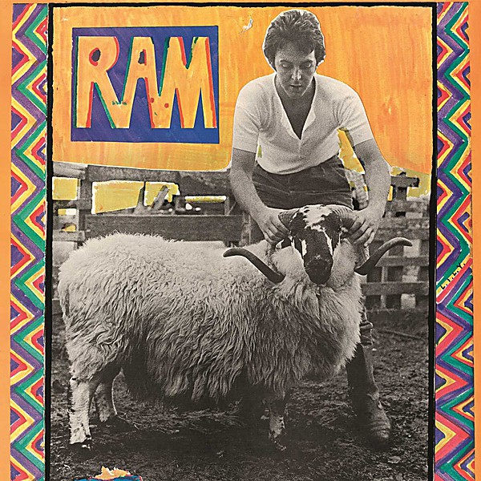

# RAM

By **Paul McCartney**

## Album Data

- **Catalog:** Beets
- **Format:** Digital, Album
- **Album:** RAM
- **Artist:** Paul Mccartney
- **Albumartist:** Paul McCartney
- **Genre:** Indie Pop
- **MusicBrainz Album Artist ID:** 
- **MusicBrainz Album ID:** 
- **MusicBrainz Release Group ID:** 
- **Year:** 0000
- **Catalog #:** 
- **Label:** 
- **Total Tracks:** 12

## Album Tracks

### Track 05 - Uncle Albert / Admiral Halsey

- **Artist:** Paul McCartney
- **Format:** AAC
- **Genre:** Pop Rock
- **Length:** 4:50
- **MusicBrainz Track ID:** [ed0a9aa0-55aa-4740-bbdf-538ab13a6414](https://musicbrainz.org/recording/ed0a9aa0-55aa-4740-bbdf-538ab13a6414)
- **Title:** Uncle Albert / Admiral Halsey
- **Track:** 05
- **Year:** 2012

### Track 12 - The Back Seat of My Car

- **Artist:** Paul McCartney
- **Format:** AAC
- **Genre:** Soft Rock
- **Length:** 4:29
- **MusicBrainz Track ID:** [ea955c29-8395-41ea-9523-42df1401e685](https://musicbrainz.org/recording/ea955c29-8395-41ea-9523-42df1401e685)
- **Title:** The Back Seat of My Car
- **Track:** 12
- **Year:** 2012

## See also

- [All the Best](All_the_Best.md)
- [McCartney](McCartney.md)
- [Memory Almost Full](Memory_Almost_Full.md)
- [New](New.md)
- [Pure McCartney](Pure_McCartney.md)
- [RAM](RAM_2.md)
- [CD: Mccartney](../../CD/Paul_McCartney/Mccartney.md)
- [CD: ](../../CD/Paul_McCartney/Paul_McCartney.md)
- [CD: Ram](../../CD/Paul_McCartney/Ram.md)
- [Roon: Band On The Run](../../Roon/Paul_McCartney/Band_On_The_Run.md)
- [Roon: McCartney (Archive Collection)](../../Roon/Paul_McCartney/McCartney_Archive_Collection.md)
- [Roon: NEW (Deluxe Edition)](../../Roon/Paul_McCartney/NEW_Deluxe_Edition.md)
- [Roon: Pure McCartney](../../Roon/Paul_McCartney/Pure_McCartney.md)
- [Roon: Ram (Archive Collection)](../../Roon/Paul_McCartney/Ram_Archive_Collection.md)
- [Roon: Wings At The Speed Of Sound (Archive Collection)](../../Roon/Paul_McCartney/Wings_At_The_Speed_Of_Sound_Archive_Collection.md)
- [Roon: Wings Over America (Live / Remastered)](../../Roon/Paul_McCartney/Wings_Over_America_Live_-_Remastered.md)
- [Roon: Wingspan](../../Roon/Paul_McCartney/Wingspan.md)
- [Vinyl: McCartney](../../Vinyl/Paul_McCartney/McCartney.md)
- [Vinyl: ](../../Vinyl/Paul_McCartney/Paul_McCartney.md)
- [Vinyl: Press To Play](../../Vinyl/Paul_McCartney/Press_To_Play.md)
