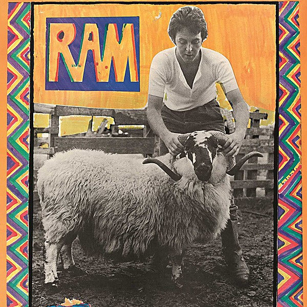

# RAM

By **Paul Mccartney**

## Album Data

- **Catalog:** Beets
- **Format:** Digital, Album
- **Album:** RAM
- **Artist:** Paul Mccartney
- **Albumartist:** Paul Mccartney
- **Genre:** Indie Pop
- **MusicBrainz Album Artist ID:** 
- **MusicBrainz Album ID:** 
- **MusicBrainz Release Group ID:** 
- **Year:** 2012
- **Catalog #:** 
- **Label:** 
- **Total Tracks:** 12

## Album Tracks

### Track 05 - Uncle Albert / Admiral Halsey

- **Artist:** Paul McCartney
- **Format:** AAC
- **Genre:** Pop Rock
- **Length:** 4:50
- **MusicBrainz Track ID:** [ed0a9aa0-55aa-4740-bbdf-538ab13a6414](https://musicbrainz.org/recording/ed0a9aa0-55aa-4740-bbdf-538ab13a6414)
- **Title:** Uncle Albert / Admiral Halsey
- **Track:** 05
- **Year:** 2012

### Track 12 - The Back Seat of My Car

- **Artist:** Paul McCartney
- **Format:** AAC
- **Genre:** Soft Rock
- **Length:** 4:29
- **MusicBrainz Track ID:** [ea955c29-8395-41ea-9523-42df1401e685](https://musicbrainz.org/recording/ea955c29-8395-41ea-9523-42df1401e685)
- **Title:** The Back Seat of My Car
- **Track:** 12
- **Year:** 2012

