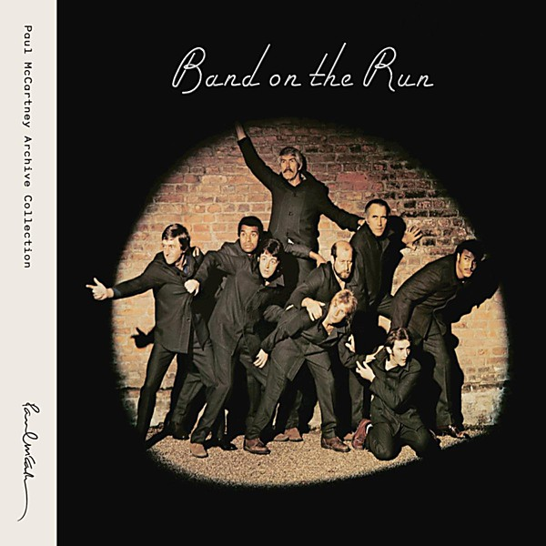

# Band on the Run (2010 Remaster)

By **Paul McCartney & Wings**

## Album Data

- **Catalog:** Beets
- **Format:** Digital, Album
- **Album:** Band on the Run (2010 Remaster)
- **Artist:** Paul Mccartney & Wings
- **Albumartist:** Paul McCartney & Wings
- **Genre:** Rock
- **MusicBrainz Album Artist ID:** 
- **MusicBrainz Album ID:** 
- **MusicBrainz Release Group ID:** 
- **Year:** 0000
- **Catalog #:** 
- **Label:** 
- **Total Tracks:** 18

## Album Tracks

### Track 01 - Band on the Run

- **Artist:** Paul McCartney & Wings
- **Format:** MP3
- **Genre:** Soft Rock
- **Length:** 5:13
- **MusicBrainz Track ID:** 
- **Title:** Band on the Run
- **Track:** 01
- **Year:** 0000

### Track 02 - Jet

- **Artist:** Paul McCartney & Wings
- **Format:** MP3
- **Genre:** Rock
- **Length:** 4:09
- **MusicBrainz Track ID:** 
- **Title:** Jet
- **Track:** 02
- **Year:** 0000

### Track 03 - Bluebird

- **Artist:** Paul McCartney & Wings
- **Format:** MP3
- **Genre:** Soft Rock
- **Length:** 3:25
- **MusicBrainz Track ID:** 
- **Title:** Bluebird
- **Track:** 03
- **Year:** 0000

### Track 04 - Mrs. Vandebilt

- **Artist:** Paul McCartney & Wings
- **Format:** MP3
- **Genre:** Progressive Rock
- **Length:** 4:41
- **MusicBrainz Track ID:** 
- **Title:** Mrs. Vandebilt
- **Track:** 04
- **Year:** 0000

### Track 05 - Let Me Roll It

- **Artist:** Paul McCartney & Wings
- **Format:** MP3
- **Genre:** Soft Rock
- **Length:** 4:50
- **MusicBrainz Track ID:** 
- **Title:** Let Me Roll It
- **Track:** 05
- **Year:** 0000

### Track 06 - Mamunia

- **Artist:** Paul McCartney & Wings
- **Format:** MP3
- **Genre:** Soft Rock
- **Length:** 4:50
- **MusicBrainz Track ID:** 
- **Title:** Mamunia
- **Track:** 06
- **Year:** 0000

### Track 07 - No Words

- **Artist:** Paul McCartney & Wings
- **Format:** MP3
- **Genre:** Progressive Rock
- **Length:** 2:36
- **MusicBrainz Track ID:** 
- **Title:** No Words
- **Track:** 07
- **Year:** 0000

### Track 08 - Picasso's Last Words (Drink to Me)

- **Artist:** Paul McCartney & Wings
- **Format:** MP3
- **Genre:** Soft Rock
- **Length:** 5:49
- **MusicBrainz Track ID:** 
- **Title:** Picasso's Last Words (Drink to Me)
- **Track:** 08
- **Year:** 0000

### Track 09 - Nineteen Hundred and Eighty Five

- **Artist:** Paul McCartney & Wings
- **Format:** MP3
- **Genre:** Soul
- **Length:** 5:31
- **MusicBrainz Track ID:** 
- **Title:** Nineteen Hundred and Eighty Five
- **Track:** 09
- **Year:** 0000

### Track 10 - Helen Wheels

- **Artist:** Paul McCartney & Wings
- **Format:** MP3
- **Genre:** Pop Rock
- **Length:** 3:47
- **MusicBrainz Track ID:** 
- **Title:** Helen Wheels
- **Track:** 10
- **Year:** 0000

### Track 11 - Country Dreamer

- **Artist:** Paul McCartney & Wings
- **Format:** MP3
- **Genre:** Rock
- **Length:** 3:09
- **MusicBrainz Track ID:** 
- **Title:** Country Dreamer
- **Track:** 11
- **Year:** 0000

### Track 12 - Bluebird [from One Hand Clapping]

- **Artist:** Paul McCartney & Wings
- **Format:** MP3
- **Genre:** Rock
- **Length:** 3:28
- **MusicBrainz Track ID:** 
- **Title:** Bluebird [from One Hand Clapping]
- **Track:** 12
- **Year:** 0000

### Track 13 - Jet [from One Hand Clapping]

- **Artist:** Paul McCartney & Wings
- **Format:** MP3
- **Genre:** Rock
- **Length:** 3:57
- **MusicBrainz Track ID:** 
- **Title:** Jet [from One Hand Clapping]
- **Track:** 13
- **Year:** 0000

### Track 14 - Let Me Roll It [from One Hand Clapping]

- **Artist:** Paul McCartney & Wings
- **Format:** MP3
- **Genre:** Rock
- **Length:** 4:25
- **MusicBrainz Track ID:** 
- **Title:** Let Me Roll It [from One Hand Clapping]
- **Track:** 14
- **Year:** 0000

### Track 15 - Band on the Run [from One Hand Clapping]

- **Artist:** Paul McCartney & Wings
- **Format:** MP3
- **Genre:** Rock
- **Length:** 5:14
- **MusicBrainz Track ID:** 
- **Title:** Band on the Run [from One Hand Clapping]
- **Track:** 15
- **Year:** 0000

### Track 16 - Nineteen Hundred and Eighty Five [from One Hand Clapping]

- **Artist:** Paul McCartney & Wings
- **Format:** MP3
- **Genre:** Rock
- **Length:** 5:59
- **MusicBrainz Track ID:** 
- **Title:** Nineteen Hundred and Eighty Five [from One Hand Clapping]
- **Track:** 16
- **Year:** 0000

### Track 17 - Country Dreamer [from One Hand Clapping]

- **Artist:** Paul McCartney & Wings
- **Format:** MP3
- **Genre:** Rock
- **Length:** 2:16
- **MusicBrainz Track ID:** 
- **Title:** Country Dreamer [from One Hand Clapping]
- **Track:** 17
- **Year:** 0000

### Track 18 - Zoo Gang

- **Artist:** Paul McCartney & Wings
- **Format:** MP3
- **Genre:** Acid Rock
- **Length:** 2:01
- **MusicBrainz Track ID:** 
- **Title:** Zoo Gang
- **Track:** 18
- **Year:** 0000

## See also

- [Wings Over America (Remastered)](Wings_Over_America_Remastered.md)
