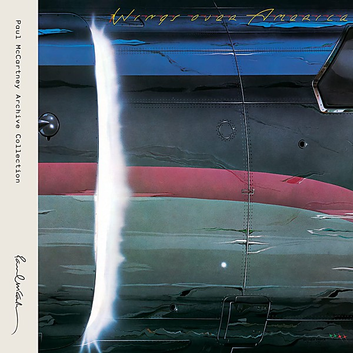

# Wings Over America (Remastered)

By **Paul McCartney And Wings**

## Album Data

- **Catalog:** Beets
- **Format:** Digital, Album
- **Album:** Wings Over America (Remastered)
- **Artist:** Paul Mccartney And Wings
- **Albumartist:** Paul McCartney And Wings
- **Genre:** Rock
- **MusicBrainz Album Artist ID:** 
- **MusicBrainz Album ID:** 
- **MusicBrainz Release Group ID:** 
- **Year:** 2013
- **Catalog #:** 
- **Label:** 
- **Total Tracks:** 29

## Album Tracks

### Track 01 - Venus And Mars / Rock Show / Jet (Remastered)

- **Artist:** Paul McCartney And Wings
- **Format:** MP3
- **Genre:** Rock
- **Length:** 10:22
- **MusicBrainz Track ID:** 
- **Title:** Venus And Mars / Rock Show / Jet (Remastered)
- **Track:** 01
- **Year:** 2013

### Track 02 - Let Me Roll It (Remastered)

- **Artist:** Paul McCartney And Wings
- **Format:** MP3
- **Genre:** Rock
- **Length:** 3:44
- **MusicBrainz Track ID:** 
- **Title:** Let Me Roll It (Remastered)
- **Track:** 02
- **Year:** 2013

### Track 03 - Spirits Of Ancient Egypt (Remastered)

- **Artist:** Paul McCartney And Wings
- **Format:** MP3
- **Genre:** Rock
- **Length:** 4:05
- **MusicBrainz Track ID:** 
- **Title:** Spirits Of Ancient Egypt (Remastered)
- **Track:** 03
- **Year:** 2013

### Track 04 - Medicine Jar (Remastered)

- **Artist:** Paul McCartney And Wings
- **Format:** MP3
- **Genre:** Rock
- **Length:** 4:06
- **MusicBrainz Track ID:** 
- **Title:** Medicine Jar (Remastered)
- **Track:** 04
- **Year:** 2013

### Track 05 - Maybe I'm Amazed (Remastered)

- **Artist:** Paul McCartney And Wings
- **Format:** MP3
- **Genre:** Soft Rock
- **Length:** 5:20
- **MusicBrainz Track ID:** 
- **Title:** Maybe I'm Amazed (Remastered)
- **Track:** 05
- **Year:** 2013

### Track 06 - Call Me Back Again (Remastered)

- **Artist:** Paul McCartney And Wings
- **Format:** MP3
- **Genre:** Rock
- **Length:** 5:15
- **MusicBrainz Track ID:** 
- **Title:** Call Me Back Again (Remastered)
- **Track:** 06
- **Year:** 2013

### Track 07 - Lady Madonna (Remastered)

- **Artist:** Paul McCartney And Wings
- **Format:** MP3
- **Genre:** Rock
- **Length:** 2:37
- **MusicBrainz Track ID:** 
- **Title:** Lady Madonna (Remastered)
- **Track:** 07
- **Year:** 2013

### Track 08 - The Long And Winding Road (Remastered)

- **Artist:** Paul McCartney And Wings
- **Format:** MP3
- **Genre:** Soft Rock
- **Length:** 4:28
- **MusicBrainz Track ID:** 
- **Title:** The Long And Winding Road (Remastered)
- **Track:** 08
- **Year:** 2013

### Track 09 - Live And Let Die (Remastered)

- **Artist:** Paul McCartney And Wings
- **Format:** MP3
- **Genre:** Rock
- **Length:** 3:20
- **MusicBrainz Track ID:** 
- **Title:** Live And Let Die (Remastered)
- **Track:** 09
- **Year:** 2013

### Track 10 - Picasso's Last Words (Remastered)

- **Artist:** Paul McCartney And Wings
- **Format:** MP3
- **Genre:** Rock
- **Length:** 1:53
- **MusicBrainz Track ID:** 
- **Title:** Picasso's Last Words (Remastered)
- **Track:** 10
- **Year:** 2013

### Track 11 - Richard Cory (Remastered)

- **Artist:** Paul McCartney And Wings
- **Format:** MP3
- **Genre:** Rock
- **Length:** 3:05
- **MusicBrainz Track ID:** 
- **Title:** Richard Cory (Remastered)
- **Track:** 11
- **Year:** 2013

### Track 12 - Bluebird (Remastered)

- **Artist:** Paul McCartney And Wings
- **Format:** MP3
- **Genre:** Rock
- **Length:** 3:43
- **MusicBrainz Track ID:** 
- **Title:** Bluebird (Remastered)
- **Track:** 12
- **Year:** 2013

### Track 13 - I've Just Seen A Face (Remastered)

- **Artist:** Paul McCartney And Wings
- **Format:** MP3
- **Genre:** Rock
- **Length:** 2:10
- **MusicBrainz Track ID:** 
- **Title:** I've Just Seen A Face (Remastered)
- **Track:** 13
- **Year:** 2013

### Track 14 - Blackbird (Remastered)

- **Artist:** Paul McCartney And Wings
- **Format:** MP3
- **Genre:** Rock
- **Length:** 2:27
- **MusicBrainz Track ID:** 
- **Title:** Blackbird (Remastered)
- **Track:** 14
- **Year:** 2013

### Track 15 - Yesterday (Remastered)

- **Artist:** Paul McCartney And Wings
- **Format:** MP3
- **Genre:** Rock
- **Length:** 1:56
- **MusicBrainz Track ID:** 
- **Title:** Yesterday (Remastered)
- **Track:** 15
- **Year:** 2013

### Track 16 - You Gave Me The Answer (Remastered)

- **Artist:** Paul McCartney And Wings
- **Format:** MP3
- **Genre:** Rock
- **Length:** 2:06
- **MusicBrainz Track ID:** 
- **Title:** You Gave Me The Answer (Remastered)
- **Track:** 16
- **Year:** 2013

### Track 17 - Magneto And Titanium Man (Remastered)

- **Artist:** Paul McCartney And Wings
- **Format:** MP3
- **Genre:** Rock
- **Length:** 3:21
- **MusicBrainz Track ID:** 
- **Title:** Magneto And Titanium Man (Remastered)
- **Track:** 17
- **Year:** 2013

### Track 18 - Go Now (Remastered)

- **Artist:** Paul McCartney And Wings
- **Format:** MP3
- **Genre:** Rock
- **Length:** 3:46
- **MusicBrainz Track ID:** 
- **Title:** Go Now (Remastered)
- **Track:** 18
- **Year:** 2013

### Track 19 - My Love (Remastered)

- **Artist:** Paul McCartney And Wings
- **Format:** MP3
- **Genre:** Rock
- **Length:** 4:14
- **MusicBrainz Track ID:** 
- **Title:** My Love (Remastered)
- **Track:** 19
- **Year:** 2013

### Track 20 - Listen To What The Man Said (Remastered)

- **Artist:** Paul McCartney And Wings
- **Format:** MP3
- **Genre:** Rock
- **Length:** 3:32
- **MusicBrainz Track ID:** 
- **Title:** Listen To What The Man Said (Remastered)
- **Track:** 20
- **Year:** 2013

### Track 21 - Let 'Em In (Remastered)

- **Artist:** Paul McCartney And Wings
- **Format:** MP3
- **Genre:** Rock
- **Length:** 4:08
- **MusicBrainz Track ID:** 
- **Title:** Let 'Em In (Remastered)
- **Track:** 21
- **Year:** 2013

### Track 22 - Time To Hide (Remastered)

- **Artist:** Paul McCartney And Wings
- **Format:** MP3
- **Genre:** Rock
- **Length:** 4:56
- **MusicBrainz Track ID:** 
- **Title:** Time To Hide (Remastered)
- **Track:** 22
- **Year:** 2013

### Track 23 - Silly Love Songs (Remastered)

- **Artist:** Paul McCartney And Wings
- **Format:** MP3
- **Genre:** Rock
- **Length:** 6:04
- **MusicBrainz Track ID:** 
- **Title:** Silly Love Songs (Remastered)
- **Track:** 23
- **Year:** 2013

### Track 24 - Beware My Love (Remastered)

- **Artist:** Paul McCartney And Wings
- **Format:** MP3
- **Genre:** Rock
- **Length:** 4:58
- **MusicBrainz Track ID:** 
- **Title:** Beware My Love (Remastered)
- **Track:** 24
- **Year:** 2013

### Track 25 - Letting Go (Remastered)

- **Artist:** Paul McCartney And Wings
- **Format:** MP3
- **Genre:** Rock
- **Length:** 4:33
- **MusicBrainz Track ID:** 
- **Title:** Letting Go (Remastered)
- **Track:** 25
- **Year:** 2013

### Track 26 - Band On The Run (Remastered)

- **Artist:** Paul McCartney And Wings
- **Format:** MP3
- **Genre:** Rock
- **Length:** 5:30
- **MusicBrainz Track ID:** 
- **Title:** Band On The Run (Remastered)
- **Track:** 26
- **Year:** 2013

### Track 27 - Hi Hi Hi (Remastered)

- **Artist:** Paul McCartney And Wings
- **Format:** MP3
- **Genre:** Rock
- **Length:** 3:48
- **MusicBrainz Track ID:** 
- **Title:** Hi Hi Hi (Remastered)
- **Track:** 27
- **Year:** 2013

### Track 28 - Soily (Remastered)

- **Artist:** Paul McCartney And Wings
- **Format:** MP3
- **Genre:** Rock
- **Length:** 5:47
- **MusicBrainz Track ID:** 
- **Title:** Soily (Remastered)
- **Track:** 28
- **Year:** 2013

## See also

- [Band on the Run (2010 Remaster)](Band_on_the_Run_2010_Remaster.md)
