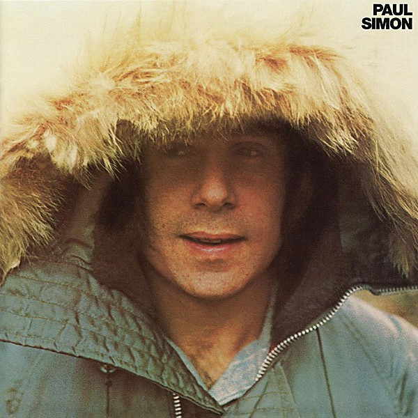

# Paul Simon

By **Paul Simon**

## Album Data

- **Catalog:** Beets
- **Format:** Digital, Album
- **Album:** Paul Simon
- **Artist:** Paul Simon
- **Albumartist:** Paul Simon
- **Genre:** Soft Rock
- **MusicBrainz Album Artist ID:** 
- **MusicBrainz Album ID:** 
- **MusicBrainz Release Group ID:** 
- **Year:** 2010
- **Catalog #:** 
- **Label:** 
- **Total Tracks:** 00

## Album Tracks

### Track 01 - Still Crazy After All These Years

- **Artist:** Paul Simon
- **Format:** MP3
- **Genre:** Soft Rock
- **Length:** 3:23
- **MusicBrainz Track ID:** 
- **Title:** Still Crazy After All These Years
- **Track:** 01
- **Year:** 1975

### Track 02 - My Little Town

- **Artist:** Paul Simon
- **Format:** MP3
- **Genre:** Soft Rock
- **Length:** 3:48
- **MusicBrainz Track ID:** 
- **Title:** My Little Town
- **Track:** 02
- **Year:** 1975

### Track 03 - I Do It for Your Love

- **Artist:** Paul Simon
- **Format:** MP3
- **Genre:** Soft Rock
- **Length:** 3:31
- **MusicBrainz Track ID:** 
- **Title:** I Do It for Your Love
- **Track:** 03
- **Year:** 1975

### Track 04 - 50 Ways to Leave Your Lover

- **Artist:** Paul Simon
- **Format:** MP3
- **Genre:** Soft Rock
- **Length:** 3:37
- **MusicBrainz Track ID:** 
- **Title:** 50 Ways to Leave Your Lover
- **Track:** 04
- **Year:** 1975

### Track 05 - Night Game

- **Artist:** Paul Simon
- **Format:** MP3
- **Genre:** Soft Rock
- **Length:** 2:54
- **MusicBrainz Track ID:** 
- **Title:** Night Game
- **Track:** 05
- **Year:** 1975

### Track 06 - Gone At Last

- **Artist:** Paul Simon
- **Format:** MP3
- **Genre:** Soft Rock
- **Length:** 3:35
- **MusicBrainz Track ID:** 
- **Title:** Gone At Last
- **Track:** 06
- **Year:** 1975

### Track 07 - Some Folks' Lives Roll Easy

- **Artist:** Paul Simon
- **Format:** MP3
- **Genre:** Soft Rock
- **Length:** 3:10
- **MusicBrainz Track ID:** 
- **Title:** Some Folks' Lives Roll Easy
- **Track:** 07
- **Year:** 1975

### Track 08 - You're Kind

- **Artist:** Paul Simon
- **Format:** MP3
- **Genre:** Soft Rock
- **Length:** 3:14
- **MusicBrainz Track ID:** 
- **Title:** You're Kind
- **Track:** 08
- **Year:** 1975

### Track 09 - Silent Eyes

- **Artist:** Paul Simon
- **Format:** MP3
- **Genre:** Soft Rock
- **Length:** 3:59
- **MusicBrainz Track ID:** 
- **Title:** Silent Eyes
- **Track:** 09
- **Year:** 1975

### Track 10 - Slip Slidin' Away (Demo)

- **Artist:** Paul Simon
- **Format:** MP3
- **Genre:** Soft Rock
- **Length:** 5:28
- **MusicBrainz Track ID:** 
- **Title:** Slip Slidin' Away (Demo)
- **Track:** 10
- **Year:** 1975

### Track 11 - Gone at Last (Original Demo)

- **Artist:** Paul Simon
- **Format:** MP3
- **Genre:** Soft Rock
- **Length:** 4:36
- **MusicBrainz Track ID:** 
- **Title:** Gone at Last (Original Demo)
- **Track:** 11
- **Year:** 1975

## See also

- [Graceland](Graceland.md)
- [Still Crazy After All These Years](Still_Crazy_After_All_These_Years.md)
- [There Goes Rhymin' Simon](There_Goes_Rhymin_Simon.md)
- [Roon: Paul Simon](../../Roon/Paul_Simon/Paul_Simon.md)
- [Roon: There Goes Rhymin' Simon](../../Roon/Paul_Simon/There_Goes_Rhymin_Simon.md)
- [Vinyl: ](../../Vinyl/Paul_Simon/Paul_Simon_index.md)
- [Vinyl: Paul Simon](../../Vinyl/Paul_Simon/Paul_Simon.md)
- [Vinyl: There Goes Rhymin' Simon](../../Vinyl/Paul_Simon/There_Goes_Rhymin_Simon.md)
