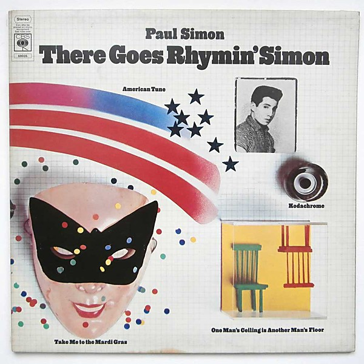

# There Goes Rhymin' Simon

By **Paul Simon**

## Album Data

- **Catalog:** Beets
- **Format:** Digital, Album
- **Album:** There Goes Rhymin' Simon
- **Artist:** Paul Simon
- **Albumartist:** Paul Simon
- **Genre:** Soft Rock
- **MusicBrainz Album Artist ID:** 
- **MusicBrainz Album ID:** 
- **MusicBrainz Release Group ID:** 
- **Year:** 2010
- **Catalog #:** 9 25447-2
- **Label:** Warner Bros. Records
- **Total Tracks:** 11

## Album Tracks

### Track 01 - The Boy in the Bubble

- **Artist:** Paul Simon
- **Format:** MP3
- **Genre:** Soft Rock
- **Length:** 3:57
- **MusicBrainz Track ID:** [43aa23e4-b522-48ca-a0fe-e63aec7d5295](https://musicbrainz.org/recording/43aa23e4-b522-48ca-a0fe-e63aec7d5295)
- **Title:** The Boy in the Bubble
- **Track:** 01
- **Year:** 1986

### Track 02 - Graceland

- **Artist:** Paul Simon
- **Format:** MP3
- **Genre:** Soft Rock
- **Length:** 4:48
- **MusicBrainz Track ID:** [263798a5-ccb7-49d1-8478-da1d6f2b7c1e](https://musicbrainz.org/recording/263798a5-ccb7-49d1-8478-da1d6f2b7c1e)
- **Title:** Graceland
- **Track:** 02
- **Year:** 1986

### Track 03 - I Know What I Know

- **Artist:** Paul Simon
- **Format:** MP3
- **Genre:** Worldbeat
- **Length:** 3:13
- **MusicBrainz Track ID:** [ebf11bdd-0588-44c6-8d92-b029fee7d58d](https://musicbrainz.org/recording/ebf11bdd-0588-44c6-8d92-b029fee7d58d)
- **Title:** I Know What I Know
- **Track:** 03
- **Year:** 1986

### Track 04 - Gumboots

- **Artist:** Paul Simon
- **Format:** MP3
- **Genre:** Soft Rock
- **Length:** 2:43
- **MusicBrainz Track ID:** [9526475e-3d01-47fc-b142-1d127f462d44](https://musicbrainz.org/recording/9526475e-3d01-47fc-b142-1d127f462d44)
- **Title:** Gumboots
- **Track:** 04
- **Year:** 1986

### Track 05 - Diamonds on the Soles of Her Shoes

- **Artist:** Paul Simon
- **Format:** MP3
- **Genre:** Worldbeat
- **Length:** 5:45
- **MusicBrainz Track ID:** [42933ea3-9f5c-426c-9e86-24de756eae60](https://musicbrainz.org/recording/42933ea3-9f5c-426c-9e86-24de756eae60)
- **Title:** Diamonds on the Soles of Her Shoes
- **Track:** 05
- **Year:** 1986

### Track 06 - You Can Call Me Al

- **Artist:** Paul Simon
- **Format:** MP3
- **Genre:** Soft Rock
- **Length:** 4:38
- **MusicBrainz Track ID:** [01e1696b-b3c7-4ffe-a42b-ec2c952f7429](https://musicbrainz.org/recording/01e1696b-b3c7-4ffe-a42b-ec2c952f7429)
- **Title:** You Can Call Me Al
- **Track:** 06
- **Year:** 1986

### Track 07 - Under African Skies

- **Artist:** Paul Simon
- **Format:** MP3
- **Genre:** Soft Rock
- **Length:** 3:34
- **MusicBrainz Track ID:** [7d4844ad-fc1e-4491-b57a-e7f925cbd53f](https://musicbrainz.org/recording/7d4844ad-fc1e-4491-b57a-e7f925cbd53f)
- **Title:** Under African Skies
- **Track:** 07
- **Year:** 1986

### Track 08 - Homeless

- **Artist:** Paul Simon
- **Format:** MP3
- **Genre:** Soft Rock
- **Length:** 3:48
- **MusicBrainz Track ID:** [71cd6064-0c37-4d6e-8e98-003d676915c3](https://musicbrainz.org/recording/71cd6064-0c37-4d6e-8e98-003d676915c3)
- **Title:** Homeless
- **Track:** 08
- **Year:** 1986

### Track 09 - Crazy Love, Vol. II

- **Artist:** Paul Simon
- **Format:** MP3
- **Genre:** Soft Rock
- **Length:** 4:15
- **MusicBrainz Track ID:** [073788f1-aca2-482f-9a64-6dde4f16012d](https://musicbrainz.org/recording/073788f1-aca2-482f-9a64-6dde4f16012d)
- **Title:** Crazy Love, Vol. II
- **Track:** 09
- **Year:** 1986

### Track 10 - That Was Your Mother

- **Artist:** Paul Simon
- **Format:** MP3
- **Genre:** Zydeco
- **Length:** 2:53
- **MusicBrainz Track ID:** [2e68e8d5-8635-4678-bc1a-9fa54655ddc2](https://musicbrainz.org/recording/2e68e8d5-8635-4678-bc1a-9fa54655ddc2)
- **Title:** That Was Your Mother
- **Track:** 10
- **Year:** 1986

### Track 11 - All Around the World or The Myth of Fingerprints

- **Artist:** Paul Simon
- **Format:** MP3
- **Genre:** Soft Rock
- **Length:** 3:10
- **MusicBrainz Track ID:** [8bbb4009-ab4a-4c84-a90f-9f8433767af5](https://musicbrainz.org/recording/8bbb4009-ab4a-4c84-a90f-9f8433767af5)
- **Title:** All Around the World or The Myth of Fingerprints
- **Track:** 11
- **Year:** 1986

## See also

- [Graceland](Graceland.md)
- [Paul Simon](Paul_Simon.md)
- [Still Crazy After All These Years](Still_Crazy_After_All_These_Years.md)
- [Roon: Paul Simon](../../Roon/Paul_Simon/Paul_Simon.md)
- [Roon: There Goes Rhymin' Simon](../../Roon/Paul_Simon/There_Goes_Rhymin_Simon.md)
- [Vinyl: ](../../Vinyl/Paul_Simon/Paul_Simon_index.md)
- [Vinyl: Paul Simon](../../Vinyl/Paul_Simon/Paul_Simon.md)
- [Vinyl: There Goes Rhymin' Simon](../../Vinyl/Paul_Simon/There_Goes_Rhymin_Simon.md)
