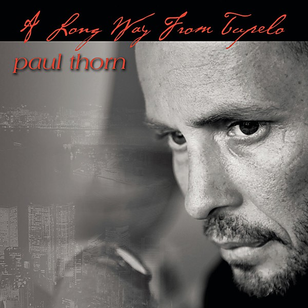

# A Long Way From Tupelo

By **Paul Thorn**

## Album Data

- **Catalog:** Beets
- **Format:** Digital, Album
- **Album:** A Long Way From Tupelo
- **Artist:** Paul Thorn
- **Albumartist:** Paul Thorn
- **Genre:** Americana
- **MusicBrainz Album Artist ID:** [f560cffe-c225-4b91-8511-403219819200](https://musicbrainz.org/artist/f560cffe-c225-4b91-8511-403219819200)
- **MusicBrainz Album ID:** [e4ad2079-854f-4112-ac92-cf121ade664d](https://musicbrainz.org/release/e4ad2079-854f-4112-ac92-cf121ade664d)
- **MusicBrainz Release Group ID:** [b5231399-cc0e-35e9-899b-b0a3832da512](https://musicbrainz.org/release-group/b5231399-cc0e-35e9-899b-b0a3832da512)
- **Year:** 2008
- **Catalog #:** 
- **Label:** ARK 21
- **Total Tracks:** 14

## Album Tracks

### Track 01 - Ain't Love Strange

- **Artist:** Paul Thorn
- **Format:** ALAC
- **Genre:** Country Rock
- **Length:** 3:50
- **MusicBrainz Track ID:** [f0d83a97-e6d0-4190-a135-4f4a3f2c4d55](https://musicbrainz.org/recording/f0d83a97-e6d0-4190-a135-4f4a3f2c4d55)
- **Title:** Ain't Love Strange
- **Track:** 01
- **Year:** 1999

### Track 02 - Blue Stew

- **Artist:** Paul Thorn
- **Format:** ALAC
- **Genre:** Blue-Eyed Soul
- **Length:** 3:37
- **MusicBrainz Track ID:** [84ef99aa-b384-4515-ba97-d714e3e96ada](https://musicbrainz.org/recording/84ef99aa-b384-4515-ba97-d714e3e96ada)
- **Title:** Blue Stew
- **Track:** 02
- **Year:** 1999

### Track 03 - I Have a Good Day

- **Artist:** Paul Thorn
- **Format:** ALAC
- **Genre:** Blue-Eyed Soul
- **Length:** 3:14
- **MusicBrainz Track ID:** [35417330-d272-42bb-a363-4490551edca8](https://musicbrainz.org/recording/35417330-d272-42bb-a363-4490551edca8)
- **Title:** I Have a Good Day
- **Track:** 03
- **Year:** 1999

### Track 04 - Burn Down the Trailer Park

- **Artist:** Paul Thorn
- **Format:** ALAC
- **Genre:** Blues
- **Length:** 3:23
- **MusicBrainz Track ID:** [c42e5721-175e-4acb-910d-44b25bba3fb0](https://musicbrainz.org/recording/c42e5721-175e-4acb-910d-44b25bba3fb0)
- **Title:** Burn Down the Trailer Park
- **Track:** 04
- **Year:** 1999

### Track 05 - What Do You Take Me For?

- **Artist:** Paul Thorn
- **Format:** ALAC
- **Genre:** Comedy
- **Length:** 4:25
- **MusicBrainz Track ID:** [01310c3c-4e17-4a93-952b-0e365fcd4bf4](https://musicbrainz.org/recording/01310c3c-4e17-4a93-952b-0e365fcd4bf4)
- **Title:** What Do You Take Me For?
- **Track:** 05
- **Year:** 1999

### Track 06 - Fabio & Liberace

- **Artist:** Paul Thorn
- **Format:** ALAC
- **Genre:** Blue-Eyed Soul
- **Length:** 3:29
- **MusicBrainz Track ID:** [e5c30b10-80a2-4a11-9709-5569d2f2d7ec](https://musicbrainz.org/recording/e5c30b10-80a2-4a11-9709-5569d2f2d7ec)
- **Title:** Fabio & Liberace
- **Track:** 06
- **Year:** 1999

### Track 07 - Mood Ring

- **Artist:** Paul Thorn
- **Format:** ALAC
- **Genre:** Blue-Eyed Soul
- **Length:** 3:56
- **MusicBrainz Track ID:** [0da4ff3c-b4d5-472d-be5b-b798b1390436](https://musicbrainz.org/recording/0da4ff3c-b4d5-472d-be5b-b798b1390436)
- **Title:** Mood Ring
- **Track:** 07
- **Year:** 1999

### Track 08 - Black Rainbow

- **Artist:** Paul Thorn
- **Format:** ALAC
- **Genre:** Blue-Eyed Soul
- **Length:** 3:07
- **MusicBrainz Track ID:** [ee5182df-caec-4c71-8bc5-e67af0583e90](https://musicbrainz.org/recording/ee5182df-caec-4c71-8bc5-e67af0583e90)
- **Title:** Black Rainbow
- **Track:** 08
- **Year:** 1999

### Track 09 - Where Was I?

- **Artist:** Paul Thorn
- **Format:** ALAC
- **Genre:** Americana
- **Length:** 4:07
- **MusicBrainz Track ID:** [a7480253-13ef-4a40-acee-48b45fcd831c](https://musicbrainz.org/recording/a7480253-13ef-4a40-acee-48b45fcd831c)
- **Title:** Where Was I?
- **Track:** 09
- **Year:** 1999

### Track 10 - A Lot of Good Reasons

- **Artist:** Paul Thorn
- **Format:** ALAC
- **Genre:** Blue-Eyed Soul
- **Length:** 3:44
- **MusicBrainz Track ID:** [5638b030-5db5-45d5-8529-f94f81319b27](https://musicbrainz.org/recording/5638b030-5db5-45d5-8529-f94f81319b27)
- **Title:** A Lot of Good Reasons
- **Track:** 10
- **Year:** 1999

### Track 11 - Help Me Out, Hook Me Up

- **Artist:** Paul Thorn
- **Format:** ALAC
- **Genre:** Blue-Eyed Soul
- **Length:** 3:02
- **MusicBrainz Track ID:** [8fe74115-7930-4869-9a17-82b63fcd9ace](https://musicbrainz.org/recording/8fe74115-7930-4869-9a17-82b63fcd9ace)
- **Title:** Help Me Out, Hook Me Up
- **Track:** 11
- **Year:** 1999

### Track 12 - Accept My Love

- **Artist:** Paul Thorn
- **Format:** ALAC
- **Genre:** Blue-Eyed Soul
- **Length:** 2:59
- **MusicBrainz Track ID:** [c6fa6654-4cc0-402e-b16b-8ab4ec8238a9](https://musicbrainz.org/recording/c6fa6654-4cc0-402e-b16b-8ab4ec8238a9)
- **Title:** Accept My Love
- **Track:** 12
- **Year:** 1999

### Track 13 - Ain't Gonna Beg

- **Artist:** Paul Thorn
- **Format:** ALAC
- **Genre:** Texas Blues
- **Length:** 3:59
- **MusicBrainz Track ID:** [3b6232de-ac0e-48f3-9b7b-e0e617b6757a](https://musicbrainz.org/recording/3b6232de-ac0e-48f3-9b7b-e0e617b6757a)
- **Title:** Ain't Gonna Beg
- **Track:** 13
- **Year:** 1999

### Track 14 - Thats All I Know Right Now

- **Artist:** Paul Thorn
- **Format:** ALAC
- **Genre:** Blue-Eyed Soul
- **Length:** 3:12
- **MusicBrainz Track ID:** [c1ee70ad-213f-46c1-b161-3c886c66b168](https://musicbrainz.org/recording/c1ee70ad-213f-46c1-b161-3c886c66b168)
- **Title:** Thats All I Know Right Now
- **Track:** 14
- **Year:** 1999

## See also

- [Ain't Love Strange](Aint_Love_Strange.md)
- [A Long Way From Tupelo](A_Long_Way_From_Tupelo.md)
- [Are You With Me](Are_You_With_Me.md)
- [Hammer and Nail](Hammer_and_Nail.md)
- [Mission Temple Fireworks Stand](Mission_Temple_Fireworks_Stand.md)
- [Paul Thorn - Live](Paul_Thorn_-_Live.md)
- [So Far So Good Live](So_Far_So_Good_Live.md)
- [Too Blessed to Be Stressed](Too_Blessed_to_Be_Stressed.md)
- [Roon: Aint Love Strange](../../Roon/Paul_Thorn/Aint_Love_Strange.md)
- [Roon: Hammer & Nail Live (Live)](../../Roon/Paul_Thorn/Hammer_and_Nail_Live_Live.md)
- [Roon: Hammer & Nail](../../Roon/Paul_Thorn/Hammer_and_Nail.md)
- [Roon: Mission Temple Fireworks Stand](../../Roon/Paul_Thorn/Mission_Temple_Fireworks_Stand.md)
- [Roon: Pimps & Preachers](../../Roon/Paul_Thorn/Pimps_and_Preachers.md)
- [Roon: So Far so Good](../../Roon/Paul_Thorn/So_Far_so_Good-_The_Best_of_Paul_Thorn_Band_Live.md)
- [Vinyl: ](../../Vinyl/Paul_Thorn/Paul_Thorn.md)
- [Vinyl: Too Blessed To Be Stressed](../../Vinyl/Paul_Thorn/Too_Blessed_To_Be_Stressed.md)
