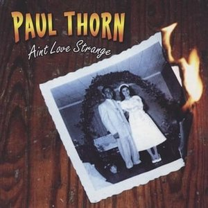

# Ain't Love Strange

By **Paul Thorn**

## Album Data

- **Catalog:** Beets
- **Format:** Digital, Album
- **Album:** Ain't Love Strange
- **Artist:** Paul Thorn
- **Albumartist:** Paul Thorn
- **Genre:** Blue-Eyed Soul
- **MusicBrainz Album Artist ID:** [f560cffe-c225-4b91-8511-403219819200](https://musicbrainz.org/artist/f560cffe-c225-4b91-8511-403219819200)
- **MusicBrainz Album ID:** [0e24268e-2bac-46e4-a864-652f1bc8a4e2](https://musicbrainz.org/release/0e24268e-2bac-46e4-a864-652f1bc8a4e2)
- **MusicBrainz Release Group ID:** [e499486b-e007-4c77-a252-e2905e80ad6e](https://musicbrainz.org/release-group/e499486b-e007-4c77-a252-e2905e80ad6e)
- **Year:** 1999
- **Catalog #:** 70862
- **Label:** Back Porch
- **Total Tracks:** 12

## Album Tracks

### Track 01 - Lovers Vacation

- **Artist:** Paul Thorn
- **Format:** ALAC
- **Genre:** Blue-Eyed Soul
- **Length:** 3:42
- **MusicBrainz Track ID:** [39e2f57f-7c1d-44a0-80d9-bfb76389fe57](https://musicbrainz.org/recording/39e2f57f-7c1d-44a0-80d9-bfb76389fe57)
- **Title:** Lovers Vacation
- **Track:** 01
- **Year:** 2004

### Track 02 - If I Can Get Over Her

- **Artist:** Paul Thorn
- **Format:** ALAC
- **Genre:** Blue-Eyed Soul
- **Length:** 3:20
- **MusicBrainz Track ID:** [7bfa8d33-c5f7-4fac-9cf3-d313307fec5f](https://musicbrainz.org/recording/7bfa8d33-c5f7-4fac-9cf3-d313307fec5f)
- **Title:** If I Can Get Over Her
- **Track:** 02
- **Year:** 2004

### Track 03 - High

- **Artist:** Paul Thorn
- **Format:** ALAC
- **Genre:** Blue-Eyed Soul
- **Length:** 3:06
- **MusicBrainz Track ID:** [dddd5a44-a33a-4aad-918e-62415284d78d](https://musicbrainz.org/recording/dddd5a44-a33a-4aad-918e-62415284d78d)
- **Title:** High
- **Track:** 03
- **Year:** 2004

### Track 04 - Love on Me

- **Artist:** Paul Thorn
- **Format:** ALAC
- **Genre:** Blue-Eyed Soul
- **Length:** 3:53
- **MusicBrainz Track ID:** [5abb8f01-3973-49f5-a26c-da6977f99d0a](https://musicbrainz.org/recording/5abb8f01-3973-49f5-a26c-da6977f99d0a)
- **Title:** Love on Me
- **Track:** 04
- **Year:** 2004

### Track 05 - She Won't Cheat on Us

- **Artist:** Paul Thorn
- **Format:** ALAC
- **Genre:** Blue-Eyed Soul
- **Length:** 3:27
- **MusicBrainz Track ID:** [3ec23e7f-86f1-4e09-9869-2a1951879b11](https://musicbrainz.org/recording/3ec23e7f-86f1-4e09-9869-2a1951879b11)
- **Title:** She Won't Cheat on Us
- **Track:** 05
- **Year:** 2004

### Track 06 - That's a Lie

- **Artist:** Paul Thorn
- **Format:** ALAC
- **Genre:** Blue-Eyed Soul
- **Length:** 3:35
- **MusicBrainz Track ID:** [f2798523-479d-49ad-9af2-951b4ca89e19](https://musicbrainz.org/recording/f2798523-479d-49ad-9af2-951b4ca89e19)
- **Title:** That's a Lie
- **Track:** 06
- **Year:** 2004

### Track 07 - I Don't Wanna Know

- **Artist:** Paul Thorn
- **Format:** ALAC
- **Genre:** Blue-Eyed Soul
- **Length:** 3:49
- **MusicBrainz Track ID:** [ffb2e6fb-9cf1-4c38-bc0a-c360bb382140](https://musicbrainz.org/recording/ffb2e6fb-9cf1-4c38-bc0a-c360bb382140)
- **Title:** I Don't Wanna Know
- **Track:** 07
- **Year:** 2004

### Track 08 - Are You With Me?

- **Artist:** Paul Thorn
- **Format:** ALAC
- **Genre:** Americana
- **Length:** 3:52
- **MusicBrainz Track ID:** [4a7e50e6-0c18-45cd-acf1-27d6291ed87c](https://musicbrainz.org/recording/4a7e50e6-0c18-45cd-acf1-27d6291ed87c)
- **Title:** Are You With Me?
- **Track:** 08
- **Year:** 2004

### Track 09 - If You Can't Love Me 4-Ever

- **Artist:** Paul Thorn
- **Format:** ALAC
- **Genre:** Blue-Eyed Soul
- **Length:** 4:03
- **MusicBrainz Track ID:** [99b65b32-f377-401f-a5b7-d6a267b33f65](https://musicbrainz.org/recording/99b65b32-f377-401f-a5b7-d6a267b33f65)
- **Title:** If You Can't Love Me 4-Ever
- **Track:** 09
- **Year:** 2004

### Track 10 - Nothin' to Show for It

- **Artist:** Paul Thorn
- **Format:** ALAC
- **Genre:** Blue-Eyed Soul
- **Length:** 4:10
- **MusicBrainz Track ID:** [0e63af6e-4c4b-4d30-a87a-ed000fa9f231](https://musicbrainz.org/recording/0e63af6e-4c4b-4d30-a87a-ed000fa9f231)
- **Title:** Nothin' to Show for It
- **Track:** 10
- **Year:** 2004

### Track 11 - Almost What You Need

- **Artist:** Paul Thorn
- **Format:** ALAC
- **Genre:** Blue-Eyed Soul
- **Length:** 3:50
- **MusicBrainz Track ID:** [35c750ac-80bb-445c-8739-d607662091c8](https://musicbrainz.org/recording/35c750ac-80bb-445c-8739-d607662091c8)
- **Title:** Almost What You Need
- **Track:** 11
- **Year:** 2004

### Track 12 - Love Will Find You

- **Artist:** Paul Thorn
- **Format:** ALAC
- **Genre:** Blue-Eyed Soul
- **Length:** 4:39
- **MusicBrainz Track ID:** [2f71c993-cfba-4fc9-b503-6285b0e49e8e](https://musicbrainz.org/recording/2f71c993-cfba-4fc9-b503-6285b0e49e8e)
- **Title:** Love Will Find You
- **Track:** 12
- **Year:** 2004

## See also

- [A Long Way From Tupelo](A_Long_Way_From_Tupelo_2.md)
- [A Long Way From Tupelo](A_Long_Way_From_Tupelo.md)
- [Are You With Me](Are_You_With_Me.md)
- [Hammer and Nail](Hammer_and_Nail.md)
- [Mission Temple Fireworks Stand](Mission_Temple_Fireworks_Stand.md)
- [Paul Thorn - Live](Paul_Thorn_-_Live.md)
- [So Far So Good Live](So_Far_So_Good_Live.md)
- [Too Blessed to Be Stressed](Too_Blessed_to_Be_Stressed.md)
- [Roon: Aint Love Strange](../../Roon/Paul_Thorn/Aint_Love_Strange.md)
- [Roon: Hammer & Nail Live (Live)](../../Roon/Paul_Thorn/Hammer_and_Nail_Live_Live.md)
- [Roon: Hammer & Nail](../../Roon/Paul_Thorn/Hammer_and_Nail.md)
- [Roon: Mission Temple Fireworks Stand](../../Roon/Paul_Thorn/Mission_Temple_Fireworks_Stand.md)
- [Roon: Pimps & Preachers](../../Roon/Paul_Thorn/Pimps_and_Preachers.md)
- [Roon: So Far so Good](../../Roon/Paul_Thorn/So_Far_so_Good-_The_Best_of_Paul_Thorn_Band_Live.md)
- [Vinyl: ](../../Vinyl/Paul_Thorn/Paul_Thorn.md)
- [Vinyl: Too Blessed To Be Stressed](../../Vinyl/Paul_Thorn/Too_Blessed_To_Be_Stressed.md)
