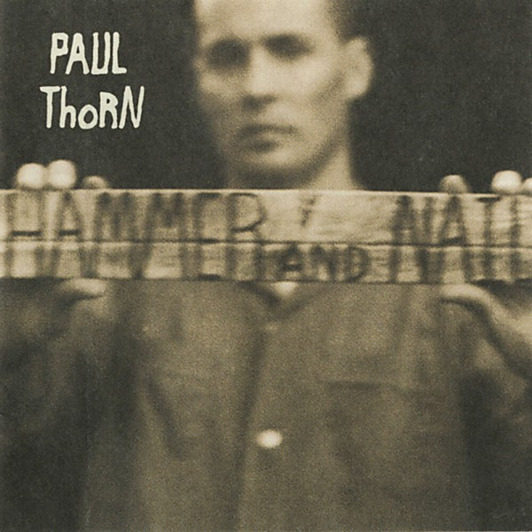

# Hammer and Nail

By **Paul Thorn**

## Album Data

- **Catalog:** Beets
- **Format:** Digital, Album
- **Album:** Hammer and Nail
- **Artist:** Paul Thorn
- **Albumartist:** Paul Thorn
- **Genre:** Blue-Eyed Soul
- **MusicBrainz Album Artist ID:** [f560cffe-c225-4b91-8511-403219819200](https://musicbrainz.org/artist/f560cffe-c225-4b91-8511-403219819200)
- **MusicBrainz Album ID:** [a1184cc6-2d81-4801-acd1-2effaccad01b](https://musicbrainz.org/release/a1184cc6-2d81-4801-acd1-2effaccad01b)
- **MusicBrainz Release Group ID:** [a350bd5c-e70a-44e4-a530-c56959272bda](https://musicbrainz.org/release-group/a350bd5c-e70a-44e4-a530-c56959272bda)
- **Year:** 1997
- **Catalog #:** 72438-13051-2-6
- **Label:** Back Porch
- **Total Tracks:** 12

## Album Tracks

### Track 01 - Everybody Looks Good at the Starting Line

- **Artist:** Paul Thorn
- **Format:** ALAC
- **Genre:** Alternative Country
- **Length:** 4:35
- **MusicBrainz Track ID:** [1d2bfa75-8074-489d-8d73-5909687723a1](https://musicbrainz.org/recording/1d2bfa75-8074-489d-8d73-5909687723a1)
- **Title:** Everybody Looks Good at the Starting Line
- **Track:** 01
- **Year:** 2002

### Track 02 - Rise Up

- **Artist:** Paul Thorn
- **Format:** ALAC
- **Genre:** Alternative Country
- **Length:** 3:48
- **MusicBrainz Track ID:** [4c1e7645-5dc3-4177-b9fe-9a36debb9b09](https://musicbrainz.org/recording/4c1e7645-5dc3-4177-b9fe-9a36debb9b09)
- **Title:** Rise Up
- **Track:** 02
- **Year:** 2002

### Track 03 - Downtown Babylon

- **Artist:** Paul Thorn
- **Format:** ALAC
- **Genre:** Alternative Country
- **Length:** 3:55
- **MusicBrainz Track ID:** [89fdc20f-d78f-4255-84f0-2c52d430dc6a](https://musicbrainz.org/recording/89fdc20f-d78f-4255-84f0-2c52d430dc6a)
- **Title:** Downtown Babylon
- **Track:** 03
- **Year:** 2002

### Track 04 - Mission Temple Fireworks Stand

- **Artist:** Paul Thorn
- **Format:** ALAC
- **Genre:** Blues
- **Length:** 3:33
- **MusicBrainz Track ID:** [815d93ee-214c-43ef-b392-625224df77e7](https://musicbrainz.org/recording/815d93ee-214c-43ef-b392-625224df77e7)
- **Title:** Mission Temple Fireworks Stand
- **Track:** 04
- **Year:** 2002

### Track 05 - Things Left Undone

- **Artist:** Paul Thorn
- **Format:** ALAC
- **Genre:** Folk Rock
- **Length:** 3:51
- **MusicBrainz Track ID:** [a74110ce-793e-4970-aac7-208f8cc845f4](https://musicbrainz.org/recording/a74110ce-793e-4970-aac7-208f8cc845f4)
- **Title:** Things Left Undone
- **Track:** 05
- **Year:** 2002

### Track 06 - There's Something Out There

- **Artist:** Paul Thorn
- **Format:** ALAC
- **Genre:** Alternative Country
- **Length:** 3:47
- **MusicBrainz Track ID:** [542847b0-6b28-4227-b400-9c0778c312c2](https://musicbrainz.org/recording/542847b0-6b28-4227-b400-9c0778c312c2)
- **Title:** There's Something Out There
- **Track:** 06
- **Year:** 2002

### Track 07 - Even Heroes Die

- **Artist:** Paul Thorn
- **Format:** ALAC
- **Genre:** Blues
- **Length:** 4:13
- **MusicBrainz Track ID:** [a38d4019-db40-455b-b06c-bcf78320e0f4](https://musicbrainz.org/recording/a38d4019-db40-455b-b06c-bcf78320e0f4)
- **Title:** Even Heroes Die
- **Track:** 07
- **Year:** 2002

### Track 08 - Ain't Livin' in Sin No More

- **Artist:** Paul Thorn
- **Format:** ALAC
- **Genre:** Blues
- **Length:** 3:47
- **MusicBrainz Track ID:** [7d24afa8-62dc-4440-9514-35f79c6d72e9](https://musicbrainz.org/recording/7d24afa8-62dc-4440-9514-35f79c6d72e9)
- **Title:** Ain't Livin' in Sin No More
- **Track:** 08
- **Year:** 2002

### Track 09 - Sister Ruby's House of Prayer

- **Artist:** Paul Thorn
- **Format:** ALAC
- **Genre:** Folk Rock
- **Length:** 4:05
- **MusicBrainz Track ID:** [670562f0-36d8-4cd8-bd40-76958730300b](https://musicbrainz.org/recording/670562f0-36d8-4cd8-bd40-76958730300b)
- **Title:** Sister Ruby's House of Prayer
- **Track:** 09
- **Year:** 2002

### Track 10 - Angel Too Soon

- **Artist:** Paul Thorn
- **Format:** ALAC
- **Genre:** Blues
- **Length:** 3:37
- **MusicBrainz Track ID:** [a645a1a4-73ab-4db4-9fab-cd362987a73b](https://musicbrainz.org/recording/a645a1a4-73ab-4db4-9fab-cd362987a73b)
- **Title:** Angel Too Soon
- **Track:** 10
- **Year:** 2002

### Track 11 - Nothin' but the Devil

- **Artist:** Paul Thorn
- **Format:** ALAC
- **Genre:** Alternative Country
- **Length:** 4:00
- **MusicBrainz Track ID:** [acc7d376-ff00-4725-8f87-f4eb8411dedb](https://musicbrainz.org/recording/acc7d376-ff00-4725-8f87-f4eb8411dedb)
- **Title:** Nothin' but the Devil
- **Track:** 11
- **Year:** 2002

### Track 12 - I'm a Lucky Man

- **Artist:** Paul Thorn
- **Format:** ALAC
- **Genre:** Blues
- **Length:** 4:46
- **MusicBrainz Track ID:** [9c4b762d-6e74-45af-869d-b46c24f1c071](https://musicbrainz.org/recording/9c4b762d-6e74-45af-869d-b46c24f1c071)
- **Title:** I'm a Lucky Man
- **Track:** 12
- **Year:** 2002

## See also

- [Ain't Love Strange](Aint_Love_Strange.md)
- [A Long Way From Tupelo](A_Long_Way_From_Tupelo_2.md)
- [A Long Way From Tupelo](A_Long_Way_From_Tupelo.md)
- [Are You With Me](Are_You_With_Me.md)
- [Mission Temple Fireworks Stand](Mission_Temple_Fireworks_Stand.md)
- [Paul Thorn - Live](Paul_Thorn_-_Live.md)
- [So Far So Good Live](So_Far_So_Good_Live.md)
- [Too Blessed to Be Stressed](Too_Blessed_to_Be_Stressed.md)
- [Roon: Aint Love Strange](../../Roon/Paul_Thorn/Aint_Love_Strange.md)
- [Roon: Hammer & Nail Live (Live)](../../Roon/Paul_Thorn/Hammer_and_Nail_Live_Live.md)
- [Roon: Hammer & Nail](../../Roon/Paul_Thorn/Hammer_and_Nail.md)
- [Roon: Mission Temple Fireworks Stand](../../Roon/Paul_Thorn/Mission_Temple_Fireworks_Stand.md)
- [Roon: Pimps & Preachers](../../Roon/Paul_Thorn/Pimps_and_Preachers.md)
- [Roon: So Far so Good](../../Roon/Paul_Thorn/So_Far_so_Good-_The_Best_of_Paul_Thorn_Band_Live.md)
- [Vinyl: ](../../Vinyl/Paul_Thorn/Paul_Thorn.md)
- [Vinyl: Too Blessed To Be Stressed](../../Vinyl/Paul_Thorn/Too_Blessed_To_Be_Stressed.md)
